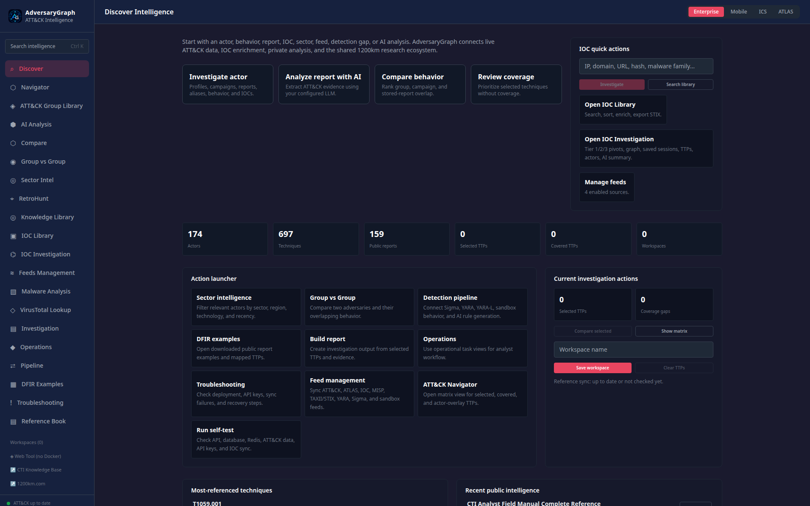
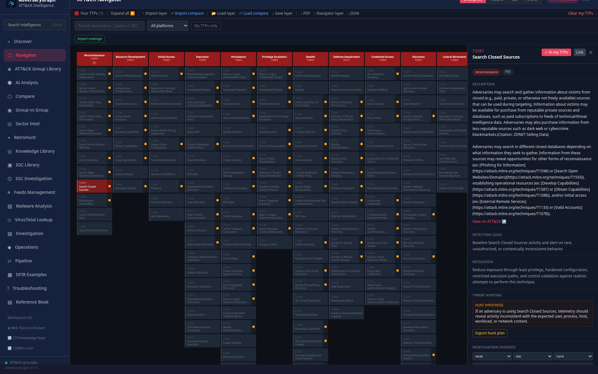

# AdversaryGraph

<p align="center">
  
</p>

> **Malware Analysis safety note:** Malware Analysis is a controlled lab workflow
> backed by the isolated MalwareGraph service. Treat static analysis, unpacking,
> string analysis, decompilation, runtime-debug, IOC, TTP, family, and attribution
> output as analyst-assistance data. Validate every finding before operational,
> legal, incident-response, customer-reporting, blocking, or production use.


**AI-assisted CTI-to-detection workbench for MITRE ATT&CK mapping, malware-analysis evidence, IOC enrichment, and detection-gap analysis.**

[](https://github.com/anpa1200/adversarygraph/actions/workflows/ci.yml)
[](VERSION)
[](LICENSE)
[](SECURITY.md)
[](ROADMAP.md)
[](DISCOVERY.md)
[](DISCOVERY.md)
[](https://github.com/hslatman/awesome-threat-intelligence/pull/385)
[](https://github.com/threat-hunting/awesome_Threat-Hunting/pull/5)

**Current release: v4.0.0 · [Release Summary](docs/release-summary-v4.0.0.md) · [Malware Analysis Guide](docs/malware-analysis-guide.md) · [Official Platform Guide](https://1200km.com/adversarygraph-docs/platform-guide/) · [Official Malware Analysis Docs](https://1200km.com/adversarygraph-docs/malware-analysis/) · [Release Article Draft](docs/publication-drafts/adversarygraph-v4-malware-analysis.md) · [From Log to Report Workflow](docs/publication-drafts/medium-adversarygraph-from-log-to-report-ioc-investigation.md) · [Live Intelligence Workspace](https://1200km.com/threat-matrix/) · [Documentation & Usage Guide](https://1200km.com/adversarygraph-docs/) · [Capabilities](https://1200km.com/adversarygraph-docs/capabilities/) · [Use Cases](https://1200km.com/adversarygraph/use-cases.html) · [1200km Article](https://1200km.com/articles/adversarygraph-v2-self-hosted-ai-cti-platform.html) · [Published Medium Article](https://medium.com/@1200km/adversarygraph-v2-5-new-name-new-release-full-ai-cti-platform-capability-map-93cd9224127e)**

**Current v4 visual documentation:** [Platform Guide](docs/adversarygraph-platform-guide.md) · [Platform Screenshot Manifest](docs/assets/adversarygraph-v4-platform/manifest.md) · [Malware Screenshot Manifest](docs/assets/malware-analysis-v4/manifest.md)

AdversaryGraph AI is a self-hosted CTI-to-detection workbench for mapping threat reports, IOC context, malware-analysis findings, and operational telemetry to MITRE ATT&CK, comparing TTP overlap with known groups and campaigns, identifying detection gaps, and exporting analyst-ready outputs.

> **Rename note:** AdversaryGraph is the canonical product name. Legacy public URLs are preserved as static redirect pages where possible.

**Live Web Workspace:** https://1200km.com/threat-matrix/

**Project Hub:** https://1200km.com/adversarygraph/

**Documentation:** https://1200km.com/adversarygraph-docs/

**Capabilities:** https://1200km.com/adversarygraph-docs/capabilities/

**Platform Guide:** https://1200km.com/adversarygraph-docs/platform-guide/

**Malware Analysis Docs:** https://1200km.com/adversarygraph-docs/malware-analysis/

**Use Cases:** https://1200km.com/adversarygraph/use-cases.html

**From Log to Report workflow:** https://1200km.com/articles/adversarygraph-from-log-to-report-ioc-investigation.html

**1200km Article:** https://1200km.com/articles/adversarygraph-v2-self-hosted-ai-cti-platform.html

**Published Medium Article:** https://medium.com/@1200km/adversarygraph-v2-5-new-name-new-release-full-ai-cti-platform-capability-map-93cd9224127e

**Medium Archive:** https://medium.com/@1200km

> **Validation and attribution limitation:** AdversaryGraph assists analysts but does not replace analyst validation. LLM-generated mappings may contain false positives, false negatives, or ambiguous technique assignments. Group/campaign similarity is based on TTP overlap and is an investigation lead, not attribution proof.

## Table of Contents

- [Short Installation Guide](#short-installation-guide)
- [From Log to Report Workflow](#from-log-to-report-workflow)
- [Project Maturity Evidence](#project-maturity-evidence)
- [Malware Analysis Mode](#malware-analysis-mode)
- [Public Demo Privacy Note](#public-demo-privacy-note)
- [Validation and Limitations](#validation-and-limitations)
- [Screenshots And Visual Evidence](#screenshots-and-visual-evidence)
- [Features](#features)
- [Platform Guide](docs/adversarygraph-platform-guide.md)
- [Architecture](#architecture)
- [Malware Analysis Module](docs/malware-analysis-module.md)
- [Malware Analysis Architecture](docs/malware-analysis-architecture.md)
- [Malware Analysis Guide](docs/malware-analysis-guide.md)
- [Quick Start](#quick-start)
- [Usage Guide](#usage-guide)
- [Two-Database Architecture](#two-database-architecture)
- [API Reference](#api-reference)
- [Configuration](#configuration)
- [Development](#development)
- [Deployment](#deployment)
- [Publishing And Discovery](#publishing-and-discovery)
- [Tech Stack](#tech-stack)
- [Changelog](#changelog)
- [License](#license)

## Short Installation Guide

Use this path for a fresh local Docker deployment.

```bash
git clone https://github.com/anpa1200/adversarygraph.git
cd adversarygraph
cp .env.example .env
```

Edit `.env` and set at least one LLM provider:

```env
# Cloud provider example
ANTHROPIC_API_KEY=your_key_here
MINIMAX_API_KEY=your_key_here

# Or local OpenAI-compatible endpoint
LOCAL_LLM_BASE_URL=http://host.docker.internal:11434/v1
LOCAL_LLM_API_KEY=local
LOCAL_LLM_MODEL=llama3.1:8b
```

Optional enrichment keys and feed sync:

```env
# abuse.ch ThreatFox IOC sync
THREATFOX_AUTH_KEY=your_abuse_ch_auth_key
AUTO_IOC_FULL_SYNC_ON_STARTUP=true
AUTO_THREATFOX_SYNC_DAYS=7

# AlienVault OTX actor-attributed pulse enrichment
OTX_API_KEY=your_otx_key

# VirusTotal on-demand IOC reputation and relationship lookup
VIRUSTOTAL_API_KEY=your_virustotal_key

# Optional IOC Investigation pivots
URLSCAN_API_KEY=your_urlscan_key
# GreyNoise Community is used by default; no key is needed for baseline lookup.
GREYNOISE_API_KEY=
SHODAN_API_KEY=your_shodan_key
ABUSEIPDB_API_KEY=your_abuseipdb_key
CENSYS_API_KEY=your_censys_platform_pat
CENSYS_ORG_ID=optional_censys_org_id

# OpenCTI symmetric sync
OPENCTI_URL=https://opencti.example.com
OPENCTI_TOKEN=your_opencti_token
OPENCTI_SYNC_LIMIT=500
OPENCTI_VERIFY_TLS=true

# Daily dynamic DB refresh schedule in UTC
DYNAMIC_DB_SYNC_HOUR=3
DYNAMIC_DB_SYNC_MINUTE=30
DYNAMIC_DB_IOC_SYNC_DAYS=7
```

No key is required for MITRE ATT&CK/ATLAS sync, built-in public MISP Galaxy metadata sync, Malpedia, GreyNoise Community lookup, or public urlscan lookups within provider limits. MISP JSON exports, STIX/TAXII collection URLs, custom JSON/CSV/TXT feeds, Sigma/YARA feeds, and sandbox behavior feeds are connected from the UI or API as source URLs/tokens. OpenCTI sync needs an OpenCTI API token with read access to indicators, observables, reports, and labels, plus create/update access for indicators and reports. Keep filled `.env` files private.

Start the stack:

```bash
docker compose up -d --build
```

Open:

- Frontend: `http://localhost:3000`
- API health: `http://localhost:8000/api/health`
- API docs: `http://localhost:8000/docs`

Run the built-in health checks:

```bash
./scripts/selftest.sh
```

On first startup, AdversaryGraph downloads and ingests MITRE ATT&CK / ATLAS reference data. The first sync can take a few minutes.

## From Log to Report Workflow

AdversaryGraph documents the practical workflow for turning firewall logs, EDR
events, proxy records, PCAP-derived text, suspicious commands, and raw IOC lists
into a structured CTI investigation:

1. Create a new Investigation workspace.
2. Paste operational telemetry into AI Analysis.
3. Extract IOCs, suspicious commands, PowerShell, hashes, domains, URLs, and
   ATT&CK technique leads.
4. Add the AI analysis result to the active investigation.
5. Investigate extracted IOCs through Tier 1 / Tier 2 / Tier 3 pivots.
6. Add useful IOC Investigation results to the same investigation.
7. Review source evidence, relationship graph nodes, actor leads, source
   conflicts, kill-chain coverage, and TTP leads.
8. Create a Navigator-like layer from investigation TTPs and send it to the matrix.
9. Compare the TTP layer with threat actors and save the result to the investigation.
10. Summarize the investigation with AI.
11. Generate a local or AI-assisted report for analyst handoff.

The complete public walkthrough is mirrored in the 1200km ecosystem:
<https://1200km.com/articles/adversarygraph-from-log-to-report-ioc-investigation.html>.

## Project Maturity Evidence

AdversaryGraph v4.0.0 publishes the operational evidence expected from a serious self-hosted CTI tool:

| Area | Evidence |
|---|---|
| Installability | [Quickstart](docs/quickstart.md), Docker Compose deployment, `.env.example` |
| Analyst documentation | [Full v2 guide](docs/full-guide-v2.md), [user guide](docs/user-guide.md), [comparison](docs/comparison.md), [limitations](docs/limitations.md) |
| Operations | [Admin guide](docs/admin-guide.md), [security model](docs/security-model.md), [security policy](SECURITY.md) |
| Quality | Backend unit/integration tests, frontend build, [CI workflow](.github/workflows/ci.yml) |
| Reviewability | [Demo dataset](docs/demo-dataset/public-report-excerpt.md), [expected mappings](docs/demo-dataset/expected-mappings.json), [sample outputs](docs/sample-outputs/) |
| Validation | [Evaluation plan](docs/validation/evaluation-plan.md), [mapping review rubric](docs/validation/mapping-review-rubric.md) |
| Maintenance | [Maintainers](MAINTAINERS.md), [roadmap](ROADMAP.md), [changelog](CHANGELOG.md), [contributing guide](CONTRIBUTING.md) |
| Production readiness | [Production readiness tracker](docs/production-readiness.md) |

The current documentation is intended to make external review practical rather than promotional.

For the current release scope, see the [v4.0.0 release summary](docs/release-summary-v4.0.0.md) and [release notes](docs/release-notes/v4.0.0.md).

## Malware Analysis Mode

AdversaryGraph v4 includes an integrated Malware Analysis workspace backed by a
separate MalwareGraph service in the same Docker Compose stack. The workflow is
case-based: create a malware-analysis case, upload a raw sample or
password-protected ZIP, run first-pass static triage, and collect extracted IOCs,
TTPs, strings, artifacts, files, behaviors, unpack layers, debug findings, and AI
analysis leads into one AdversaryGraph-linked case view.

Current malware-analysis pages include:

- **First Analysis** - file type, magic bytes, entropy, packed/obfuscated
  signals, packer hints, hashes, and PE-header triage.
- **Unpacker** - packer detection, safe unpack attempts, output validation,
  AI-assisted packer analysis, and saving unpacked artifacts back to the case.
- **Strings** - full string extraction, smart IOC/API/registry/command
  categorization, optional AI string analysis, and clickable IOC/TTP links.
- **Decompilation and Debug** - IDE-style decompilation/debug workspace for
  functions, pseudo-code, registers, memory views, breakpoints, and step plans.
- **Dynamic Analysis** - isolated runtime workflow planning and gated dynamic
  debugging controls for disposable, network-isolated environments only.

Every extracted hash, IP, domain, URL, file, registry key, behavior, and ATT&CK
technique lead is designed to be clickable into the existing AdversaryGraph IOC,
Navigator, VirusTotal, and investigation workflows. Runtime execution and live
debugging remain disabled by default and require an explicitly isolated
MalwareGraph runtime profile.

## Public Demo Privacy Note

The public Web workspace is intended for exploration. Do not upload confidential, customer-sensitive, classified, or internal reports into public demos or third-party environments. Use the self-hosted Docker deployment for private analysis.

## Validation and Limitations

AdversaryGraph assists analysts but does not replace analyst validation. LLM-generated ATT&CK mappings may include false positives, false negatives, or ambiguous technique assignments. Group and campaign similarity is based on TTP overlap and should be treated as an investigation lead, not attribution proof.

## Screenshots And Visual Evidence

The current v4 platform walkthrough is documented in
[`docs/adversarygraph-platform-guide.md`](docs/adversarygraph-platform-guide.md).
It includes validated screenshots for Discover, Navigator, ATT&CK Group Library,
AI Analysis, Compare, Group vs Group, Sector Intel, RetroHunt, Knowledge
Library, IOC Library, IOC Investigation, VirusTotal Lookup, Feeds Management,
Investigation Report, Operations, Pipeline, DFIR Examples, Troubleshooting,
Sector Packs, IOC node detail, and the Malware Analysis extension.

Current screenshot manifests:

- v4 platform: [`docs/assets/adversarygraph-v4-platform/manifest.md`](docs/assets/adversarygraph-v4-platform/manifest.md)
- v4 malware analysis: [`docs/assets/malware-analysis-v4/manifest.md`](docs/assets/malware-analysis-v4/manifest.md)
- v2 historical walkthrough: [`docs/assets/adversarygraph-v2/manifest.md`](docs/assets/adversarygraph-v2/manifest.md)
- v3 IOC investigation walkthrough: [`docs/assets/adversarygraph-v3/manifest.md`](docs/assets/adversarygraph-v3/manifest.md)

| Current platform workflow | Current malware workflow |
|---|---|
|  |  |
|  |  |

Screenshot evidence is preserved in [`docs/screenshots/`](docs/screenshots/).
The set covers the public ATT&CK matrix workspace, group overlay workflows,
analysis views, report/evidence review, and ecosystem navigation from the
companion walkthrough.

The published v2.5 Medium walkthrough is mirrored into the local documentation
and 1200km article page. Its screenshots and infographics are stored in
[`docs/assets/adversarygraph-v2/`](docs/assets/adversarygraph-v2/) and listed in
[`docs/assets/adversarygraph-v2/manifest.md`](docs/assets/adversarygraph-v2/manifest.md).
The full visual appendix is included in [`docs/full-guide-v2.md`](docs/full-guide-v2.md).

Demo workflow video:
[`DFIR report download to AI analysis and comparison`](docs/demo-videos/dfir-report-ai-analysis-compare.mp4)
shows the end-to-end flow from indexed public report examples to local PDF
upload, streamed ATT&CK extraction, and selected TTP review. A GIF version is
also available at [`docs/demo-videos/dfir-report-ai-analysis-compare.gif`](docs/demo-videos/dfir-report-ai-analysis-compare.gif).

| Matrix and actor workflow | Analysis and review workflow |
|---|---|
|  |  |
|  |  |

## Features

| Module | Capability |
|---|---|
| **Navigator** | Full ATT&CK/ATLAS matrix support (Enterprise, Mobile, ICS, ATLAS) with D3.js zoom/pan, sub-technique expansion, dual-layer colouring |
| **Threat Actor Library** | Currently ingested MITRE ATT&CK group profiles, aliases, techniques, and named campaign relationships |
| **AI Analysis** | Upload PDF/DOCX/TXT or paste text → streamed LLM extraction of ATT&CK or ATLAS mapping candidates via Claude, OpenAI, Gemini, MiniMax, or a local OpenAI-compatible LLM; results saved to Reports Library (DB 2) |
| **Compare — Groups** | Jaccard similarity ranking of your TTPs vs currently ingested group profiles; visual matrix diff, tactic breakdown, gap analysis |
| **Compare — Campaigns** | Jaccard similarity ranking of your TTPs vs every named MITRE campaign (e.g. SolarWinds C0024, Operation Ghost C0023) |
| **Compare — Reports** | Browse stored AI analyses (DB 2); re-run group-similarity comparison without re-calling the LLM |
| **Sector Intelligence** | Local actor relevance scoring by client sector, geography, environment keywords, activity window, ATT&CK campaign recency, and MISP Galaxy evidence |
| **IOC Intelligence** | Local source-backed IOC storage with ThreatFox/OTX/Malpedia sync, global IOC Library search, MISP/custom feed connection, actor IOC tabs, IOC-to-TTP mapping, freshness filtering, confidence, source links, VT check, and CSV export |
| **VirusTotal Lookup** | On-demand IOC reputation lookup for IPs, domains, URLs, and hashes with clean verdicts, extracted ATT&CK TTPs, local actor matches, and matrix/My TTP actions |
| **DFIR Examples** | Indexed public DFIR Report examples with TTP/actor metadata and a local PDF workflow for private AI analysis |
| **Export** | ATT&CK Navigator JSON layers, PDF reports, plain JSON, and STIX 2.1 bundles for OpenCTI import |
| **Feeds Management** | Manual and scheduled MITRE ATT&CK and MITRE ATLAS sync for Enterprise, Mobile, ICS, and ATLAS with status reporting and stale-data indicators |
| **Anomaly Detection Reference Book** | Docker-served, autonomously synchronized reference catalogs with exact paragraph-level links from every mapped matrix TTP |
| **Intelligence Pipeline** | Scheduled reviewed RSS intake, STIX/TAXII, MISP and ATLAS imports, normalized observables, public enrichment, team audit trail |
| **Detection Studio** | Versioned Sigma, YARA, YARA-L, KQL, SPL and EQL skeleton or AI-assisted rule generation with structural validation and explicit analyst-review placeholders |
| **Operations** | Investigations, evidence graphs, report intake, tracked actor changes, and detection engineering lifecycle |
| **Malware Analysis** | Fully integrated MalwareGraph dashboard backed by an isolated analysis service. Case-based password-protected ZIP and raw-file intake, first-pass static analysis, entropy and PE-header triage, string extraction with AI classification, unpack (static and dynamic/policy-gated), obfuscation analysis, AI full analysis pipeline, decompilation metadata, analyst-guided and AI-assisted debug workspaces, IOC/TTP extraction, custom LLM completions, and clickable links from every hash/IP/domain/URL/TTP/behavior/detection into AdversaryGraph IOC Intelligence, ATT&CK Navigator, Compare, and Detection Studio. See [Malware Analysis Guide](docs/malware-analysis-guide.md), [Module](docs/malware-analysis-module.md), and [Architecture](docs/malware-analysis-architecture.md). |

---

## Architecture

## Web vs Docker

**AdversaryGraph Web** is the public browser-native workspace for ATT&CK exploration, manual layers, group overlays and comparisons, local workspaces, ecosystem research, coverage-gap analysis, and browser-generated exports. It does not perform LLM report extraction or backend private-report storage.

**AdversaryGraph Docker** is the full self-hosted platform for provider-configured AI extraction, private PostgreSQL-backed analyses, campaigns, APIs, PDF reports, detection-rule workflows, and scheduled ATT&CK synchronization.

AdversaryGraph is self-hosted. In Docker mode, report content is sent only to the LLM provider configured by the operator. For fully private analysis, use a local or private LLM gateway. The public Web workspace does not perform LLM report extraction or backend report storage.

The malware-analysis capability uses a separate isolated MalwareGraph analysis
service in the same Docker Compose stack, but the analyst experience is a native AdversaryGraph dashboard. Every
extracted hash, IP, domain, URL, behavior, TTP, detection, malware-family lead,
and actor-similarity lead becomes clickable graph-linked data that pivots into
IOC Intelligence, ATT&CK Navigator, Compare Groups, Detection Studio, evidence
views, and exports. Malware archives and extracted samples stay out of the main
application containers, and the default workflow is static-only. Any execution,
debugging, or dynamic unpacking must run in a disposable sandbox boundary with
fake-internet or restricted network controls. See [Malware Analysis Module](docs/malware-analysis-module.md)
and [Malware Analysis Architecture](docs/malware-analysis-architecture.md).

The Docker deployment gives the operator control over storage, networking, and provider configuration. Trusted-header authentication and roles are available when configured, but internet-facing deployments still require TLS, an authenticating reverse proxy, restricted network exposure, backups, retention controls, and secrets management.

```
┌──────────────────────────────────────────────────────────────────┐
│                         Docker Compose                           │
├────────────────┬───────────────┬──────────────┬─────────────────┤
│  React / Vite  │   FastAPI     │  PostgreSQL  │  Redis + Celery │
│  (port 3000)   │  (port 8000)  │     16       │  worker + beat  │
│                │               │              │                 │
│  Vite proxy    │  SQLAlchemy   │  DB 1: ATT&CK│  daily MITRE    │
│  /api → :8000  │  async ORM    │  DB 2: Reports  sync job       │
└────────────────┴───────────────┴──────────────┴─────────────────┘
```

**Backend** — Python 3.12, FastAPI, SQLAlchemy 2.x (async), Celery  
**Frontend** — React 18, TypeScript, Vite, D3.js, Tailwind CSS, Zustand  
**Database** — PostgreSQL 16 with JSONB for ATT&CK STIX data  
**Queue** — Redis + Celery (daily MITRE sync at 03:00 UTC)

### Data flow

```
User uploads report
        │
        ▼
  _read_input()          ← stream with 50 MB byte-cap, size-check before buffer
        │
        ▼
  LLMAdapter.extract()   ← Claude / OpenAI / Gemini / MiniMax / Local
        │
        ▼
  _parse_response()      ← JSON extraction with raw_decode fallback
        │
        ▼
  _rank_apt_groups()     ← Jaccard TTP overlap vs group profiles in DB 1
        │
        ▼
  AnalysisResult → DB 2  ← session + name, techniques, similarity leads, domain
        │
        ▼
  Frontend renders       ← techniques table, group similarity ranking, Navigator injection
```

### Two-database model

| Database | What it holds | Key tables |
|---|---|---|
| **DB 1 (MITRE)** | ATT&CK groups, campaigns, techniques, relationships — ingested from official STIX bundles | `apt_groups`, `campaigns`, `campaign_techniques`, `apt_group_campaigns`, `techniques` |
| **DB 2 (Reports)** | Every AI analysis you run: extracted techniques, summary, group-similarity leads, name, domain | `analysis_sessions`, `analysis_results` |

---

## Quick Start

### Prerequisites

- Docker + Docker Compose (v2)
- API key for at least one cloud LLM provider, or a local OpenAI-compatible LLM endpoint

### 1 — Clone and configure

```bash
git clone https://github.com/anpa1200/adversarygraph.git
cd adversarygraph
cp .env.example .env
```

Edit `.env` and add your API keys:

```env
# Optional cloud providers
ANTHROPIC_API_KEY=sk-ant-...
OPENAI_API_KEY=sk-...
OPENAI_MODEL=gpt-4.1
GEMINI_API_KEY=AIza...
MINIMAX_API_KEY=sk-...
MINIMAX_MODEL=MiniMax-M3
MINIMAX_BASE_URL=https://api.minimax.io/v1

# Optional local provider: Ollama / LM Studio / LocalAI / vLLM with OpenAI-compatible API
LOCAL_LLM_BASE_URL=http://host.docker.internal:11434/v1
LOCAL_LLM_API_KEY=local
LOCAL_LLM_MODEL=llama3.1:8b

# Database and internal services
DB_NAME=adversarygraph
DB_USER=ag_user
DB_PASS=changeme_strong_password
REDIS_PASSWORD=changeme_redis
ADVERSARYGRAPH_DB_DIR=./data/postgres

# Browser origins allowed to call the API
CORS_ALLOWED_ORIGINS=http://localhost:3000

# Optional trusted-header authentication behind a hardened reverse proxy
AUTH_ENABLED=false
AUTH_DEFAULT_ROLE=viewer
PROXY_SECRET=

# ATT&CK / ATLAS domains to ingest (comma-separated)
ATTCK_DOMAINS=enterprise-attack,mobile-attack,ics-attack,atlas

# IOC enrichment and feed sync (optional)
THREATFOX_AUTH_KEY=your_abuse_ch_auth_key
AUTO_IOC_FULL_SYNC_ON_STARTUP=true
AUTO_THREATFOX_SYNC_DAYS=7
OTX_API_KEY=your_otx_key
VIRUSTOTAL_API_KEY=your_virustotal_key
OPENCTI_URL=https://opencti.example.com
OPENCTI_TOKEN=your_opencti_token
OPENCTI_SYNC_LIMIT=500
OPENCTI_VERIFY_TLS=true
DYNAMIC_DB_SYNC_HOUR=3
DYNAMIC_DB_SYNC_MINUTE=30
DYNAMIC_DB_IOC_SYNC_DAYS=7

LOG_LEVEL=info
```

> You only need one working provider. Cloud API keys can be left blank if you use the local provider.
>
> Enrichment keys are optional. `AUTO_IOC_FULL_SYNC_ON_STARTUP=true` starts a non-blocking IOC source sync after API startup for ThreatFox, Malpedia, OTX, and enabled custom feeds. `THREATFOX_AUTH_KEY` enables abuse.ch ThreatFox IOC sync, `OTX_API_KEY` enables AlienVault OTX pulse enrichment, `VIRUSTOTAL_API_KEY` enables on-demand IOC reputation and relationship lookup, and `OPENCTI_URL` plus `OPENCTI_TOKEN` enables OpenCTI pull/push/bidirectional sync. MITRE ATT&CK/ATLAS and public MISP Galaxy sync do not require API keys. MISP JSON exports, STIX/TAXII URLs, custom JSON/CSV/TXT feeds, Sigma/YARA feeds, and sandbox behavior feeds are configured later from the UI/API as source URLs or tokens.
>
> **You must create `.env` before running `docker compose up`.** Without it, cloud API keys are empty and local-provider defaults are used.
>
> PostgreSQL stores data in `ADVERSARYGRAPH_DB_DIR` (`./data/postgres` by
> default). This folder is created on first deployment and is outside the
> container lifecycle. Keep it when rebuilding containers; it contains private
> report sessions, private/custom IOCs, custom feeds, and the current synced
> public reference database.
>
> Existing deployments that still use the older Docker-managed `pg_data` volume
> can migrate once:
>
> ```bash
> ./scripts/migrate-postgres-volume-to-external-dir.sh
> docker compose up -d
> ```
>
> PostgreSQL uses `.env` credentials when the database directory is first created.
> If `DB_PASS` changes after a volume already exists, apply the new password
> without deleting data:
>
> ```bash
> docker compose --profile tools run --rm db-apply-env-creds
> docker compose up -d --force-recreate api worker beat frontend
> ```

For Ollama on the same host:

```bash
ollama pull llama3.1:8b
ollama serve
```

Keep:

```env
LOCAL_LLM_BASE_URL=http://host.docker.internal:11434/v1
LOCAL_LLM_MODEL=llama3.1:8b
```

For LM Studio, start its local OpenAI-compatible server and use:

```env
LOCAL_LLM_BASE_URL=http://host.docker.internal:1234/v1
LOCAL_LLM_MODEL=<model-name-shown-by-LM-Studio>
```

### 2 — Start

```bash
docker compose up
```

**First startup takes 5–15 minutes.** The API container automatically:
1. Runs `create_tables()` to initialise the PostgreSQL schema
2. Downloads the latest ATT&CK STIX bundles and the MITRE ATLAS STIX bundle from GitHub
3. Parses the STIX 2.1 JSON directly (no third-party ATT&CK library — Python 3.12 compatible)
4. Upserts tactics, techniques, groups, campaigns, and all relationships into PostgreSQL. ATLAS currently contributes matrix/tactic/technique data; MITRE's ATLAS bundle does not publish APT group profiles.

The `atlas-builder` container builds the embedded reference-book snapshot immediately,
then synchronizes it with the standalone Anomaly Detection Atlas repository every hour.
Set `ATLAS_SYNC_INTERVAL=0` to disable remote synchronization. Run `make sync-atlas`
to import unpushed changes from a local sibling `anomaly-detection-atlas` checkout.

Watch progress:

```bash
docker compose logs -f api
```

Expected output (v19.1):

```
Parsing enterprise-attack-19.1.json ...
  Parsed: current tactics, techniques, groups, campaigns, and relationships
  Ingested 15 tactics
  Ingested techniques from the selected ATT&CK release
  Ingested groups from the selected ATT&CK release
  Ingested campaigns from the selected ATT&CK release
  Ingested campaign-technique and group-campaign attribution links
Finished ingesting enterprise-attack v19.1
Parsing atlas-<sha>.json ...
  Parsed: ATLAS tactics, techniques, and sub-techniques
Finished ingesting atlas v<sha>
```

### 3 — Open

| Service | URL |
|---|---|
| **Frontend** | http://localhost:3000 |
| **Reference book** | http://localhost:3001/anomaly-detection-atlas/ |
| **API docs** | http://localhost:8000/docs |
| **Health** | http://localhost:8000/api/health |
| **Feeds management** | http://localhost:3000/feeds |

---

## Usage Guide

### Navigator

The central workspace. The full ATT&CK matrix renders as a colour-coded heatmap.

#### Basic interaction

| Action | How |
|---|---|
| Zoom / pan | Scroll to zoom, drag to pan. Double-click resets view. |
| Select a technique | Click any cell — turns red, added to your TTP layer |
| Expand sub-techniques | Click the ▶ arrow on any parent cell |
| Open detail panel | Click a cell to open the right-side panel (full description, detection notes, data sources, exact reference paragraphs, AI assistant) |
| Search | Type in the search box to filter by name or ATT&CK ID |
| Filter by platform | Use the platform dropdown (Windows, Linux, macOS, Cloud, etc.) |
| Filter by tactic | Use the tactic dropdown to focus on a specific kill-chain phase |

#### Layer toolbar

| Button | Action |
|---|---|
| ↑ Import layer | Load an existing ATT&CK Navigator `.json` layer |
| ↓ Navigator layer | Export your TTPs + overlay as ATT&CK Navigator JSON |
| ↓ PDF | Export current layer as a formatted PDF report |
| Expand all / Collapse all | Toggle sub-technique visibility |
| Clear my TTPs | Reset your selection |
| Clear overlay | Remove the group-profile overlay |

#### Colour coding

| Colour | Meaning |
|---|---|
| Red `#e94560` | In your TTP layer |
| Blue `#3b82f6` | In the group-profile overlay only |
| Amber `#f59e0b` | In both layers (shared TTPs) |
| Dark | Not selected |

#### AI Assistant

Click any technique to open the detail panel with an embedded chat. The full ATT&CK description for the selected technique is already in context. Example prompts:

- *"What are the most common detections for this technique?"*
- *"Write a SIGMA rule skeleton for T1059.001"*
- *"What ATT&CK groups use this in combination with lateral movement?"*

### Reference Book and Exact TTP Crosslinks

AdversaryGraph integrates the complete Anomaly Detection Atlas as an autonomous Docker service.
Click **Reference Book** in the sidebar to open the full documentation site.

Each matrix technique panel loads `ttp-reference-index.json` and shows links only to exact matching
paragraphs or table rows. A technique can link to multiple relevant activity descriptions, basic
detection rules, and statistical-anomaly mappings. The links use stable generated anchors such as:

```text
http://localhost:3001/anomaly-detection-atlas/attack-basic-detection-rule-catalog/#ttp-t1059-001
http://localhost:3001/anomaly-detection-atlas/attack-statistical-anomaly-mapping/#ttp-t1030
```

The embedded snapshot makes the book usable without a successful remote synchronization. The
`atlas-builder` service checks the standalone atlas repository every hour, regenerates exact TTP
anchors and the crosslink index, then atomically publishes the updated Docusaurus build.

Manual local synchronization:

```bash
make sync-atlas
docker compose up -d --build atlas-builder atlas-docs frontend
```

---

### AI Analysis

Analyse threat intelligence documents and automatically map every observable behaviour to ATT&CK. Each completed analysis is saved to the **Reports Library (DB 2)**.

#### Step-by-step

1. Click **Analyze** in the sidebar
2. Select an LLM provider and optionally specify a model
3. Choose a domain (`enterprise-attack`, `mobile-attack`, or `ics-attack`)
4. Optionally enter a **name** for this analysis (shown in the Reports Library later)
5. Either paste text or upload a file (PDF, DOCX, TXT — up to 50 MB)
6. Click **Analyse with AI**
7. Watch the live SSE token stream as the model thinks
8. Review the three tabs:

| Tab | Content |
|---|---|
| **Techniques** | ATT&CK technique mappings with confidence score, tactic, and evidence snippet |
| **Group Similarity Leads** | Top group profiles ranked by Jaccard TTP overlap |
| **Raw Response** | Full LLM JSON output for debugging |

9. Click **→ Inject into Navigator** to push all extracted techniques into your layer

#### Confidence score guide

| Score | Meaning |
|---|---|
| 90–100 % | Explicitly stated in the text |
| 70–89 % | Strongly implied |
| 40–69 % | Weakly implied or inferred from context |
| < 40 % | Speculative — treat with caution |

#### Supported file types

| Type | Notes |
|---|---|
| `.pdf` | Text extraction via PyMuPDF |
| `.docx` | Paragraphs and table cells extracted via python-docx |
| `.txt` / plain text | UTF-8, latin-1, CP1252 auto-detected |

Files are truncated at 120,000 characters before being sent to the LLM.

---

### ATT&CK Group Library

Browse the threat groups in the currently ingested ATT&CK release. Each group has two tabs:

#### Techniques tab

- All known techniques with ATT&CK IDs, tactic, and use description
- **Add all to my TTPs** — bulk-load every technique into your Navigator layer
- **Overlay on Navigator** — show the group's TTPs as a blue overlay on the matrix

#### Campaigns tab (DB 1)

Named operations attributed to this group, parsed from MITRE ATT&CK STIX data.

Each campaign card shows:
- ATT&CK campaign ID (e.g. C0024), name, and date range
- Technique count for that specific operation
- Expand to see the full technique list with tactic tags
- **Add to my TTPs** — load this campaign's specific TTP fingerprint into Navigator

> **Why campaigns matter:** A group's aggregate profile is the union of all operations over years. A campaign profile is specific to one attack. Matching against C0024 (SolarWinds Compromise) at 45% similarity is a more specific lead than matching against G0016 (APT29) at 15%.

---

### Compare

Rank ATT&CK groups and campaigns against your TTPs using Jaccard similarity.

**Jaccard similarity** = `|shared techniques| / |union of all techniques|`

Use the **mode switcher** at the top of the Compare page to choose what to compare against:

#### Mode: Groups (DB 1)

Rank every ATT&CK group against your current Navigator selection.

| Detail tab | Content |
|---|---|
| **Overview** | Similarity score, shared techniques (amber chips), your-only techniques |
| **Tactic Breakdown** | Stacked bar per kill-chain phase: shared / user-only / group-profile-only |
| **Visual Diff** | Compact matrix colour-strip showing the full overlap |
| **Gap Analysis** | Every technique in the group's profile not in your layer — your detection backlog |

**Actions:**
- **Overlay in Navigator** — visualise the overlap on the full matrix
- **↓ PDF Report** — export a formatted comparison report

#### Mode: Campaigns (DB 1)

Rank named campaigns from the currently ingested ATT&CK release against your current Navigator selection.

The detail panel shows:
- Similarity score, shared techniques highlighted in purple
- Full campaign technique list with overlap indicators
- Attribution (which group conducted this campaign)
- Date range of the campaign

#### Mode: Reports (DB 2)

Browse your stored AI analysis sessions. Click any report body to see which group and campaign profiles have the strongest TTP overlap with its extracted profile — without re-running the expensive LLM call.

Use cases:
- **Retrospective TTP-overlap review** after a new ATT&CK version is released
- **Cross-incident correlation** across multiple saved reports
- **Environmental profiling** — which groups keep appearing across your incident set

**Per-session actions:**
- **↓ PDF** — download the full analysis PDF for that session at any time
- **↓ STIX/OpenCTI** — download a STIX 2.1 bundle containing the report, ATT&CK attack-patterns, and similarity-lead intrusion sets for OpenCTI import
- **✕ Remove** — delete the session from DB 2 (browser confirm required; list refreshes automatically)

---

### Export

#### Analysis PDF

From **Analyze**, click **Download PDF** on any completed analysis. Includes:
- Cover page with provider, model, domain, session ID, timestamp
- Executive summary (AI-generated)
- Extracted techniques table sorted by confidence
- Group-similarity section with top Jaccard-overlap leads
- Tactic coverage breakdown

#### STIX 2.1 / OpenCTI Export

From **Analyze**, click **↓ STIX/OpenCTI** on a completed analysis to download a
STIX 2.1 bundle. The bundle is designed for OpenCTI import and contains:

- a STIX `report` for the AdversaryGraph analysis session
- ATT&CK `attack-pattern` objects for extracted TTPs
- optional `intrusion-set` objects for group-similarity leads
- AdversaryGraph custom metadata for confidence, review status, evidence source, similarity score, model, provider, and ATT&CK domain

AdversaryGraph does not export IOCs here. Group matches are exported as
TTP-overlap investigation leads, not attribution claims.

#### Navigator layer PDF

From **Navigator**, click **↓ PDF** in the toolbar. Lists all techniques in your current layer with tactics and platforms.

#### ATT&CK Navigator JSON

Click **↓ Navigator layer** to download a `.json` file compatible with [MITRE ATT&CK Navigator](https://mitre-attack.github.io/attack-navigator/).

---

### MITRE Sync

AdversaryGraph tracks new ATT&CK releases automatically.

#### Automatic sync (daily)

A Celery Beat scheduler runs `check_and_sync` every day at 03:00 UTC. It queries MITRE's GitHub repository for new bundle versions and ingests updates without downtime.

#### Staleness indicator

The sidebar footer shows:
- **Green dot** — all domains are on the latest version
- **Amber pulse** — at least one domain has a newer version available

#### Manual sync

```bash
# Via API
curl -X POST http://localhost:8000/api/sync/trigger

# Check status
curl http://localhost:8000/api/sync/status
```

---

## Two-Database Architecture

### DB 1 — MITRE ATT&CK (read-only reference data)

Populated from MITRE's official STIX 2.1 bundles on startup and on each sync. Contains:

- **Groups** — named threat actors with aggregate TTP profiles from the ingested release
- **Campaigns** — named operations with per-operation TTP profiles from the ingested release
- **Attribution links** — which group conducted which campaign (`attributed-to` relationships)
- **Technique usage** — the specific techniques observed in each group/campaign with use descriptions

Built on the currently ingested MITRE ATT&CK and MITRE ATLAS datasets. Counts depend on the selected domain and source release.

| Domain | Groups | Campaigns | Techniques |
|---|---|---|---|
| Enterprise | Dynamic | Dynamic | Dynamic |
| ICS | Dynamic | Dynamic | Dynamic |
| Mobile | Dynamic | Dynamic | Dynamic |
| ATLAS | N/A from upstream | N/A from upstream | Dynamic |

### DB 2 — User Report Sessions (append-only)

Created by every AI Analysis you run. Each session stores:

- `name` — the label you gave when uploading (or the filename)
- `domain` — which ATT&CK domain was used
- `provider` / `model` — which LLM was used
- `extracted_techniques` — JSON array of `{attack_id, name, tactic, confidence, evidence}`
- `apt_matches` — JSON array of the Jaccard ranking computed at analysis time
- `summary` — the AI-generated summary
- `status` — `processing` / `completed` / `failed`

Sessions in DB 2 can be re-compared at any time via `POST /api/analyze/sessions/{id}/compare` — this re-runs Jaccard against the *current* DB 1 (useful after a new ATT&CK version has been ingested).

### Sector Intelligence DB — Actor Relevance Evidence

AdversaryGraph stores feed-backed actor relevance observations locally so scoring
does not depend on live source availability at query time.

Initial v3 MVP source:

- **MISP Galaxy threat actors** — actor aliases, targeted sectors, CFR target
  categories, suspected victim geographies, origin metadata, motivation, and refs.
- **MITRE ATT&CK campaigns** — campaign first/last seen dates and actor links for
  recency scoring.

The Sector Intel page lets you sync MISP Galaxy and rank actors for a client context:

```text
sector + region + environment keywords + activity window
  -> relevant actors
  -> reasons
  -> evidence links
  -> ATT&CK TTP depth
```

API:

```text
GET  /api/sector/sources
POST /api/sector/sync/misp-galaxy
GET  /api/sector/sectors
GET  /api/sector/relevance?sectors=telecom&regions=Israel&days=365
```

### IOC Intelligence DB — Actor Observables

AdversaryGraph stores source-backed indicators locally and links them to actors only
when there is explicit evidence. ATT&CK itself does not provide live IOCs.

Supported initial sources:

- **Startup IOC sync** — when `AUTO_IOC_FULL_SYNC_ON_STARTUP=true`, AdversaryGraph
  starts a non-blocking full IOC source sync after API startup for ThreatFox,
  Malpedia, OTX, and enabled custom feeds. Missing optional API keys are reported
  per source and do not block the application.
- **abuse.ch ThreatFox** — current malware-related IOCs. Set
  `THREATFOX_AUTH_KEY` in `.env` before syncing. The recent IOC API supports
  1-7 day windows; use ThreatFox exports or custom feeds for larger windows.
- **AlienVault OTX** — actor-attributed pulse search. Set `OTX_API_KEY` in
  `.env`; AdversaryGraph searches ATT&CK actor names/aliases, imports pulse
  indicators, and links them when pulse adversary/title/tags match the actor.
- **Malpedia** — public malware-family metadata and actor attribution. This
  adds `malware-family` enrichment records with family aliases, references,
  attribution evidence, and actor links when Malpedia names match ATT&CK actor
  names or aliases. No API key is required for the public family metadata sync.
- **IOC Investigation pivots** — on-demand Tier 1 / Tier 2 / Tier 3 enrichment can query
  VirusTotal, ThreatFox, MalwareBazaar, OTX, urlscan.io, GreyNoise, AbuseIPDB,
  Shodan, Censys, and the local IOC database. Missing optional provider keys
  are shown as source-level status, not as platform failure.
- **Custom / personal IOC feeds** — private JSON, CSV, or TXT feeds registered
  from the IOC Library, actor IOC tab, or API.
- **MISP JSON exports** — connect a MISP event/attribute export URL as a custom
  JSON IOC feed. Full MISP server authentication is intentionally not embedded;
  use a local gateway or export URL that returns JSON to the AdversaryGraph
  container.
- **STIX 2.1 / TAXII** — export filtered IOC Library records as STIX 2.1,
  import STIX bundles, or pull a TAXII 2.1 collection objects URL into the
  local IOC database.
- **OpenCTI symmetric sync** — set `OPENCTI_URL` and `OPENCTI_TOKEN`, then use
  Feeds Management to pull OpenCTI indicators, observables, labels, and reports
  into AdversaryGraph or push local IOCs and completed reports back to OpenCTI.
- **Manual report import** — JSON import for report, MISP, OpenCTI, or vendor CTI
  extracts where the actor mapping is already known.

Actor IOC tabs show:

- active IOCs for the selected actor
- source and source URL
- confidence, TLP, first/last seen, malware family, campaign, tags, and evidence
- ATT&CK technique IDs found in IOC metadata, feed records, OTX pulses, or uploaded reports
- actions to add IOC-linked TTPs to `My TTPs` or show them on the matrix
- CSV export for client handoff or downstream tooling

The global **IOC Library** page at `/ioc-library` provides:

- full IOC search across indicator value, source, malware family, campaign, and
  description
- filters for IOC type, source, and group/attacker
- sorting by last seen, first seen, type, indicator, source, confidence, or
  group/attacker
- custom JSON/CSV/TXT feed connection and per-source sync
- MISP JSON export connection as a custom IOC source
- filtered STIX 2.1 export for IOC handoff to OpenCTI or other CTI platforms
- STIX bundle import and TAXII collection pull for source-backed IOC ingestion
- per-IOC detail pages with source metadata, raw enrichment values, mapped TTPs,
  actor links, and clickable pivots back into the matrix, actor library,
  source reports, and IOC search
- per-IOC VirusTotal check button with found ATT&CK TTPs, actor matches, and
  matrix / `My TTPs` actions

The **IOC Investigation** page at `/ioc-investigation` is the v3.0 workflow for
starting from one artifact and expanding context:

- classify the input as IP, domain, URL, hash, or generic artifact
- collect local source-backed evidence and configured enrichment-source results
- expand Tier 1, Tier 2, and Tier 3 relationships
- save, reopen, and delete previous investigations
- focus the relationship graph on any node and open node detail pages for follow-up pivots
- rank source evidence, show next-best pivots, extract timeline context, and flag source conflicts
- analyze urlscan activity for suspicious URL, redirect, payload, and infrastructure patterns
- extract ATT&CK technique leads and actor/APT leads from source metadata
- summarize kill-chain/tactic coverage and suspicion score
- optionally send the collected evidence to a configured LLM for a concise
  analyst summary
- show discovered TTPs on Navigator, add them to `My TTPs`, search IOC Library,
  or continue in VirusTotal Lookup

IOC types are normalized during import and enrichment. Provider labels such as
`sha256_hash`, `filehash-sha256`, `sha1_hash`, and `md5_hash` are folded into
`sha256`, `sha1`, and `md5` so hash counts and filters stay consistent.

IOC-to-TTP mapping uses this priority order:

1. strict source/report evidence, where an uploaded report, STIX/TAXII object,
   MISP/custom record, or explicit feed field contains an ATT&CK technique ID
2. enrichment-platform evidence, where ThreatFox, OTX, Malpedia, VirusTotal,
   sandbox, Sigma/YARA, or other metadata contains ATT&CK technique IDs
3. optional AI fallback, used only when enabled for sync/enrichment and no
   strict or platform TTP evidence was found

Use **Enrich IOC TTPs** in IOC Library or Feeds Management to reprocess the
local IOC database. To allow AI fallback during a sync, enable the AI checkbox in
the UI or pass `ai_enrich=true&ai_provider=local|claude|openai|gemini|minimax` to
`/api/sync/ioc`, `/api/ioc/sync/threatfox`, `/api/ioc/sync/otx`, or
`/api/ioc/sync/{source_id}`.

### Sigma / YARA Rule Feeds

Detection Studio can connect external Sigma and YARA rule feeds from the
Pipeline page. Supported feed URLs are:

- a raw `.yml`, `.yaml`, `.yar`, or `.yara` rule file
- a text or JSON URL that contains rule URLs
- a GitHub tree URL such as `https://github.com/SigmaHQ/sigma/tree/master/rules`
- the default public Yara-Rules malware tree: `https://github.com/Yara-Rules/rules/tree/master/malware`

Use **Pipeline -> Detections -> Connect Sigma / YARA Rule Feeds** to add the
default SigmaHQ feed, the public Yara-Rules malware feed, or a private rule repository. Sync imports matching rules
into Detection Studio as `DetectionVersion` records. Imported rules keep their
source URL in validation metadata and are mapped to ATT&CK when the rule text or
Sigma tags contain technique IDs.

Detection Studio can also generate controlled YARA-L skeletons for Chronicle /
Google SecOps-style detection engineering handoff. YARA-L output is generated as
analyst-review content and keeps the same placeholder warning model as Sigma,
YARA, KQL, SPL, and EQL.

For detection authoring, use **Pipeline -> Detections -> Generate Detection
Rule**. The generator supports deterministic skeleton mode and optional
AI-assisted mode through local, Claude, OpenAI, Gemini, or MiniMax providers.
Paste report excerpts, behavior notes, log-source constraints, or false-positive
notes into the context field. AI output is stored as a detection version and
must still be reviewed before production use.

API:

```text
POST /api/pipeline/rule-feeds/defaults
POST /api/pipeline/sources
POST /api/pipeline/sources/{source_id}/run
GET  /api/pipeline/detections/versions
```

### Sandbox Behavior Enrichment

The Pipeline **Sandbox** tab connects sandbox behavior feeds and stores report
output as observable enrichment. This is intended for private CAPE/Cuckoo
exports, ANY.RUN-style gateway exports, internal detonation systems, or a JSON
feed generated by your own malware lab.

Supported feed shape:

- a JSON array of sandbox reports
- a JSON object with `reports`, `data`, `results`, `analyses`, `items`, or
  `tasks`
- a single sandbox report object

The parser extracts sample hashes, verdict, score, malware family, tags,
behavior signatures, process names/command lines, network artifacts, and ATT&CK
technique IDs found anywhere in the report. Each report creates or updates a
hash observable and attaches a `sandbox:<feed name>` enrichment record.

API:

```text
POST /api/pipeline/sources        # kind=sandbox
POST /api/pipeline/sources/{source_id}/run
GET  /api/pipeline/sandbox/behaviors
```

API:

```text
GET  /api/ioc/sources
GET  /api/ioc/library?search=apt&type=sha256&actor=G0006&sort=last_seen_desc
GET  /api/ioc/library/export/stix?search=apt&type=sha256&limit=5000
POST /api/ioc/sources
POST /api/sync/ioc?days=7
POST /api/ioc/sync/threatfox?days=7
POST /api/ioc/sync/malpedia
POST /api/ioc/sync/otx
POST /api/ioc/sync/{source_id}
POST /api/ioc/import
POST /api/ioc/import/stix
POST /api/ioc/import/taxii
POST /api/ioc/investigate
GET  /api/ioc/actors/G0049?days=180&active_only=true
GET  /api/ioc/actors/G0049/summary?days=180
GET  /api/ioc/actors/G0049/export.csv?days=180&active_only=true
```

Custom JSON/CSV records can use these fields:

```text
value, type, actor_attack_id, actor_name, malware_family, campaign,
technique_ids, source_url, first_seen, last_seen, confidence, tlp, tags, description
```

TXT feeds are treated as one IOC per line with best-effort type inference.

### VirusTotal Lookup — On-Demand IOC Context

VirusTotal Lookup checks one IOC at a time and does not persist the VirusTotal
response. Configure `VIRUSTOTAL_API_KEY` in `.env`, then open `/virustotal` in
the Docker frontend.

Supported inputs:

- IP address
- domain
- URL
- MD5, SHA1, or SHA256

The page displays verdict counts, community votes, selected engine detections,
object names, tags, threat labels, crowdsourced YARA/IDS/Sigma rules, sandbox
verdicts, DNS/WHOIS/network metadata, and ATT&CK IDs found in VirusTotal
context. TTP matches include source evidence from VT object attributes or
behavior MITRE trees.

Local actor matching checks ATT&CK group names and aliases against VT threat
labels, tags, filenames, crowdsourced rule text, sandbox verdicts, malware
configuration, and behavior context. Matched actors include evidence showing
which VT field produced the match.

Actions:

- add found TTPs to `My TTPs`
- show found TTPs on the matrix
- open a matched adversary page
- overlay a matched adversary on the matrix
- add the matched adversary's TTPs to the working set

---

## API Reference

Full interactive documentation at **http://localhost:8000/docs**.

Registered route groups include:

### ATT&CK Data

```
GET  /api/attack/versions
GET  /api/attack/tactics?domain=enterprise-attack[&version=19.1]
GET  /api/attack/techniques?domain=enterprise-attack[&tactic=initial-access&search=phish&platform=Windows&subtechniques=true]
GET  /api/attack/techniques/{attack_id}?domain=enterprise-attack
```

### ATT&CK Group Profiles (DB 1)

```
GET  /api/apt/groups?domain=enterprise-attack[&search=APT29&version=19.1]
GET  /api/apt/groups/{attack_id}?domain=enterprise-attack
POST /api/apt/compare?domain=enterprise-attack[&top_n=10&version=19.1]
     body: { "technique_ids": ["T1566", "T1059", "T1078"] }   ← max 500 IDs
```

### Campaigns (DB 1)

```
GET  /api/apt/campaigns?domain=enterprise-attack[&group_id=G0016&search=solar&version=19.1]
GET  /api/apt/campaigns/{attack_id}?domain=enterprise-attack
POST /api/apt/campaigns/compare?domain=enterprise-attack[&top_n=20&version=19.1]
     body: { "technique_ids": ["T1566", "T1059", "T1078"] }   ← max 500 IDs
```

### Sector Intelligence

```
GET  /api/sector/sources
POST /api/sector/sync/misp-galaxy
GET  /api/sector/sectors
GET  /api/sector/relevance?sector=telecom&region=Israel&days=365[&technologies=cloud]
```

### Analysis

```
POST /api/analyze
     multipart: provider={claude|openai|gemini|local}, domain=enterprise-attack,
                name="My Report", text=... | file=@report.pdf

POST /api/analyze/stream          ← Server-Sent Events (same fields)

GET    /api/analyze/sessions[?limit=50&offset=0]              ← DB 2 report library
POST   /api/analyze/sessions/{session_id}/compare[?top_n=10]  ← re-run Jaccard
DELETE /api/analyze/sessions/{session_id}                     ← remove from DB 2

GET  /api/analyze/{session_id}    ← returns AnalysisOut or 202 if processing

POST /api/analyze/chat
     body: { "message": "...", "provider": "claude", "model": "...", "context": "..." }
```

> **Route order note:** `GET /analyze/sessions` must be registered before `GET /analyze/{session_id}` in the router — it is. Do not reorder these routes or the literal string `sessions` will be treated as a UUID and return 400.

#### SSE event types

| Event `type` | Payload | Meaning |
|---|---|---|
| `token` | `{"content": "..."}` | LLM token streamed in real-time |
| `result` | `{"data": AnalysisOut}` | Final parsed result |
| `error` | `{"message": "..."}` | LLM or DB failure |
| `done` | — | Chat stream completed |

### Export

```
GET  /api/export/analysis/{session_id}   → PDF download
GET  /api/export/analysis/{session_id}/stix
     → STIX 2.1 JSON bundle for OpenCTI import
POST /api/export/layer
     body: { "technique_ids": ["T1059"], "domain": "enterprise-attack" }
     → PDF download
```

### Sync

```
GET  /api/sync/status          ← source metadata, configured domains, current/latest versions
POST /api/sync/trigger         ← queue reference feed sync
     body: {
       "source": "mitre-attack",
       "domains": ["enterprise-attack", "mobile-attack", "ics-attack"],
       "force": false
     }
POST /api/sync/dynamic-db?days=7&force_attack=false
     → refresh public dynamic DB: ATT&CK/ATLAS, MISP Galaxy, ThreatFox, Malpedia,
       OTX/custom IOC sources
GET  /api/sync/task/{task_id}  ← poll queued sync
```

MITRE sync covers matrices, tactics, techniques, sub-techniques, APT groups,
campaigns, group-technique relationships, campaign-technique relationships,
campaign-group attribution links, and STIX external references.

The daily dynamic DB sync runs through Celery Beat at
`DYNAMIC_DB_SYNC_HOUR:DYNAMIC_DB_SYNC_MINUTE` UTC. It refreshes public/reference
data and feed-backed IOC enrichment while preserving private report sessions,
manual imports, and custom/private feed records in the external Postgres data
directory.

### Health

```
GET  /api/health
```

---

## Configuration

All configuration is via environment variables in `.env`.

| Variable | Default | Description |
|---|---|---|
| `DB_NAME` | `adversarygraph` | PostgreSQL database name. The legacy default is kept so existing deployments continue to start after upgrade. |
| `DB_USER` | `ag_user` | Database user |
| `DB_PASS` | required | PostgreSQL password. The API fails fast if this is missing. Use a strong deployment-specific value. |
| `REDIS_PASSWORD` | `changeme_redis` | Redis/Celery broker password. Change this for any shared or production host. |
| `ADVERSARYGRAPH_DB_DIR` | `./data/postgres` | External persistent Postgres data directory created on first deployment. Keep this folder across rebuilds. |
| `CORS_ALLOWED_ORIGINS` | `http://localhost:3000,http://localhost:5173` | Comma-separated browser origins allowed to call the API. Wildcard `*` is rejected when credentials are enabled. |
| `AUTH_ENABLED` | `false` | Enables reverse-proxy supplied identity headers. Keep disabled only for local or trusted-network use. |
| `AUTH_DEFAULT_ROLE` | `viewer` | Role used for anonymous/local requests when auth is disabled or no proxy identity is supplied. |
| `PROXY_SECRET` | — | Shared secret required before the API trusts `X-Auth-User` and `X-Auth-Roles` headers from a reverse proxy. |
| `ANTHROPIC_API_KEY` | — | Anthropic / Claude API key |
| `OPENAI_API_KEY` | — | OpenAI API key |
| `OPENAI_MODEL` | `gpt-4.1` | OpenAI model used when no request-level model is provided |
| `GEMINI_API_KEY` | — | Google Gemini API key |
| `MINIMAX_API_KEY` | — | MiniMax API key |
| `MINIMAX_MODEL` | `MiniMax-M3` | MiniMax model used when no request-level model is provided |
| `MINIMAX_BASE_URL` | `https://api.minimax.io/v1` | MiniMax OpenAI-compatible API base URL |
| `LOCAL_LLM_BASE_URL` | `http://host.docker.internal:11434/v1` | OpenAI-compatible local LLM endpoint |
| `LOCAL_LLM_API_KEY` | `local` | API key placeholder for local OpenAI-compatible servers |
| `LOCAL_LLM_MODEL` | `llama3.1:8b` | Local model used when no request-level model is provided |
| `ATTCK_DOMAINS` | `enterprise-attack,mobile-attack,ics-attack,atlas` | Comma-separated ATT&CK/ATLAS domains to ingest |
| `DYNAMIC_DB_SYNC_HOUR` | `3` | Daily public dynamic DB sync hour in UTC |
| `DYNAMIC_DB_SYNC_MINUTE` | `30` | Daily public dynamic DB sync minute in UTC |
| `DYNAMIC_DB_IOC_SYNC_DAYS` | `7` | ThreatFox/public IOC sync window for daily dynamic DB refresh |
| `LOG_LEVEL` | `info` | `debug` / `info` / `warning` / `error` |

To ingest only Enterprise (faster first start):

```env
ATTCK_DOMAINS=enterprise-attack
```

---

## Development

### Project structure

```
adversarygraph/
├── backend/
│   ├── app/
│   │   ├── api/routes/
│   │   │   ├── analyze.py      # /analyze, /analyze/stream, /analyze/sessions, /analyze/chat
│   │   │   ├── attack.py       # /attack/tactics, /attack/techniques
│   │   │   ├── apt.py          # /apt/groups, /apt/compare, /apt/campaigns, /apt/campaigns/compare
│   │   │   ├── export.py       # /export/analysis, /export/layer
│   │   │   └── sync.py         # /sync/status, /sync/trigger
│   │   ├── core/
│   │   │   ├── config.py       # Pydantic Settings from .env
│   │   │   └── database.py     # async engine, session factory, create_tables
│   │   ├── models/
│   │   │   ├── analysis.py     # AnalysisSession (name, domain), AnalysisResult
│   │   │   └── attack.py       # AttackVersion, Tactic, Technique, AptGroup,
│   │   │                       # Campaign, CampaignTechnique, AptGroupCampaign
│   │   ├── services/
│   │   │   ├── ai/
│   │   │   │   ├── base.py     # LLMAdapter ABC, SYSTEM_PROMPT, _parse_response (raw_decode)
│   │   │   │   ├── claude.py   # Anthropic adapter (cached client)
│   │   │   │   ├── openai.py   # OpenAI adapter (cached client)
│   │   │   │   ├── gemini.py   # Gemini adapter (cached genai instance)
│   │   │   │   └── factory.py  # get_adapter(provider, model)
│   │   │   ├── attck/
│   │   │   │   ├── downloader.py      # Fetch STIX bundles from MITRE GitHub
│   │   │   │   ├── ingestor.py        # Parse STIX 2.1, upsert groups+campaigns
│   │   │   │   └── version_checker.py
│   │   │   ├── file_parser.py  # PDF / DOCX / TXT text extraction
│   │   │   └── report_generator.py  # fpdf2 PDF builder
│   │   └── tasks/
│   │       ├── celery_app.py   # Celery + Redis config
│   │       └── sync.py         # check_and_sync Celery beat task
│   ├── main.py
│   └── requirements.txt
├── frontend/
│   └── src/
│       ├── api/client.ts       # attackApi, aptApi, reportsApi, analyzeApi, exportApi
│       ├── types/attack.ts     # TS interfaces for all DB 1 + DB 2 types
│       ├── components/
│       │   ├── Navigator/      # AttackMatrix, LayerControls, TechniquePanel, LLMChat
│       │   └── Compare/        # MatrixDiff, TacticBreakdown
│       ├── pages/
│       │   ├── Navigator.tsx
│       │   ├── APTLibrary.tsx  # Groups list + Techniques tab + Campaigns tab
│       │   ├── Analyze.tsx
│       │   └── Compare.tsx     # Mode switcher: Groups / Campaigns / Reports
│       ├── hooks/              # useAttackMatrix, useSseStream
│       └── store/              # Zustand global state (domain, version, selectedTechniques)
├── docker-compose.yml
├── Makefile
└── .env.example
```

### Makefile shortcuts

```bash
make up           # docker compose up --build
make down         # stop and remove containers
make logs         # follow api + worker logs
make shell-api    # bash into the api container
make shell-db     # psql into postgres
make ingest       # trigger ATT&CK re-ingestion manually
make reset        # tear down volumes and rebuild from scratch (destructive)
```

### Running tests

```bash
# Inside the api container (real PostgreSQL):
docker compose exec api pytest tests/ -v

# Locally (unit tests, no DB):
cd backend
pip install -r requirements.txt
PYTHONPATH=. pytest tests/unit/ -v
```

### Database schema and migrations

AdversaryGraph uses SQLAlchemy `create_all()` on startup — no migration framework required for a fresh install.

If upgrading an existing deployment, apply these `ALTER TABLE` statements manually:

```sql
-- v0.2.1: stores the ATT&CK domain used for each analysis session
ALTER TABLE analysis_sessions
  ADD COLUMN IF NOT EXISTS domain VARCHAR(50) NOT NULL DEFAULT 'enterprise-attack';

-- v0.3.0: user-defined label for each report session
ALTER TABLE analysis_sessions
  ADD COLUMN IF NOT EXISTS name VARCHAR(255);

-- v0.3.0: campaigns, campaign-technique links, campaign-group attribution
-- (created automatically by create_all() if tables don't exist)
-- If upgrading a v0.2.x DB, restart the API container and it will create them.
```

### Adding a new LLM provider

1. Create `backend/app/services/ai/myprovider.py` extending `LLMAdapter`:

```python
class MyProviderAdapter(LLMAdapter):
    def __init__(self, model: str = "my-model") -> None:
        self._model = model
        self._api_client = MySDK(api_key=settings.my_provider_api_key)

    @property
    def provider(self) -> str: return "myprovider"

    @property
    def model(self) -> str: return self._model

    async def _raw_complete(self, system: str, user: str) -> str: ...
    async def _stream_complete(self, system: str, user: str) -> AsyncIterator[str]: ...
```

2. Register in `factory.py`
3. Add to `ALLOWED_PROVIDERS` in `analyze.py`
4. Add to the frontend provider dropdowns in `Analyze.tsx` and `LLMChat.tsx`

---

## Deployment

### Production and Security Note

AdversaryGraph is suitable for local labs, private analyst workstations, internal CTI workflows, and controlled self-hosted deployments. Internet-facing deployments require additional access control and hardening.

### Security checklist

- [ ] Set a strong `DB_PASS` in `.env`
- [ ] Set a strong `REDIS_PASSWORD` in `.env`
- [ ] Never commit `.env` to git (it is in `.gitignore`)
- [ ] Do not expose PostgreSQL publicly; bind it to an internal network or localhost only
- [ ] Protect the API with a VPN, SSO, OAuth proxy, authenticating reverse proxy, or internal network controls
- [ ] For reverse-proxy auth, set `AUTH_ENABLED=true`, set `PROXY_SECRET`, and configure the proxy to strip client-supplied `X-Auth-User`, `X-Auth-Roles`, and `X-Internal-Proxy-Secret` before setting trusted values
- [ ] Use TLS for browser and API traffic
- [ ] Restrict CORS to approved origins
- [ ] Use strong, unique secrets and rotate LLM API keys regularly
- [ ] Configure PostgreSQL backups, restore testing, retention, and deletion controls
- [ ] For any internet-facing deployment, place AdversaryGraph behind nginx or Caddy with TLS and authentication
- [ ] Review trusted-header authentication and role configuration before team deployment
- [ ] API keys are read from environment variables and never stored in the database

### Scaling

- The API runs a single uvicorn worker by default. For concurrent users add `--workers 4` in `docker-compose.yml`.
- Celery workers scale horizontally — add additional `worker` service instances.
- The PostgreSQL connection pool is set to 10 connections (max 20 overflow).

## Publishing And Discovery

Use [`DISCOVERY.md`](DISCOVERY.md) for canonical links, community-specific launch
copy, newsletter pitch text, and current external submission tracking.

---

## Tech Stack

| Layer | Technology | Notes |
|---|---|---|
| Backend framework | FastAPI 0.115 | Async, OpenAPI auto-docs |
| ORM | SQLAlchemy 2.x (async) | asyncpg driver |
| Database | PostgreSQL 16 | JSONB for STIX arrays |
| Task queue | Celery 5.4 + Redis 7 | Daily ATT&CK sync |
| ATT&CK parsing | stdlib `json` only | No mitreattack-python; Python 3.12-compatible |
| STIX/OpenCTI export | stdlib `json` only | Report, ATT&CK attack-patterns, intrusion-set similarity leads |
| AI — Claude | `anthropic` SDK | Cached async client in `__init__` |
| AI — OpenAI | `openai` SDK | Cached client; JSON mode on non-streaming |
| AI — Gemini | `google-generativeai` | `configure()` called once in `__init__` |
| AI — MiniMax | `openai` SDK | OpenAI-compatible MiniMax Chat Completions endpoint |
| AI — Local | `openai` SDK | OpenAI-compatible local endpoint such as Ollama, LM Studio, LocalAI, or vLLM |
| File parsing | PyMuPDF (PDF), python-docx (DOCX) | Streamed with 50 MB hard cap |
| PDF reports | fpdf2 | Multi-page with tactic coverage chart |
| Frontend framework | React 18 + TypeScript | |
| Build tool | Vite 6 | |
| Visualisation | D3.js 7 | ATT&CK matrix heatmap |
| Styling | Tailwind CSS 3 | |
| State | Zustand 5 | |
| Data fetching | TanStack Query 5 | |
| Testing | pytest, pytest-asyncio, httpx | |

---

## Changelog

### v3.0.0 (2026-06-20)

**Investigation workbench release:**
- Promoted IOC Investigation into a full analyst workflow with Tier 1, Tier 2,
  and Tier 3 relationship expansion
- Added saved IOC investigation history with reload and delete actions
- Added clickable graph node pages, connected-node focus, actionable graph
  filtering, and observable reinvestigation from graph pivots
- Added evidence ranking, next-best pivots, timeline extraction, and
  source-conflict summaries for defensible IOC triage
- Added urlscan activity analysis for suspicious URL/page behavior and TTP leads
- Expanded AI log/PCAP analysis for IOC extraction, suspicious behavior
  diagnosis, ATT&CK mapping, and report-ready summaries
- Added v3.0 release notes, release summary, and publication draft:
  [AdversaryGraph v3.0 Investigation Workbench](docs/publication-drafts/adversarygraph-v3-ioc-investigation-ai-log-pcap-analysis.md)

### v2.7.0 (2026-06-20)

**IOC investigation and relationship expansion release:**
- Added a dedicated IOC Investigation workflow for IPs, domains, URLs, hashes, and suspicious artifacts
- Added Tier 1 and Tier 2 relationship expansion across local IOC data, configured enrichment providers, and source evidence
- Added `/api/ioc/investigate` with IOC type classification, enrichment source status, TTP leads, actor/APT leads, kill-chain context, relationship graph output, and AI-ready report input
- Added enrichment pivots for VirusTotal, ThreatFox, MalwareBazaar, OTX, urlscan.io, GreyNoise, AbuseIPDB, Shodan, and local IOC/OpenCTI/MISP-loaded records
- Added UI actions to show discovered TTPs on the ATT&CK matrix, add them to My TTPs, search IOC Library, and open VirusTotal Lookup
- Updated environment examples, quickstart, admin guide, and release docs for optional IOC Investigation API keys

### v2.6.0 (2026-06-19)

**Telemetry analysis and workflow documentation release:**
- Added AI log/PCAP analysis with IOC extraction, suspicious activity triage, ATT&CK mapping, actor-overlap hints, and report output
- Added multi-layer Navigator comparison with saved/imported layers, layer colors, and overlap tags
- Added actions to inject AI-extracted TTPs into Navigator and compare them as a separate layer
- Expanded Discover page actions for self-test, report analysis, IOC investigation, actor review, feed management, and matrix workflows
- Updated the 30-use-case documentation set to v2.6.0, removed draft markers, and embedded animated GIF walkthroughs from the published use-case article

### v2.5.9 (2026-06-19)

**Detection generation release:**
- Added default public Yara-Rules malware feed source
- Added YARA-L detection skeleton generation and validation
- Added optional AI-assisted detection rule generation in Intelligence Pipeline for Sigma, YARA, YARA-L, KQL, SPL, and EQL
- Added provider selection, model override, telemetry input, and analyst context for AI rule generation
- Updated release docs, admin guide, full guide, and user guide

### v2.5.8 (2026-06-19)

**IOC detail workflow release:**
- Added per-IOC enrichment detail pages with source metadata, raw enrichment values, mapped TTPs, actor links, and raw JSON
- Made IOC values clickable from the IOC Library and actor/group IOC tabs
- Added clickable pivots into Navigator, ATT&CK Group Library, source reports, and IOC search
- Updated release docs, quickstart, admin guide, full guide, and public documentation

### v2.5.7 (2026-06-19)

**MiniMax provider release:**
- Added MiniMax as a first-class external LLM provider
- Added `MINIMAX_API_KEY`, `MINIMAX_MODEL`, and `MINIMAX_BASE_URL`
- Wired MiniMax into AI Analysis, Navigator chat, IOC AI-enrichment provider controls, Docker Compose, and self-test reporting
- Updated release docs, quickstart, admin guide, full guide, and public documentation

### v2.5.4 (2026-06-19)

**IOC normalization and mapping quality release:**
- Normalized provider hash labels into `sha256`, `sha1`, and `md5`
- Added duplicate IOC consolidation with metadata and actor-link preservation
- Added evidence-priority IOC-to-TTP mapping: strict source/report evidence, enrichment metadata, then optional AI fallback
- Added `/api/ioc/enrich/ttps` and UI controls for local IOC DB reprocessing
- Added opt-in AI fallback controls for IOC sync and enrichment

### v2.5.0 (2026-06-18)

**IOC Library, enrichment, and connector hardening release:**
- Added the IOC Library page with search, type/source filters, searchable multi-select group filters, sorting, enrichment actions, and pagination
- Added STIX 2.1 IOC export/import, TAXII collection pull support, MISP JSON export connection, and custom JSON/CSV/TXT feed registration
- Added VirusTotal IOC enrichment with structured verdicts, extracted ATT&CK TTP evidence, local actor matches, rule/sandbox context, and matrix/My TTP actions
- Added YARA/Sigma rule-feed sync and sandbox behavior feed sync for detection and malware behavior context
- Added IOC-to-TTP mapping from imported reports and enrichment/source metadata
- Fixed manual dynamic DB sync event-loop handling in the FastAPI route
- Updated the license to personal/private use free; business/commercial/organizational use requires approval

### v2.4.0 (2026-06-18)

**Dynamic reference DB and IOC consistency release:**
- Added daily dynamic reference DB sync for ATT&CK, MISP Galaxy, and configured IOC sources
- Added external persistent Postgres data directory via `ADVERSARYGRAPH_DB_DIR`
- Added manual `POST /api/sync/dynamic-db` and Feeds Management UI action
- Added migration helper for moving old Docker named-volume data into `./data/postgres`
- Extended self-test details with database host/name and external data directory layout
- Fixed actor IOC count mismatch by aligning the group list and actor IOC tab on current active 180-day IOCs

### v2.2.0 (2026-06-18)

**Operational troubleshooting and self-test release:**
- Added internal Docker troubleshooting page at `/troubleshooting`
- Added contextual troubleshooting links from API and startup self-test error messages
- Added `Recheck` button on API error popups to rerun deployment self-test
- Error popup turns green and shows `All correct.` when the recheck passes
- Added `/api/system/selftest` and Docker `selftest` service for API, database, Redis, and ATT&CK/ATLAS validation
- Improved startup recovery by refreshing matrix/discover/sync data after self-test passes
- Added longer matrix query retries during Docker startup

### v2.1.1 (2026-06-18)

**Rename, compatibility, and deployment validation release:**
- Published the project under the canonical AdversaryGraph name
- Renamed repository, docs, Docker defaults, generated assets, docs, release material, and ecosystem links to AdversaryGraph
- Preserved old public site URLs through compatibility redirects and retained legacy asset paths where external links may exist
- Updated connected 1200km ecosystem repositories to point to the new AdversaryGraph project hub, docs, article, and repository
- Fixed the embedded ATLAS docs nginx fallback to avoid pre-build redirect-loop errors during fresh Docker startup
- Verified a clean clone deployment with `docker compose up -d --build` and HTTP 200 probes for API, frontend, and embedded ATLAS docs

### v2.1.0 (2026-06-17)

**Sector relevance and IOC intelligence release:**
- Added Sector Intelligence for client-facing actor relevance scoring by sector, geography, technology/environment, and activity window
- Added local intelligence source tables and MISP Galaxy threat-actor sync for sector, region, origin, motivation, alias, and evidence observations
- Added IOC Intelligence with ThreatFox, AlienVault OTX, custom JSON/CSV/TXT feeds, manual import, and report-upload IOC extraction
- Added actor IOC tabs, IOC counts, CSV export, freshness filtering, and actor-aware IOC enrichment
- Added centralized IOC sync controls to Feeds Management
- Added searchable A-Z multi-select filters for Sector Intelligence sectors, regions, and technologies
- Added actor shortcuts from Sector Intelligence to actor profile, TTPs, IOCs, and Navigator overlay

### v2.0.0 (2026-06-16)

**OpenCTI-ready self-hosted CTI workbench:**
- Added local LLM provider support for OpenAI-compatible endpoints such as Ollama, LM Studio, LocalAI, and vLLM
- Added STIX 2.1 export for OpenCTI import from completed AI analysis sessions
- Added DFIR Examples with indexed public report metadata, TTPs, actor mappings, and a local PDF workflow
- Added Feeds Management page and API for MITRE ATT&CK Enterprise, Mobile, ICS, and MITRE ATLAS status and manual sync
- Enriched ATT&CK Group Library with aliases, external references, technique evidence, tactic coverage, platform coverage, source names, and metadata
- Added cached ATT&CK bundle fallback behavior for more reliable startup and sync
- Added reviewer-facing demo video, GIF, poster, release notes, and [full v2 guide](docs/full-guide-v2.md)

### v0.7.0 (2026-06-12)

**Operational intelligence workbench:**
- Persistent campaign/investigation workspaces containing actors, TTPs, reports, evidence graph nodes/relationships, and timelines
- Analyst-reviewed CTI/IR report intake queue with source reliability and promotion/rejection states
- Tracked-actor snapshots with explainable added/removed TTP change logs
- Detection engineering lifecycle from idea and hunt through validation, production, and retirement
- Unified Operations UI and API endpoints under `/api/operations`
- Direct actor-library action to snapshot and monitor actor behavior changes

### v0.6.0 (2026-06-12)

**Web-workspace parity plus AI:**
- Added intelligence discovery dashboard and global actor/TTP/report search
- Bundled the same correlated CTI/IR report and 1200km resource indexes used by AdversaryGraph Web
- Added actor report tabs and technique-level reports, practical resources, detection logic, mitigation guidance, threat-hunting hypotheses, and hunt-plan export
- Added persistent evidence, source, confidence, mapping quality, notes, and coverage maturity assessments
- Added local investigation workspaces, coverage import/visualization, detection-backlog export, shareable deep links, and investigation-report export
- Preserved Docker-only AI analysis, LLM technique assistant, private report sessions, campaigns, saved server layers, API workflows, PDF export, and automated ATT&CK synchronization

Native MITRE ATLAS matrix ingestion is now integrated with the Docker sync pipeline beside Enterprise, Mobile, and ICS ATT&CK. The embedded Anomaly Detection Atlas reference book remains a separate 1200km research corpus.

### v0.5.0 (2026-06-12)

**Public intelligence and ecosystem release:**
- AdversaryGraph Web promoted as the public intelligence workspace and primary ecosystem entry point
- Permanent crawlable actor and technique pages generated from the current public-workspace dataset
- Global actor, alias, technique, report, publisher, and evidence search
- Intelligence discovery dashboard, shareable deep links, report filtering, and event-level Google Analytics
- Correlated CTI/IR reports, defensive guidance, threat hunting, evidence assessment, and detection coverage workflows
- Strong cross-links to AdversaryGraph docs, CTI Analyst Field Manual, Israel Threat Actors CTI, Anomaly Detection Atlas, ITDR Handbook, and 1200km Medium research

### v0.4.0 (2026-06-11)

**Group vs Group comparison:**
- New **Group vs Group** page (sidebar → ◉ Group vs Group): compare up to 6 ATT&CK group profiles simultaneously
- **Overlap Matrix** tab — N×N Jaccard similarity table; pairwise shared-technique cards with amber badges
- **ATT&CK View** tab — compact combined matrix filtered to techniques used by ≥ 1 selected group; each cell shows coloured dots for every group that uses the technique
- **Technique Table** tab — sortable by ID or per-group column, filterable (All / Shared 2+ / Exclusive), ✓ checkmarks per group, count column

**Clickable TTP detail panels:**
- Every technique ID throughout the UI is now a clickable link — click to open a slide-in detail panel
- Panel shows: technique name and ID, tactics, platforms, full description, detection guidance, Anomaly Detection Atlas cross-references, Ecosystem Resources section
- **Ecosystem Resources** links: Anomaly Detection Atlas (per-technique deep links), ITDR Handbook (auto-linked for identity techniques: T1078, T1098, T1110, T1111, T1136, T1531, T1539, T1550, T1552, T1555, T1556, T1558, T1606, T1621), CTI Analyst Field Manual, AdversaryGraph Web Tool
- Wired in: Navigator matrix cells, ATT&CK Group Library technique list, Compare (shared/gap/overview badges), Group vs Group (overlap badges and technique table)
- Close with **Esc** or click outside

**Ecosystem integration:**
- Sidebar links added: AdversaryGraph Web Tool (no-Docker browser version), CTI Knowledge Base, 1200km.com
- Anomaly Detection Atlas links now point to `https://1200km.com/anomaly-detection-atlas` (previously `localhost`) — works without running the full Docker stack

### v0.3.0 (2026-06-06)

**Two-database architecture:**
- Added `Campaign`, `CampaignTechnique`, `AptGroupCampaign` SQLAlchemy models
- STIX ingestor parses `campaign` objects and `attributed-to` / `uses` relationships from the selected ATT&CK release
- New API endpoints:
  - `GET /api/apt/campaigns` — list all campaigns, filterable by domain, group, search, version
  - `GET /api/apt/campaigns/{attack_id}` — full campaign detail with technique list
  - `POST /api/apt/campaigns/compare` — Jaccard ranking vs all campaigns (body: `{technique_ids: [...]}`)
  - `GET /api/analyze/sessions` — DB 2 report library (all completed analysis sessions)
  - `POST /api/analyze/sessions/{id}/compare` — re-run Jaccard for a stored report
- `AnalysisSession` gains `name VARCHAR(255)` column; name is set from the `name` form field or filename
- **ATT&CK Group Library** — Campaigns tab per group: expandable campaign cards with technique list, date range, "Add to my TTPs" action
- **Compare page** — three-mode switcher: Groups (DB 1) / Campaigns (DB 1) / Reports (DB 2)

**Bug fix:**
- `GET /api/analyze/sessions` was shadowed by `GET /api/analyze/{session_id}` because the wildcard route was registered first; fixed by reordering routes so static paths precede parameterised ones

### v0.2.1 (2026-06-06)

**Security fixes:**
- File uploads streamed with 64 KB chunk reader; 50 MB guard fires before entire body is buffered
- `/apt/compare` enforces max 500 technique IDs
- `ChatRequest.context` capped at 8,000 characters; `model` validated against pattern
- `_parse_response` uses `json.JSONDecoder().raw_decode()` — greedy regex replaced

**Correctness fixes:**
- Failed post-stream DB writes now set `status=failed` correctly
- `AnalysisSession` gains `domain` column; PDF exports show the actual analysis domain
- `GET /analyze/{id}` returns `JSONResponse(status_code=202)` instead of raising `HTTPException(202)`
- Layer PDF technique count derived from DB results, not raw client-supplied IDs

**Performance:**
- Anthropic, OpenAI-compatible, and Gemini SDK clients cached in `__init__`; connection pools reused across requests

### v0.2.0 (2026-06-06)

- Initial release: Navigator, AI Analysis, ATT&CK Group Library, Compare, Export, MITRE Sync
- STIX bundle parsing rewritten to use stdlib `json` only (Python 3.12, drops `mitreattack-python`)
- Fixed tactic matrix ordering: canonical ATT&CK kill-chain sort

---

## License

Free for personal/private use only. Business, commercial, organizational,
client-delivery, production, or government use requires prior written approval
from Andrey Pautov. See [LICENSE](LICENSE).

ATT&CK® is a registered trademark of The MITRE Corporation. This project is not affiliated with or endorsed by MITRE.
