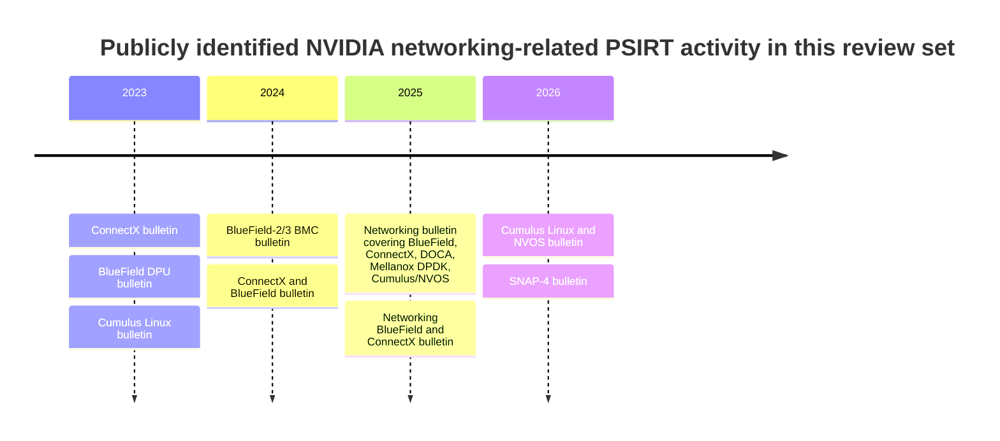

# Deep Research Report on NVIDIA Networking Product Security and Cyber Threats

## Assumptions and open questions

This report treats the topic as **NVIDIA networking and adjacent AI-infrastructure product security**, because the uploaded research brief specifies a cyber threat intelligence brief focused on NVIDIA networking, BlueField, ConnectX, Spectrum-X, Quantum InfiniBand, Cumulus Linux, NVOS, DOCA and closely related AI-infrastructure platforms. fileciteturn0file0

The main assumptions used in the analysis are these. First, the report prioritises products that NVIDIA itself places under **Networking**, **DPUs**, **InfiniBand**, **Ethernet**, and **Networking Software**, with adjacent consideration of DGX/HGX and GPU interconnects where they materially affect the same AI-cluster trust boundary. NVIDIA’s public product pages and documentation show this stack spans DPUs, Ethernet, InfiniBand, networking software, and associated management surfaces. citeturn8view6turn10view1turn10view2turn11view0turn11view2

Secondly, because no date range was specified, the evidence window defaults to the **last ten years**, but the report gives greatest weight to **2023 to June 2026** because that is where the strongest public primary evidence exists for NVIDIA PSIRT bulletins in the now-public GitHub repository and corresponding current product documentation. NVIDIA states that bulletins are publicly listed on its Product Security site and that GitHub publication began on 1 October 2025, with older bulletins being added progressively. citeturn13view0turn16view0

The biggest open questions are operational rather than factual. The brief does not specify which deployed versions, which cloud or on-premises environments, whether the estate uses managed BMCs, whether Cumulus/NVOS is internet-exposed, or whether the objective is primarily **defensive hardening**, **threat hunting**, **actor tracking**, **investment diligence**, or **product comparison**. Those missing details matter because current risk differs sharply between, for example, an internet-reachable management fabric and an isolated HPC fabric. That limitation is noted throughout as a confidence modifier. citeturn20view5turn21view0turn22view0

## Executive summary

The highest-confidence finding is that **NVIDIA’s networking estate now has a clearly evidenced, recurring stream of security issues across management interfaces, firmware, operating systems and containerised data-plane components**, rather than a single isolated class of weakness. Public NVIDIA bulletins from 2023 through June 2026 show vulnerabilities in **ConnectX**, **BlueField**, **BlueField BMC**, **Cumulus Linux**, **NVOS**, **DOCA**, **Mellanox DPDK** and **SNAP-4**. Several of these issues enable **privilege escalation**, **arbitrary code execution**, **denial of service**, **information disclosure**, or **data tampering**, with multiple bulletins rating issues as **High** severity. citeturn19view0turn18view5turn20view5turn21view0turn21view1turn22view0

The second major finding is that the most relevant attacker pressure comes less from public evidence of sustained attacks on NVIDIA specifically, and more from **strong ecosystem evidence that sophisticated actors increasingly target the same kinds of assets NVIDIA products inhabit or expose**: network appliances, routers, management planes, telecom infrastructure, virtualised control layers and AI infrastructure. Reuters reporting on **Salt Typhoon** and public reporting on **UNC3886** indicate sustained state-linked interest in network devices and critical communications infrastructure; Microsoft and other public reporting on large telecom intrusions reinforces that management-plane compromise of network fabric is now a strategic objective for major espionage actors. citeturn28news0turn28news1turn32news1turn34news0turn34search6turn34search7

Thirdly, the defensive centre of gravity should be shifted away from a GPU-only mindset. In practical terms, the **most exposed trust boundaries are not the accelerators themselves but the software and firmware around them**: NVUE, management interfaces on BlueField and ConnectX, switch operating systems, BMCs, containerised storage and data-plane services, and log or credential handling. This is consistent with the 2026 Verizon DBIR, which states that **31% of breaches now start with software vulnerabilities**, and that vulnerability exploitation has overtaken stolen passwords as the top initial route into breaches. citeturn41view2

Finally, there is a smaller but strategically important class of **research-led risks** around AI/GPU infrastructure itself. Recent academic work describes remote and cross-VM side-channel or disturbance attacks against NVIDIA accelerators and interconnects, including **Mercury** on a NVIDIA deep-learning accelerator, **NVBleed** on NVLink-enabled multi-GPU systems, and **GPUHammer** on NVIDIA GDDR6-based GPUs. At present these are mostly **research demonstrations rather than confirmed widespread operational attacks**, but they matter because they identify plausible future attack paths in shared AI infrastructure. Evidence strength here is lower than for PSIRT bulletins, but the implications for multi-tenant or cloud AI clusters are real. citeturn27academia1turn42academia0turn27academia4

## Research scope and method

The scope of this report covers five linked questions: what NVIDIA products are in scope; which public vulnerabilities most credibly matter; what attacker types are most relevant; what the strongest evidence says about trends; and what actions are prudent for owners, defenders and decision-makers. The working hypothesis is that **management-plane compromise and software/firmware weaknesses** are the dominant practical risks, while **hardware-side-channel and interconnect leakage** are emerging second-order risks. citeturn10view1turn10view2turn11view0turn20view5turn21view0turn22view0

The search strategy prioritised **official and primary sources** first: NVIDIA product pages and docs, NVIDIA PSIRT bulletins and repository, MITRE ATT&CK technique definitions, and a major industry benchmark report from Verizon. Those were supplemented with **reputable news reporting** where relevant to current actor activity and with **academic papers** for frontier risks. The default date range was the last ten years, with emphasis on 2023 to 2026 because that window contained the strongest public product-security evidence. citeturn13view0turn16view0turn36view0turn36view1turn36view2turn39view0

The evidence hierarchy used in synthesis is as follows. **High strength** means vendor bulletins, version matrices, or authoritative primary documentation. **Medium strength** means high-quality public reporting or respected CTI on adjacent infrastructures relevant to NVIDIA environments. **Low to medium strength** means academic or proof-of-concept research that demonstrates possibility, but not necessarily broad in-the-wild exploitation. citeturn20view5turn21view0turn21view1turn22view0turn28news0turn34news0turn27academia1turn42academia0turn27academia4

## Product landscape and attack surface

NVIDIA’s current networking documentation shows a layered estate. At the hardware and fabric level, NVIDIA documents **BlueField DPUs / SuperNICs**, **ConnectX adapters**, **Spectrum Ethernet switches**, and **Quantum InfiniBand switches**. At the software layer, NVIDIA documents **DOCA**, **Cumulus Linux**, **NVOS**, **Onyx**, and related switch software and firmware. This matters because each layer introduces a distinct attack surface: management interfaces, firmware update chains, switch operating systems, containerised services, BMCs, host integration packages, and orchestration interfaces. citeturn10view1turn10view2turn11view0

| Product family | What NVIDIA says it is | Main exposed surfaces | Security relevance |
|---|---|---|---|
| BlueField DPUs / SuperNICs | DPU / networking platform with BlueField hardware, platform software and DOCA documentation | Management interface, firmware, BSP/BMC, DOCA SDK and packages | High-value control point between host, network and storage; compromise can alter policy enforcement or data movement. citeturn10view1 |
| ConnectX adapters | Adapter and firmware family for accelerated networking | Firmware, management interface, host drivers/software | Often broadly deployed and close to the trust boundary between hosts and fabric. citeturn8view4turn20view5 |
| Spectrum Ethernet / Spectrum-X | Ethernet switch systems and switch software | Switch OS, web/API/CLI management plane, logs, firmware | Matters for east-west AI traffic and policy enforcement. citeturn10view2turn11view0 |
| Quantum / Quantum-2 InfiniBand | InfiniBand switches and firmware for HPC and AI | Switch firmware, NVOS, admin interfaces | Critical for AI/HPC cluster fabric availability and configuration integrity. citeturn8view5turn11view1turn11view0 |
| Cumulus Linux / NVOS | NVIDIA networking software and switch operating systems | NVUE interface, logs, credentials, local privilege boundaries | Public bulletins show repeated importance of software governance and privilege boundaries here. citeturn11view0turn21view0turn22view0 |
| SNAP-4 / DOCA containers | Containerised networking and storage services on BlueField | Container interfaces, config parsing, guest-to-service boundaries | Important for multi-tenant or VM-heavy storage/network offload use cases. citeturn21view1 |

A useful way to frame this is that NVIDIA’s networking stack is not just “switches and NICs”. It is a **programmable control fabric** spanning firmware, OS, SDKs and containers. That architecture is excellent for performance and offload, but it also means that compromise of a seemingly narrow component can have outsized effects on confidentiality, integrity or availability of the broader AI environment. That is an analytical conclusion grounded in the breadth of NVIDIA’s own documented stack and bulletin history. citeturn10view1turn10view2turn11view0turn20view5turn21view0turn21view1turn22view0

The timeline above is a **minimum public count identified in this review**, not an exhaustive historical count. It still shows a clear pattern: public issues are recurring across **firmware**, **management interfaces**, **switch operating systems**, and **container or package components**. citeturn19view0turn18view5turn20view5turn21view0turn21view1turn22view0

## Synthesised findings

### Vendor-confirmed vulnerability pattern

The strongest evidence comes from NVIDIA’s own security bulletins. In **October 2025**, NVIDIA stated that **BlueField and ConnectX** contained a vulnerability in the **management interface** that could allow a malicious actor with high privileges to execute arbitrary code, affecting multiple BlueField and ConnectX release families until specified firmware versions were applied. citeturn20view5

In **September 2025**, NVIDIA disclosed a broader networking bulletin covering **BlueField**, **DOCA**, **Mellanox DPDK**, **ConnectX**, and **Cumulus Linux / NVOS**. The bulletin included: incorrect authorisation in BlueField and ConnectX management interfaces; local privilege-escalation weaknesses in specific DOCA Debian packages; a Mellanox DPDK issue that could enable denial of service and information disclosure from a VM; and exposure of **hashed user passwords in log files** for Cumulus Linux and NVOS. That spread of issues is important because it shows risk across management, packaging, tenant isolation and operational logging rather than in one narrow codebase. citeturn21view0

In **February 2026**, NVIDIA published a dedicated **Cumulus Linux and NVOS** bulletin covering three **NVUE-interface** vulnerabilities that could allow low-privileged users to run unauthorised commands or inject commands, leading to **privilege escalation**. NVIDIA rated two of these issues at CVSS 8.0 and listed patched versions across Cumulus Linux GA/LTS and multiple NVOS lines, including GB200, GB300 and InfiniBand XDR switch variants. citeturn22view0

In **March 2026**, NVIDIA published a **SNAP-4** bulletin affecting **BlueField-3**, where a malicious guest VM could trigger denial of service in DPA or storage services through crafted messages or configurations. That is especially relevant for shared or virtualised environments because it illustrates a path from a guest-controlled boundary into fabric or storage availability impact. citeturn21view1

A compact comparison is below.

| Bulletin | Date | Affected area | Example impact | Evidence strength |
|---|---|---|---|---|
| NVIDIA BlueField and ConnectX | Oct 2025 | Management interface / firmware families | Arbitrary code execution with high privilege; medium severity in vendor scoring | High citeturn20view5 |
| NVIDIA Networking | Sep 2025 | BlueField, DOCA, Mellanox DPDK, ConnectX, Cumulus/NVOS | Privilege escalation, DoS, information disclosure, data tampering, password-hash leakage | High citeturn21view0 |
| NVIDIA Cumulus Linux and NVOS | Feb 2026 | NVUE interface | Command execution / injection leading to privilege escalation | High citeturn22view0 |
| NVIDIA Networking SNAP-4 | Mar 2026 | BlueField-3 container/services | Guest-triggered service crash or DPA/storage DoS | High citeturn21view1 |
| NVIDIA ConnectX / BlueField / Cumulus Linux earlier public bulletins | 2023–2024 | Adapter, DPU, switch OS and BMC lines | Recurring security bulletin activity across the estate | High for existence; lower for full technical detail in this review set citeturn19view0turn18view5 |

The trend line implied by these bulletins matches a broader industry pattern. Verizon’s 2026 DBIR reports that **31% of breaches now start with software vulnerabilities**, ahead of stolen passwords as the top way attackers get in, and also notes that common breach causes continue to include vulnerability exploitation and ransomware. For NVIDIA environments, that supports prioritising patch governance and exposure reduction on management and software components over a narrow focus on user credential theft alone. citeturn41view2

### Threat-actor relevance and hypotheses

There is **direct public evidence** that NVIDIA itself has been an attractive target. In 2022, the **LAPSUS$** intrusion into NVIDIA involved theft and leaking of proprietary information and employee credentials, which is a concrete reminder that both product IP and enterprise identity data around NVIDIA are of high value. The public-source quality here is lower than a primary filing, but the incident is widely reported and is directionally important. citeturn27search0

For current threat modelling, however, the more important point is **adjacency**. Public reporting on **Salt Typhoon** shows state-linked actors targeting telecom and communications infrastructure through network environments and, in some reported cases, routers and network management paths. Reuters reported that AT&T and Verizon acknowledged being targeted, and later that a US National Guard network was extensively compromised by the same actor set. Even where those intrusions are not against NVIDIA products, they strongly raise the likelihood that high-value AI networking estates would attract similar tradecraft if internet-reachable or weakly segmented. citeturn28news0turn28news1turn32news1turn34news0

Similarly, public summaries of **UNC3886** describe a Chinese espionage actor that has targeted **virtualisation and network security technologies**, and later compromised **routers** with tailored implants. That makes UNC3886 highly relevant as an *analogue threat* for NVIDIA estates that rely on DPUs, programmable NICs, switching OSs and management planes. This is not evidence of UNC3886 specifically targeting NVIDIA, but it is strong evidence that the class of infrastructure NVIDIA sells is operationally interesting to sophisticated state actors. citeturn34search6

The most useful threat hypothesis is therefore this: **the attacker most likely to matter is not the one “targeting GPUs” in the abstract, but the one seeking control of AI-cluster communications, storage offload, orchestration boundaries, and management interfaces**. NVIDIA’s own bulletins support that view, and MITRE ATT&CK technique definitions fit the observed pattern, especially **Exploit Public-Facing Application (T1190)**, **Exploitation for Privilege Escalation (T1068)**, **Valid Accounts (T1078)**, **Remote Services (T1021)**, **Unsecured Credentials (T1552)** and **Endpoint Denial of Service (T1499)** for service disruption scenarios. citeturn20view5turn21view0turn21view1turn22view0turn36view0turn36view1turn36view2turn36view3turn36view5turn36view6

| Actor or actor type | Relevance to this topic | Why it matters for NVIDIA estates | Confidence |
|---|---|---|---|
| LAPSUS$ | Direct but historical | Demonstrated that NVIDIA itself is a worthwhile target for extortion and data theft | Medium citeturn27search0 |
| Salt Typhoon | Indirect but highly relevant | Shows sustained strategic targeting of telecom and network infrastructure, including routers and management paths | Medium to high citeturn28news0turn28news1turn34news0 |
| UNC3886 | Indirect but highly relevant | Publicly associated with network-security and virtualisation technology targeting, including routers | Medium citeturn34search6 |
| Criminal ransomware / intrusion operators | Broadly relevant | DBIR shows software vulnerability exploitation is now a leading breach entry route | High for trend, lower for NVIDIA specificity citeturn41view2 |

### Research frontier risks

The third findings cluster is more exploratory. **Mercury** reports an automated remote side-channel attack against an off-the-shelf NVIDIA deep-learning accelerator, claiming it can recover model details from power traces with very low error rates. **NVBleed** reports timing and counter-based leakage on NVIDIA multi-GPU interconnects, including visible leakage across VMs in cloud settings. **GPUHammer** reports practical Rowhammer attacks on NVIDIA GDDR6 memory and shows the possibility of inducing failures that materially degrade machine-learning model accuracy. citeturn27academia1turn42academia0turn27academia4

These papers should not be read as evidence of widespread exploitation in enterprise environments. They should be read as **warning signals** about where AI-cluster security may be heading: toward attacks on shared accelerators, counters, memory and interconnects rather than only on host operating systems. That is especially relevant for multi-tenant GPU clouds, shared research clusters, and environments where management convenience keeps performance counters or telemetry broadly accessible. Evidence strength is **low to medium** because the demonstrations are academic or preprint-driven, not yet widely corroborated by vendor bulletins or incident reporting. citeturn27academia1turn42academia0turn27academia4

## Practical implications and recommendations

The practical implication is straightforward: if an organisation depends on NVIDIA networking or AI-cluster products, it should defend them as **security-critical control infrastructure**, not as “just high-performance networking”. NVIDIA’s own bulletins show that patched versions and release hygiene are often the decisive control. citeturn20view5turn21view0turn21view1turn22view0

A prioritised action plan is below.

| Priority | Action | Why it matters |
|---|---|---|
| Immediate | Build a verified asset inventory of BlueField, ConnectX, Spectrum, Quantum, Cumulus Linux, NVOS, DOCA and SNAP-4 components, including firmware and package versions | You cannot apply NVIDIA bulletin guidance accurately without exact version and platform visibility. citeturn20view5turn21view0turn21view1turn22view0 |
| Immediate | Remove internet exposure from management interfaces wherever possible; strongly segment NVUE, BMC and adapter/switch admin paths | The strongest bulletin evidence repeatedly centres on management and admin interfaces. citeturn20view5turn21view0turn22view0 |
| Immediate | Prioritise patching for NVUE, BlueField/ConnectX management stacks, DOCA packages, SNAP-4 containers, and log-handling issues in Cumulus/NVOS | These areas have confirmed public issues with privilege escalation, code execution, poor authorisation and information disclosure. citeturn20view5turn21view0turn21view1turn22view0 |
| Near term | Treat DPUs, SmartNICs and switch OSs as crown-jewel infrastructure in detection engineering and incident response runbooks | Adjacent actor activity shows network and control planes are strategic targets. citeturn28news0turn34news0turn34search6 |
| Near term | Restrict privileged telemetry and performance-counter access in shared AI environments; review tenant isolation around GPU and interconnect monitoring | This is a proportionate response to emerging side-channel research. citeturn42academia0turn27academia4 |
| Near term | Improve credential and logging hygiene on switch OSs and management services; specifically test for sensitive data leakage in logs | NVIDIA has already disclosed password-hash leakage in logs in this family. citeturn21view0 |
| Medium term | Align detections and threat hunts to ATT&CK techniques around public-facing exploitation, privilege escalation, valid accounts, remote services and unsecured credentials | Those ATT&CK techniques best match the vendor-confirmed and ecosystem-confirmed attack patterns. citeturn36view0turn36view1turn36view2turn36view3turn36view5 |

For boards, investors or procurement teams, the bottom line is that NVIDIA networking products should not be treated as “risky” in any exceptional sense; rather, they should be treated as **part of the same maturing but exposed network-device and AI-control-plane security category** now drawing regular CVE and threat-actor attention. That implies procurement and architecture decisions should favour **clear patch channels, operational isolation, firmware governance, and strong segmentation**, not only peak throughput or latency. This is an analytical judgement, but it is directly grounded in the pattern of NVIDIA bulletins and wider sector attack trends. citeturn20view5turn21view0turn21view1turn22view0turn41view2

## Gaps, uncertainties and next steps

This report is strongest on **publicly confirmed bulletins and product-surface analysis**. It is less complete on three points. First, older NVIDIA bulletins in the GitHub repository are visible in yearly indices, but some earlier file-level fetches were incomplete in the public interface used here, so technical depth for 2023 to 2024 bulletins is lower than for 2025 to 2026. Secondly, the report does not claim confirmed public evidence that current state actors are routinely exploiting NVIDIA networking products specifically; in several places the argument is an **adjacency-based threat assessment**. Thirdly, the research literature on GPU and interconnect attacks remains ahead of widespread operational confirmation. citeturn19view0turn18view5turn20view5turn21view0turn21view1turn22view0turn42academia0turn27academia4

The next practical steps are therefore clear. Narrow the estate to exact products and versions; map those versions to the NVIDIA bulletins identified here; validate whether NVUE, BMC, DOCA and SNAP-derived services are reachable outside trusted zones; and decide whether the environment is single-tenant, research-shared, or commercial multi-tenant, because that changes how seriously the side-channel and guest-to-service findings should be treated. If the topic is later narrowed further—for example to BlueField only, Cumulus/NVOS only, or DGX/HGX cluster security—the same framework can be adapted cleanly around that specific slice of the NVIDIA stack. citeturn10view1turn11view0turn20view5turn21view0turn21view1turn22view0