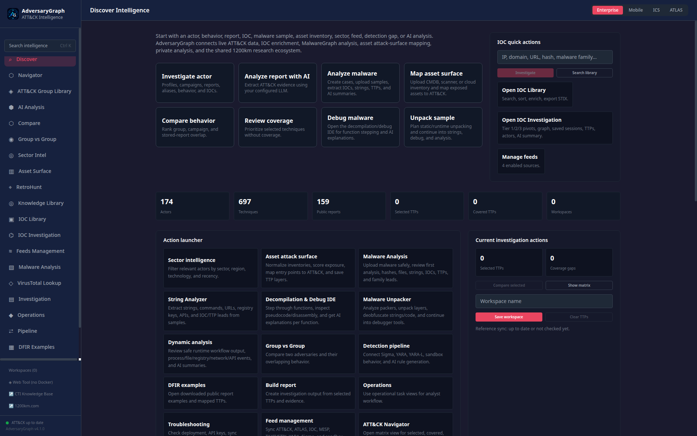
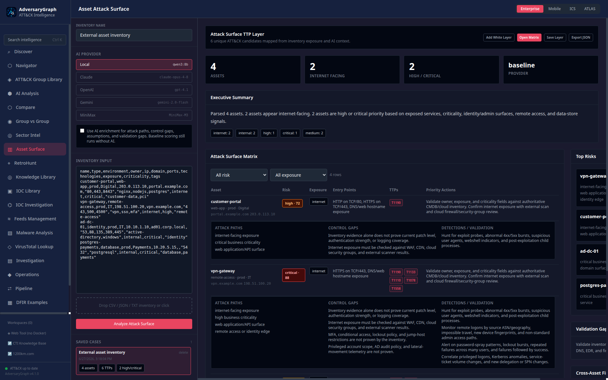
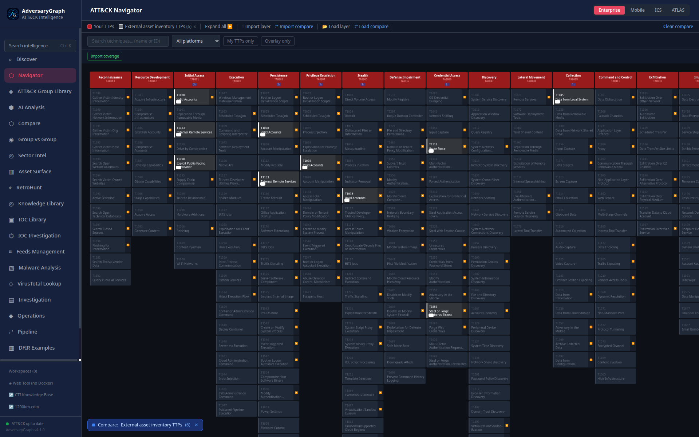

# Asset Attack Surface Mapping

Asset Attack Surface Mapping turns an asset inventory into an analyst-ready
attack surface matrix. It is designed for CMDB exports, cloud asset lists,
external scanner output, service inventories, and plain hostname/IP lists.

## Analyst Workflow

1. Open **Asset Surface** from the AdversaryGraph sidebar.
2. Upload a CSV, JSON, or TXT inventory, or paste the inventory directly.
3. Choose the AI provider. Local OpenAI-compatible models are supported.
4. Keep **Use AI enrichment** enabled when you want an executive summary,
   attack-path hypotheses, control gaps, assumptions, and validation steps.
5. Click **Analyze Attack Surface**.
6. AdversaryGraph creates a saved Asset Surface case for the analysis.
7. Review the matrix by risk and exposure, then open clickable ATT&CK technique
   tags in Navigator for detection planning.
8. Use **Add White Layer** to show all mapped candidates as a white comparison
   layer, **Open Matrix** to replace the current Navigator view with the
   asset-surface layer, **Save Layer** to store the layer server-side, or
   **Export JSON** for audit and handoff.
9. Reopen previous runs from **Saved Cases** when comparing inventories or
   refining an exposure review.

## Current Screenshots

The current screenshots are captured from the local Docker-served UI and
listed in
[`assets/adversarygraph-v4.1-platform/manifest.md`](assets/adversarygraph-v4.1-platform/manifest.md).

| Workflow | Screenshot |
|---|---|
| Discover launchers with Asset Surface and malware-analysis tools |  |
| Asset Surface analysis result with risk, exposure, TTPs, and actions |  |
| Saved previous Asset Surface cases |  |
| White Navigator layer for asset-inventory TTP candidates |  |

## Supported Inventory Fields

The parser accepts flexible field names. Common inputs include:

| Field meaning | Accepted examples |
|---|---|
| Asset name | `name`, `asset`, `hostname`, `host`, `fqdn`, `domain`, `ip` |
| Asset ID | `id`, `asset_id`, `cmdb_id` |
| Type | `type`, `asset_type`, `category`, `kind` |
| Environment | `environment`, `env`, `stage`, `account`, `subscription` |
| Owner | `owner`, `team`, `business_owner`, `service_owner` |
| IPs | `ip_addresses`, `ips`, `ip`, `ip_address`, `private_ip`, `public_ip` |
| Domains | `domains`, `domain`, `fqdn`, `dns`, `url`, `hostname` |
| Ports | `ports`, `open_ports`, `port`, `service_ports`, `listeners` |
| Technologies | `technologies`, `technology`, `services`, `software`, `product`, `stack` |
| Criticality | `criticality`, `business_criticality`, `tier`, `priority` |
| Tags | `tags`, `labels`, `business_unit`, `application` |

## Output Matrix

Each asset receives:

- Normalized asset metadata, IPs, domains, ports, technologies, owner, and
  criticality.
- Exposure classification: `internet`, `internal`, `third-party`, or `unknown`.
- Risk score and risk level based on exposure, criticality, remote
  administration, web/API services, databases, identity surfaces, containers,
  and remote-access indicators.
- Likely entry points such as HTTPS, SSH, RDP, SMB, database listeners, and DNS
  or web hostname exposure.
- ATT&CK technique candidates such as `T1190`, `T1021`, `T1005`, `T1078`, and
  `T1611`, rendered as clickable Navigator links.
- Priority actions and validation steps.
- Control gaps, detection ideas, and attack-path hypotheses. Baseline output
  always includes deterministic guidance; AI enrichment can add more specific
  business context and validation questions.
- Cross-asset findings, assumptions, and validation gaps when AI enrichment is
  enabled.

## Saved Cases

Every completed analysis is stored as an Asset Surface case in the backend. A
case preserves the full matrix JSON, summary, provider/model metadata, filename,
asset count, unique ATT&CK technique IDs, high/critical count, timestamps, and
validation gaps.

Saved cases can be reloaded from the left panel without re-uploading the
inventory. Deleting a case removes the saved matrix record, but it does not
delete any ATT&CK layer that was separately saved through **Save Layer**.

## ATT&CK Mapping Scope

The deterministic mapper links common asset-surface signals to relevant
ATT&CK Enterprise techniques. Examples:

| Surface signal | Example techniques |
|---|---|
| Internet-facing web/API surface | `T1190` Exploit Public-Facing Application |
| SSH/RDP/remote administration | `T1021` Remote Services |
| VPN, SSO, Citrix, or identity edge | `T1133` External Remote Services, `T1110` Brute Force |
| Active Directory, LDAP, Kerberos, SMB | `T1078` Valid Accounts, `T1558` Steal or Forge Kerberos Tickets |
| Databases and data stores | `T1005` Data from Local System |
| Cloud storage and backups | `T1530` Data from Cloud Storage, `T1552` Unsecured Credentials |
| Kubernetes, Docker, or container platforms | `T1611` Escape to Host |
| CI/CD and software-delivery systems | `T1195` Supply Chain Compromise, `T1608` Stage Capabilities |
| Legacy or unpatched technology signals | `T1068` Exploitation for Privilege Escalation |

These mappings are investigation leads. The analyst should accept, reject, or
refine them after validating real exposure and telemetry.

## AI Enrichment

The backend first builds a deterministic baseline matrix. AI enrichment then
receives only the parsed inventory and baseline risk matrix. The model is asked
to return strict JSON with executive summary, per-asset attack paths, control
gaps, validation steps, priority actions, assumptions, and validation gaps.

AI output is merged into the deterministic baseline instead of replacing it.
If the model fails or returns malformed JSON, the baseline matrix is still
returned.

## Validation Limits

The module does not prove that an asset is reachable or exploitable. Analysts
must validate:

- Current exposure with scanner, cloud firewall, security-group, and WAF data.
- Ownership and business criticality against authoritative CMDB records.
- Whether open ports are truly reachable from attacker-relevant networks.
- Patch level, authentication, logging, segmentation, and compensating controls.
- Whether suggested ATT&CK techniques are appropriate for the environment.

Use the matrix as a prioritization and investigation aid, not as an automated
vulnerability scanner or attribution mechanism.
