# AdversaryGraph v2.x Full Guide

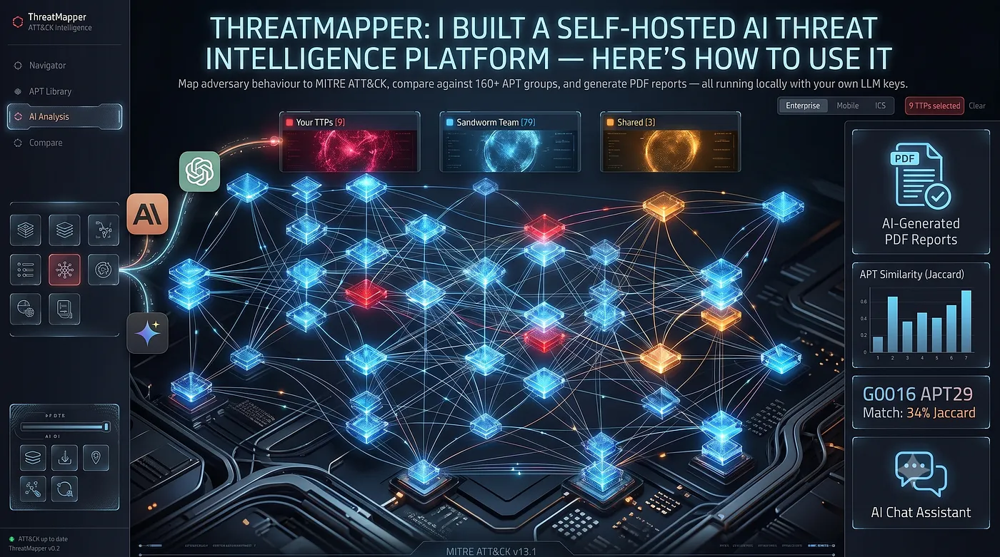

AdversaryGraph is a self-hosted CTI-to-detection workbench for turning threat
reports into MITRE ATT&CK mapping candidates, reviewing the supporting evidence,
comparing TTP overlap against known groups and campaigns, identifying detection
gaps, and exporting analyst-ready outputs.

AdversaryGraph is not an attribution engine. It helps analysts organize evidence
and investigation leads. Final mappings, similarity conclusions, and detection
handoffs require human review.

Public article and visual walkthrough:

- 1200km article: https://1200km.com/articles/adversarygraph-v2-self-hosted-ai-cti-platform.html
- Medium archive: https://medium.com/@1200km

## 1. Operating Modes

### Public Web Workspace

Use the public workspace for:

- ATT&CK exploration
- manual TTP layers
- group overlays
- browser-side comparison
- public ecosystem navigation

Do not upload confidential reports to public demos.

### Self-Hosted Docker Workspace

Use Docker mode for:

- private report analysis
- configured LLM providers
- local LLM gateways
- PostgreSQL-backed report history
- API-driven workflows
- PDF, Navigator, JSON, and STIX/OpenCTI exports
- scheduled ATT&CK synchronization

## 2. Installation

### Requirements

- Docker Engine
- Docker Compose v2
- 8 GB RAM available to Docker
- at least one AI provider key or a local OpenAI-compatible LLM endpoint

### Clone And Configure

```bash
git clone https://github.com/anpa1200/adversarygraph.git
cd adversarygraph
cp .env.example .env
```

Configure at least one provider:

```env
ANTHROPIC_API_KEY=
OPENAI_API_KEY=
OPENAI_MODEL=gpt-4.1
GEMINI_API_KEY=
```

For a local LLM:

```env
LOCAL_LLM_BASE_URL=http://host.docker.internal:11434/v1
LOCAL_LLM_API_KEY=local
LOCAL_LLM_MODEL=llama3.1:8b
```

Start:

```bash
docker compose up -d --build
```

Open:

| Service | URL |
|---|---|
| Frontend | http://localhost:3000 |
| API docs | http://localhost:8000/docs |
| Health | http://localhost:8000/api/health |
| Reference book | http://localhost:3001/anomaly-detection-atlas/ |

Health should return:

```json
{"status":"ok","version":"2.2.0"}
```

Run the built-in deployment self-test after Docker startup:

```bash
docker compose run --rm selftest
```

The self-test verifies database connectivity, Redis connectivity, and
ATT&CK/ATLAS reference data. If an API request fails in the UI, the error popup
shows the request context and provides:

- `Recheck` to rerun `/api/system/selftest`
- `Open troubleshooting` to open the internal Docker troubleshooting page

When recheck passes, the popup turns green and shows `All correct.`.

Internal troubleshooting page:

```text
http://localhost:3000/troubleshooting
```

## 3. Core Concepts

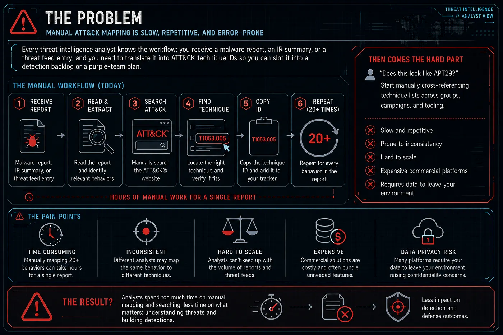

| Concept | Meaning |
|---|---|
| Technique | MITRE ATT&CK technique or sub-technique such as `T1566.002` |
| Evidence | Text from the report that supports a mapping |
| Review status | Analyst state: suggested, accepted, rejected, or needs evidence |
| Similarity | Jaccard overlap between selected TTPs and a group/campaign/report profile |
| Detection gap | A mapped behavior without sufficient telemetry, detection, or validation |
| STIX export | OpenCTI-ready bundle containing report, ATT&CK attack-patterns, and similarity leads |

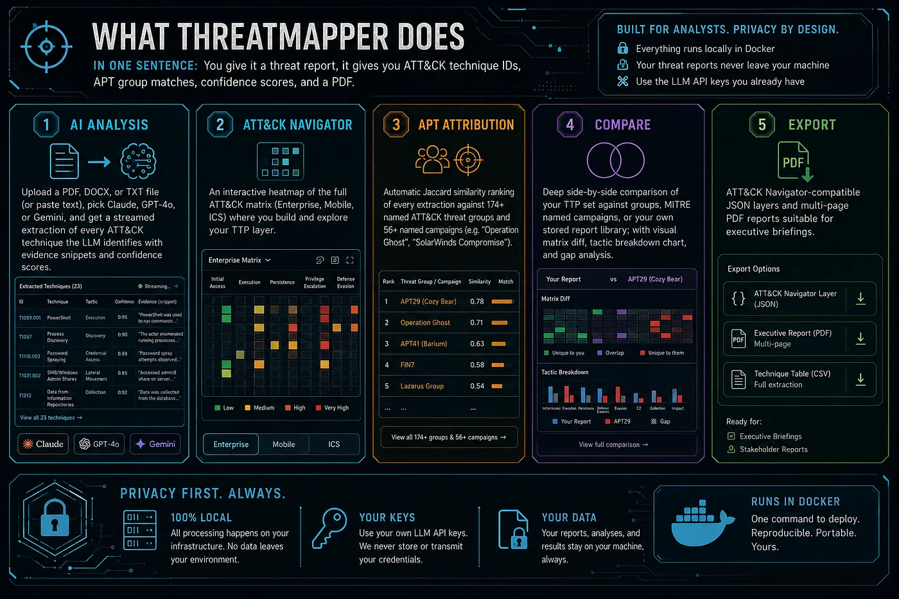

## 4. Discover Intelligence

The Discover page is the starting dashboard.

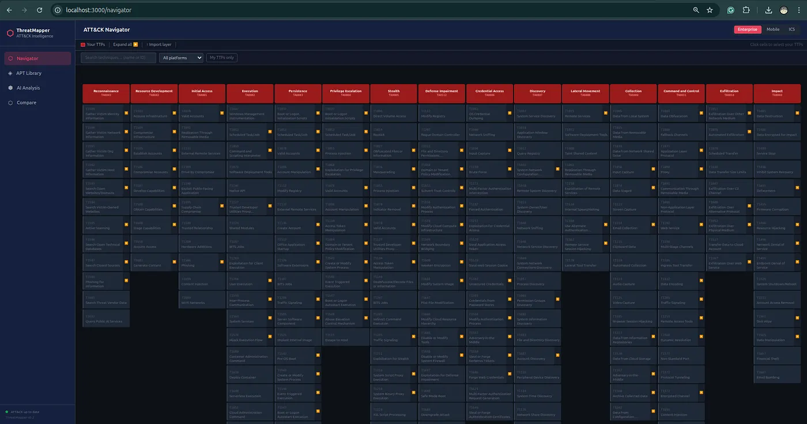

Use it to:

- start actor investigation
- launch AI analysis
- compare behavior
- review coverage
- see current ATT&CK object counts
- inspect most-referenced techniques
- open recent public intelligence examples

The page is designed for orientation, not final analysis.

## 5. AI Analysis

AI Analysis accepts:

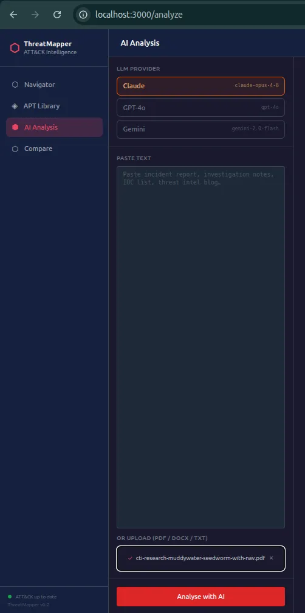

- pasted report text
- PDF files
- DOCX files
- TXT files

Providers:

- Claude
- OpenAI
- Gemini
- Local OpenAI-compatible endpoint

Workflow:

1. Select framework/domain: Enterprise ATT&CK, Mobile ATT&CK, ICS ATT&CK, or MITRE ATLAS.
2. Select provider.
3. Paste text or upload a supported file.
4. Run analysis.
5. Watch streamed model output.
6. Review extracted techniques.
7. Accept, reject, or flag mappings that need evidence.
8. Inject accepted TTPs into Navigator.
9. Export PDF or STIX/OpenCTI output.

Review every mapping. The model may over-map broad behaviors, miss
sub-techniques, or infer too much from actor/tool names.

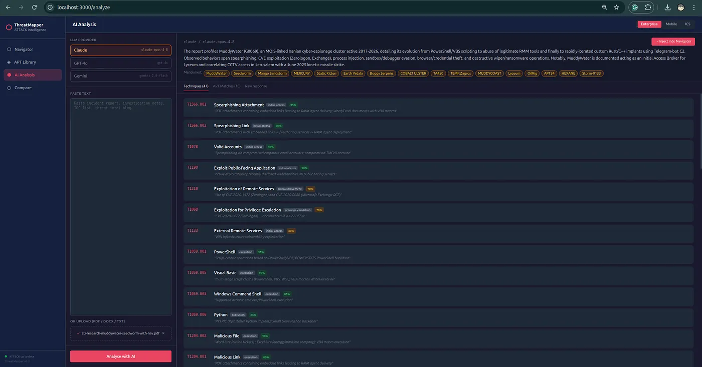

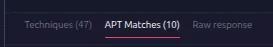

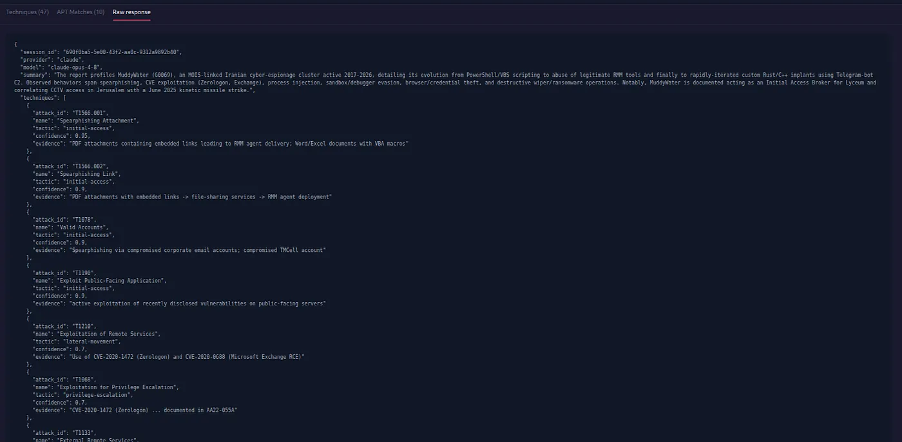

### Review Status

AdversaryGraph supports four analyst review states for extracted mappings:

- suggested
- accepted
- rejected
- needs-evidence

Use these states to separate raw model suggestions from analyst-reviewed
findings before exporting or injecting TTPs into Navigator.

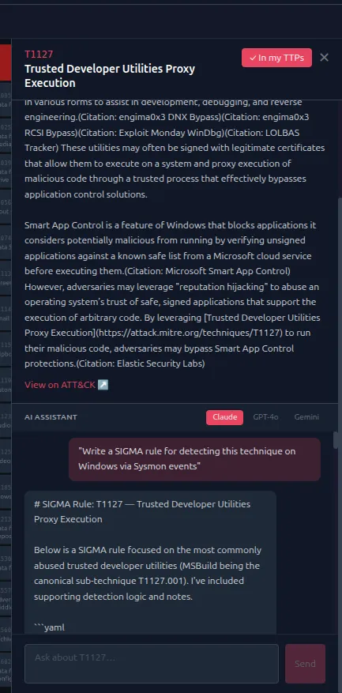

## 6. Local LLM Mode

Local mode is for private or offline-friendly analysis using an
OpenAI-compatible endpoint.

Common options:

- Ollama
- LM Studio
- LocalAI
- vLLM

Ollama example:

```bash
ollama pull llama3.1:8b
ollama serve
```

`.env`:

```env
LOCAL_LLM_BASE_URL=http://host.docker.internal:11434/v1
LOCAL_LLM_MODEL=llama3.1:8b
LOCAL_LLM_API_KEY=local
```

Use a capable model for extraction. Small models may produce incomplete JSON or
weak ATT&CK mappings.

## 7. Navigator

Navigator provides the ATT&CK matrix workspace.

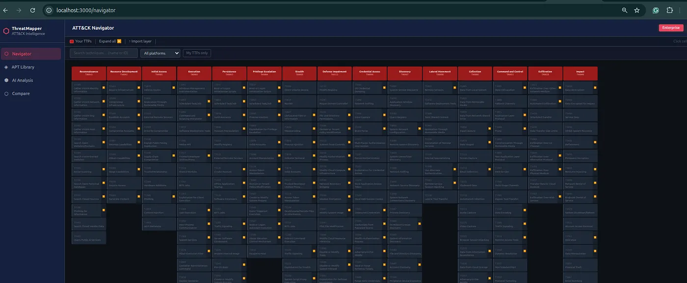

Capabilities:

- Enterprise, Mobile, ICS, and ATLAS domains
- zoom and pan matrix view
- sub-technique expansion
- technique search
- platform filtering
- manual TTP selection
- group overlay
- selected-technique side panel
- technique detail links
- import ATT&CK Navigator layer JSON
- save/load server-side layers
- export PDF
- export ATT&CK Navigator JSON

Color logic:

- red: in your selected TTP layer
- gray/blue: overlay or reference context
- amber: shared between your layer and overlay

Navigator is where reviewed AI results become an analyst-controlled TTP layer.

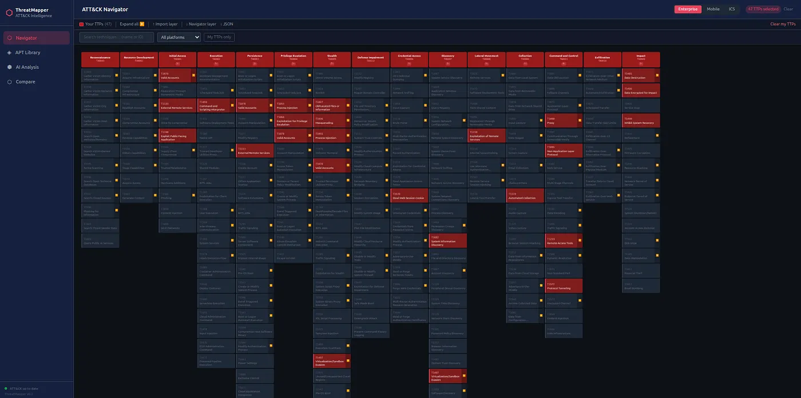

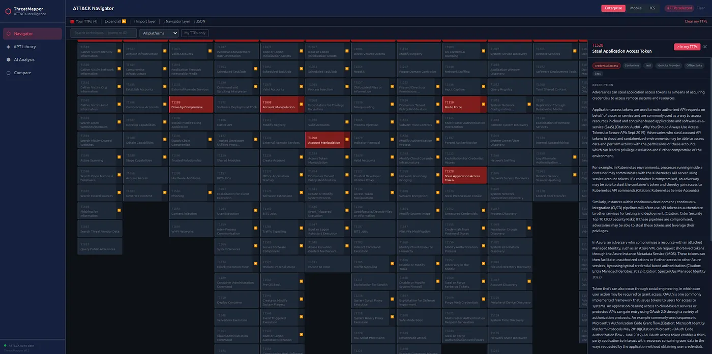

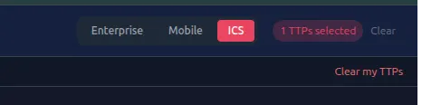

## 8. ATT&CK Group Library

The group library provides enriched ATT&CK actor context.

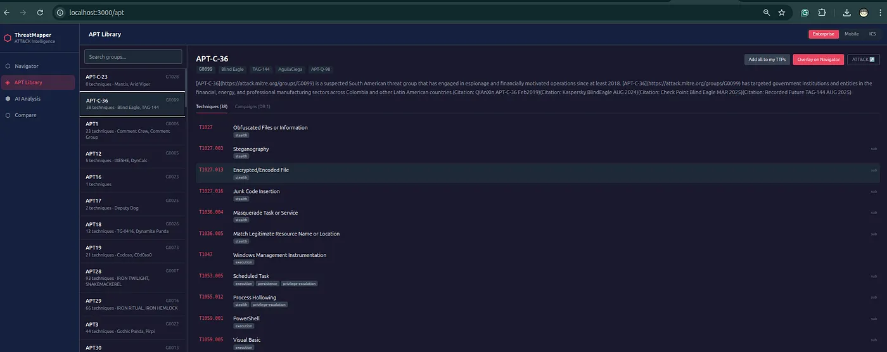

Each actor page includes:

- ATT&CK group ID
- aliases
- description
- STIX ID
- ATT&CK object version
- created/modified metadata
- mapped technique count
- campaign count
- tactic coverage
- observed platforms
- technique usage evidence
- source names
- external references
- ATT&CK source link

Use it to understand actor behavior profiles and to load actor TTPs into your
working layer.

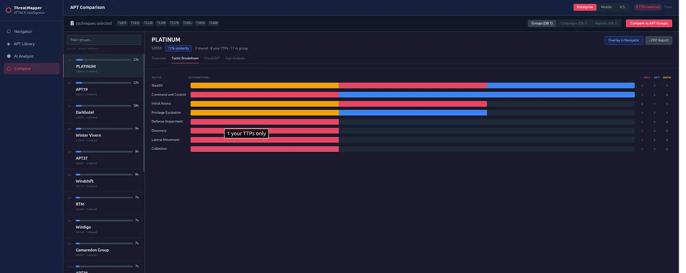

## 9. Campaigns

AdversaryGraph ingests ATT&CK campaign objects and relationships where available.

Use campaigns when group-level profiles are too broad. Campaigns often represent
more specific operations and may be better comparison targets for one incident
or report.

## 10. Compare

Compare has three modes:

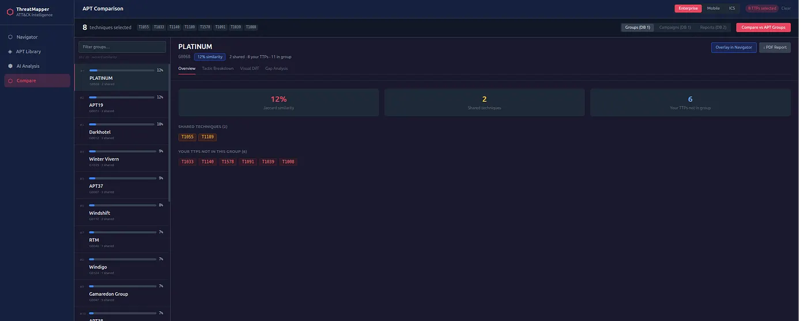

- Groups
- Campaigns
- Reports

### Groups

Ranks your selected TTP layer against known ATT&CK group profiles.

Use for:

- initial lead generation
- overlap review
- detection-gap prioritization

Do not use similarity alone as attribution.

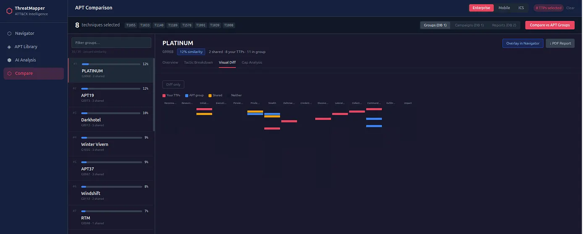

### Campaigns

Ranks your TTP layer against named ATT&CK campaigns.

Use for:

- operation-specific overlap
- narrower comparison than full group profiles
- retrospective behavior matching

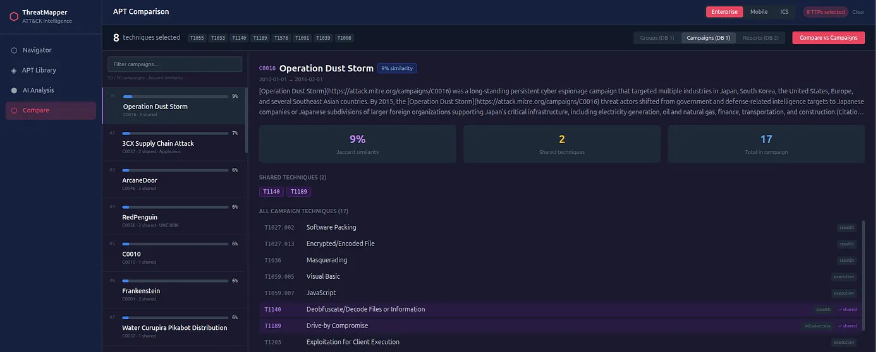

### Reports

Compares current TTPs against previous AI analyses stored in the local report
database.

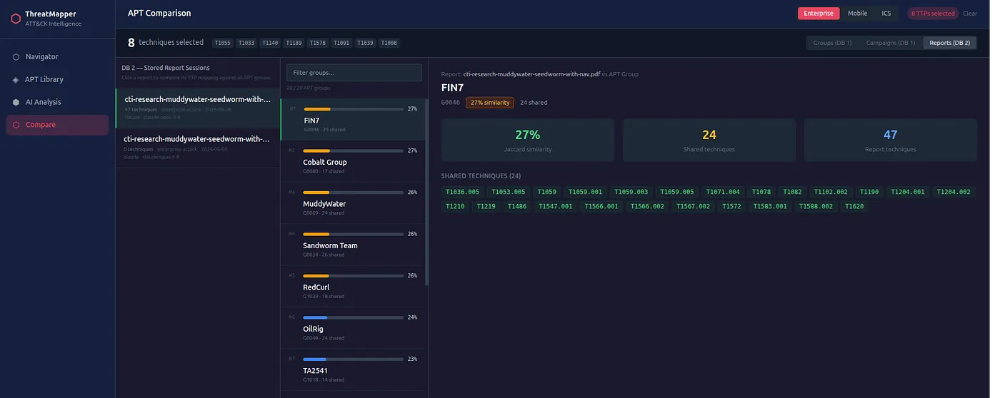

Use for:

- cross-report correlation
- repeated behavior discovery
- local incident clustering

## 11. Group vs Group

Group vs Group compares multiple ATT&CK group profiles.

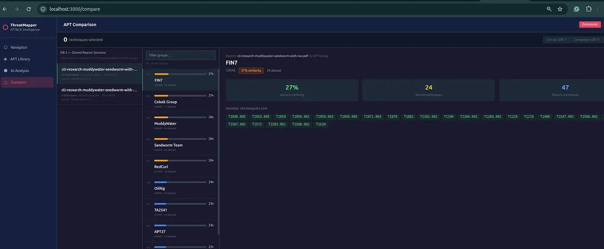

Views:

- overlap matrix
- combined ATT&CK view
- technique table

Use it to understand which actor profiles share commodity behavior and which
techniques are more distinctive.

## 12. DFIR Examples

The DFIR Examples page indexes public DFIR Report metadata.

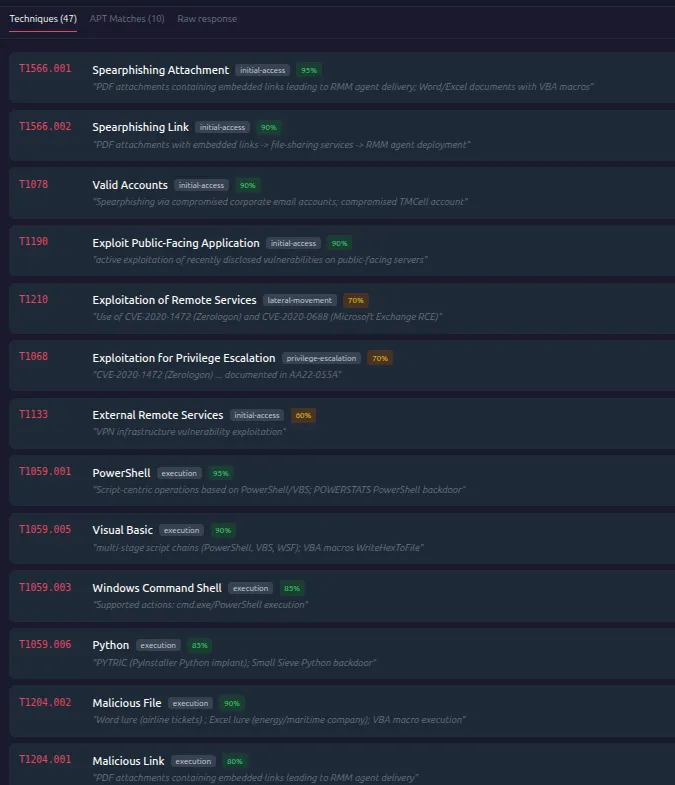

AdversaryGraph stores:

- title
- source URL
- date
- tags
- ATT&CK technique IDs
- actor mappings where available

AdversaryGraph does not mirror third-party report text, screenshots, or artifacts.

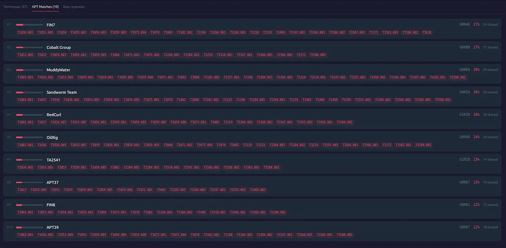

Workflow:

1. Open a source report.
2. Save a local PDF from the original source page.
3. Upload the PDF in AI Analysis.
4. Extract candidate TTPs.
5. Review evidence.
6. Compare against groups, campaigns, and previous reports.

## 13. Reference Sync

Reference Sync shows the state of ATT&CK data.

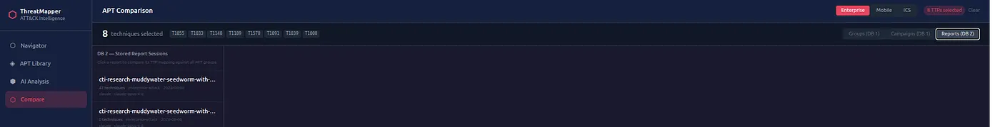

Capabilities:

- current ingested versions
- latest known versions
- stale/update-needed state
- manual sync trigger
- Enterprise, Mobile, ICS, and ATLAS domain selection
- force sync option

Scheduled sync runs through Celery Beat. Manual sync is available through the UI
and API.

## 14. Sector Intelligence

Sector Intelligence is a v2.1 workflow for client-facing relevance triage. It answers:

- which actors are relevant to a client sector
- which actors have sector or geography evidence
- which actors have recent ATT&CK campaign context
- why the actor was ranked
- which source supports the claim

The initial local sync source is MISP Galaxy threat actors. AdversaryGraph stores
observations locally, including targeted sectors, CFR target categories, suspected
victim geographies, origin metadata, motivations, aliases, and references.

Workflow:

1. Open Sector Intel.
2. Click Sync MISP Galaxy.
3. Select client sector.
4. Add optional region or geography.
5. Add environment keywords such as cloud, Kubernetes, Microsoft 365, OT, or VPN.
6. Select quarter, year, or two-year activity window.
7. Review ranked actors, reasons, and evidence.

The scoring combines:

- direct sector evidence
- broad private-sector evidence
- region/geography evidence
- recent ATT&CK campaign activity
- ATT&CK technique depth
- source confidence

Broad labels such as private sector are treated as weak supporting evidence. Direct
sector matches such as telecom, finance, energy, healthcare, or government carry
more weight.

## 15. IOC Intelligence

IOC Intelligence adds source-backed observables to actor profiles. ATT&CK provides
TTP and campaign relationships, but it does not provide live indicators. AdversaryGraph
therefore stores IOCs in a separate local database with source, freshness, confidence,
and evidence.

Initial sources:

- abuse.ch ThreatFox for recent malware-related IOCs. The recent IOC API supports
  1-7 day windows; use ThreatFox exports or custom feeds for larger windows.
- AlienVault OTX actor-attributed pulses. Set `OTX_API_KEY`; AdversaryGraph searches
  actor names/aliases, imports pulse indicators, and links indicators when pulse
  adversary/title/tags match the actor.
- custom or personal JSON, CSV, and TXT IOC feeds
- manual JSON import for report, MISP, OpenCTI, or vendor CTI extracts

Before syncing ThreatFox, set:

```bash
THREATFOX_AUTH_KEY=your_abusech_auth_key
```

Actor mapping is conservative:

- direct manual imports can set `actor_attack_id` or `actor_name`
- ThreatFox IOCs are linked only when IOC metadata contains an actor name or alias
- each IOC keeps source URL, first/last seen, confidence, TLP, malware family, tags,
  and the relationship evidence

Workflow:

1. Open ATT&CK Group Library.
2. Select an actor.
3. Open the IOCs tab.
4. Click Sync ThreatFox, add a custom feed, or import report-backed IOCs through
   the API.
5. Review current IOCs and export CSV when needed.

Custom JSON/CSV feeds can include:

```text
value, type, actor_attack_id, actor_name, malware_family, campaign,
source_url, first_seen, last_seen, confidence, tlp, tags, description
```

TXT feeds are parsed as one IOC per line. AdversaryGraph infers basic types such as
IPv4, URL, domain, email, MD5, SHA1, and SHA256.

API:

```text
GET  /api/ioc/sources
POST /api/ioc/sources
POST /api/sync/ioc?days=7
POST /api/ioc/sync/threatfox?days=7
POST /api/ioc/sync/otx
POST /api/ioc/sync/{source_id}
POST /api/ioc/import
POST /api/ioc/report
GET  /api/ioc/actors/counts?actor_ids=G0049
GET  /api/ioc/actors/G0049?days=180&active_only=true
GET  /api/ioc/actors/G0049/summary?days=180
GET  /api/ioc/actors/G0049/export.csv?days=180&active_only=true
```

## 16. Reference Book

The embedded reference book provides additional detection and anomaly context.

Use it from:

- technique detail panels
- Navigator
- actor pages
- reference links

The reference book supports paragraph-level links into relevant defensive
guidance.

## 17. Operations And Pipeline

The Operations and Pipeline areas provide a working structure for future
investigation management and intake workflows.

Current capabilities include:

- investigation records
- intake records
- detection candidates
- tracked actor records
- collection source/run models
- observable extraction
- audit-event structure
- STIX/MISP/ATLAS import endpoints for normalized report intake

Treat these as analyst workflow scaffolding and integration points.

## 18. Exports

### PDF Report

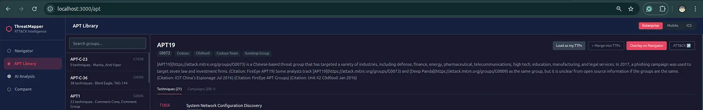

From AI Analysis:

- provider/model metadata
- domain
- summary
- extracted techniques
- evidence
- group similarity leads
- tactic coverage

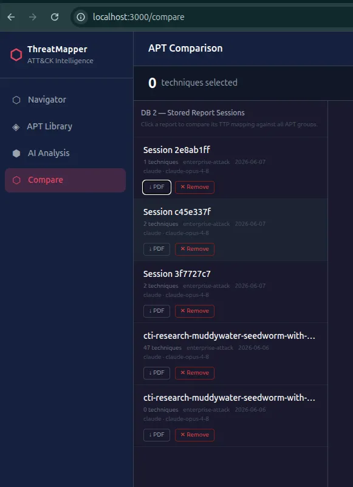

### STIX/OpenCTI

From AI Analysis:

```text
GET /api/export/analysis/{session_id}/stix
```

The STIX bundle contains:

- `report`
- ATT&CK `attack-pattern` objects
- optional `intrusion-set` objects for similarity leads
- `x_adversarygraph_*` custom metadata. These legacy STIX custom fields are kept for compatibility with existing exports after the AdversaryGraph rename.

This is not an IOC export. It is designed for report/TTP workflows in OpenCTI.
Similarity leads are not attribution.

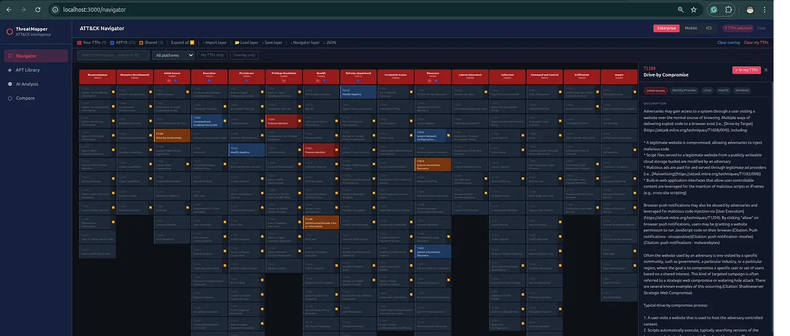

### ATT&CK Navigator Layer

From Navigator:

- selected techniques
- ATT&CK domain
- Navigator-compatible JSON

### Layer PDF

From Navigator:

- selected techniques
- tactic/platform metadata
- printable working-layer summary

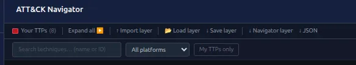

## 19. API Overview

Common endpoints:

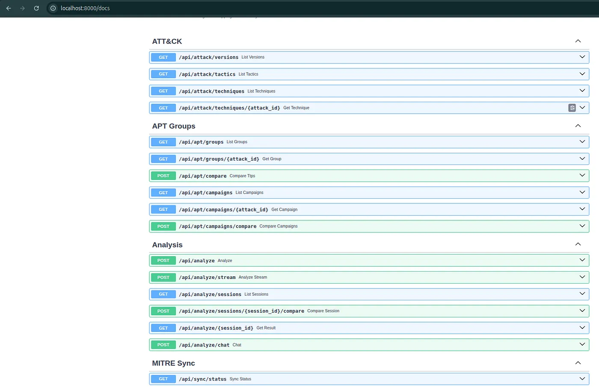

```text
GET  /api/health
GET  /api/attack/versions
GET  /api/attack/techniques
GET  /api/attack/techniques/{attack_id}
GET  /api/apt/groups
GET  /api/apt/groups/{group_id}
POST /api/apt/compare
GET  /api/apt/campaigns
POST /api/apt/campaigns/compare
POST /api/analyze
POST /api/analyze/stream
GET  /api/analyze/sessions
GET  /api/analyze/{session_id}
PATCH /api/analyze/sessions/{session_id}/techniques/{attack_id}/review
GET  /api/export/analysis/{session_id}
GET  /api/export/analysis/{session_id}/stix
POST /api/export/layer
GET  /api/sync/status
POST /api/sync/trigger
GET  /api/sector/sources
GET  /api/sector/relevance
GET  /api/ioc/sources
POST /api/ioc/sync/threatfox
POST /api/ioc/import
GET  /api/ioc/actors/{actor_id}
```

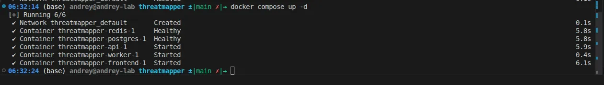

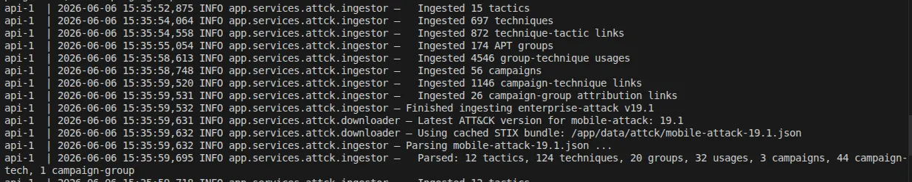

## 20. Analyst Review Rules

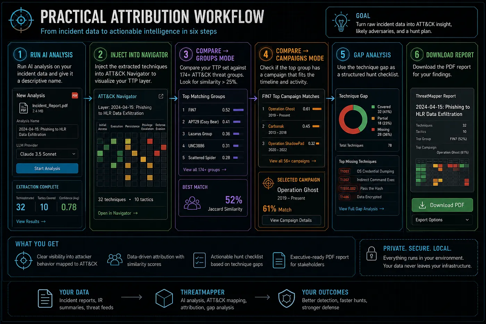

Use these rules before promoting output:

- ATT&CK overlap is not attribution.
- Similarity scores are leads, not conclusions.
- Actor names in source text do not prove actor activity.
- Tool names do not automatically imply techniques.
- Evidence must describe behavior.
- Prefer sub-techniques when evidence supports them.
- Reject mappings without behavioral evidence.
- Document uncertainty in final reporting.

## 21. Privacy And Deployment Boundaries

Do not upload confidential reports into public demos.

For private analysis:

- self-host the Docker stack
- use local LLM mode or a provider with acceptable retention terms
- restrict network access
- place the app behind TLS and authentication
- define retention policy for uploads, raw responses, and exports
- back up PostgreSQL if report history matters

## 22. Recommended End-to-End Workflow

1. Start with a public or authorized report.
2. Run AI Analysis.
3. Review every extracted mapping.
4. Accept only evidence-backed TTPs.
5. Inject accepted TTPs into Navigator.
6. Compare against groups.
7. Compare against campaigns.
8. Compare against previous reports.
9. Review detection gaps.
10. Export PDF for analyst handoff.
11. Export STIX/OpenCTI if promoting to a CTI platform.
12. Record uncertainty and avoid attribution claims unless supported by
    independent evidence.

## 23. Visual Appendix

The following images are the screenshots, diagrams, and infographics used in
the published AdversaryGraph v2.0 article and retained here as local project
assets.


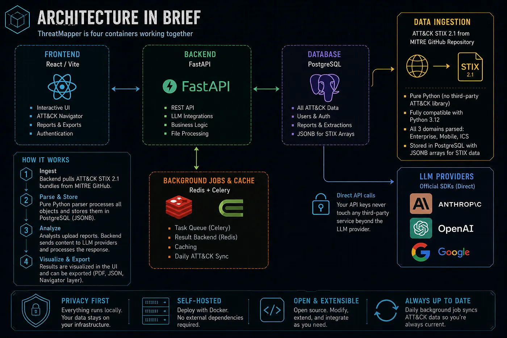


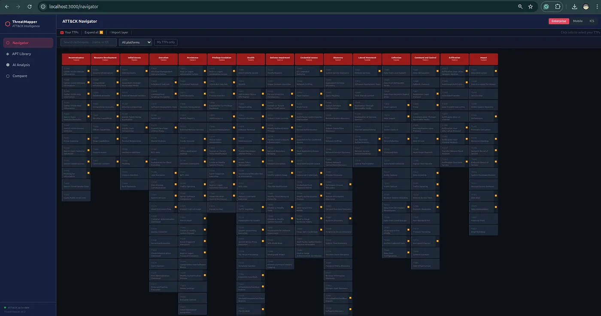


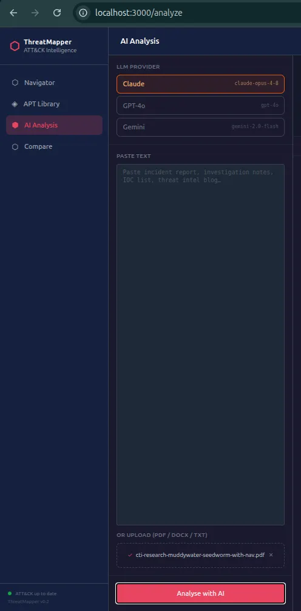


