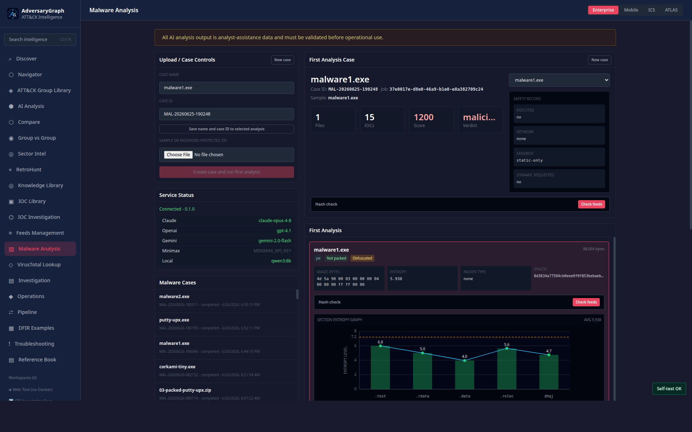
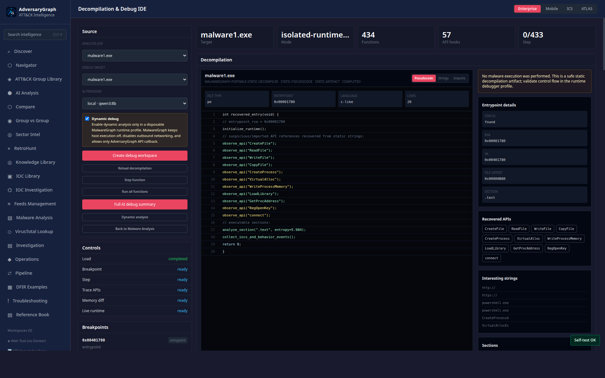
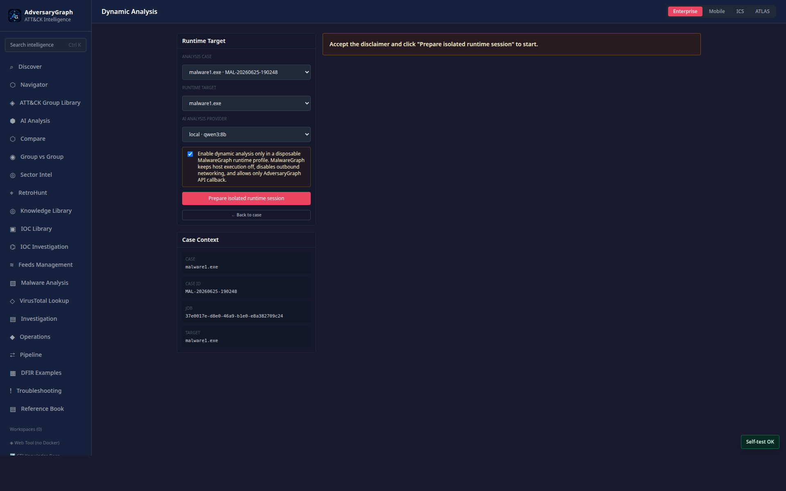

# Malware Analysis Module

  

> **UNDER CONSTRUCTION:** Malware Analysis is a new AdversaryGraph module and is
> not a final malware-verdict system. Static analysis, decompilation,
> runtime-debug plans, IOC extraction, ATT&CK mapping, family leads, and AI
> summaries are analyst-assistance data. Validate all findings before using them
> for incident response, legal reporting, customer reporting, blocking, or
> attribution.

## Status

AdversaryGraph v3.2.0 introduces the integrated MalwareGraph module as a
Docker Compose connected capability. The module can run as a standalone
MalwareGraph workbench or as a native AdversaryGraph page backed by the same
analysis service.

The current implementation focuses on safe intake, static triage, clickable
IOC/TTP extraction, first-analysis workflow controls, string analysis, AI
assistance hooks, and dynamic-debug planning. Runtime debugging is gated behind
an explicit operator policy and should be enabled only in a disposable,
network-isolated profile.

## Deployment Modes

| Mode | Use case | Integration behavior |
|---|---|---|
| Integrated AdversaryGraph | Normal platform workflow | The Malware Analysis page submits samples to the isolated MalwareGraph API through the AdversaryGraph backend and imports normalized findings as clickable graph entities. |
| Standalone MalwareGraph | Separate malware-analysis workbench | MalwareGraph runs from its own Docker Compose stack and emits the same `analysis.json` contract for later import into AdversaryGraph. |

## Malware Analysis Technology Stack

The current implementation uses the following real libraries, binaries, and
internal modules.

| Layer | Actual library / module | Short description |
|---|---|---|
| MalwareGraph API | `fastapi`, `uvicorn[standard]`, `python-multipart`, `malwaregraph.api.app` | Serves the malware-analysis REST API, file uploads, job state, reports, strings, unpacking, decompilation, and debug workspaces. |
| Data models and config | `pydantic`, `pydantic-settings`, `malwaregraph.core.models`, `malwaregraph.core.config` | Defines result contracts, settings, job records, graph entities, debug sessions, and API response schemas. |
| Archive intake | Python `zipfile`, `pyzipper`, `malwaregraph.services.archive`, `malwaregraph.workers.static_worker` | Handles password-protected ZIPs and safe extraction into MalwareGraph quarantine/storage. |
| File identity | Python `hashlib`, `malwaregraph.services.hashing` | Calculates MD5, SHA1, and SHA256 for samples and recovered layers. |
| Static file analysis | Python `struct`, `math`, `pathlib`, `malwaregraph.services.static_analysis` | Implements file classification, entropy calculation, PE header parsing, section metadata, imports, resources, and first-analysis artifacts. |
| Packer detection | `malwaregraph.services.packing`, `malwaregraph.services.unpack` | Uses section markers, entropy, packer names, import scarcity, overlay/encoded-payload signals, and heuristic packer profiles. |
| Static unpack/depacking | `upx-ucl` binary, Python `subprocess`, `zlib`, `bz2`, `lzma`, `base64`, XOR scan logic in `malwaregraph.services.unpack` | Runs deterministic `upx -d` when UPX is detected and available; also tries bounded static recovery for zlib/gzip, bz2, lzma, base64, hex, and XOR-like payloads. |
| Runtime unpack | `unipacker==1.0.8`, child Python process wrapper in `malwaregraph.services.unpack` | Provides PE32 emulation-style unpack attempts when explicitly enabled by policy. Qiling profile names exist in planning output, but Qiling is not currently installed as a dependency. |
| Strings | Python `re`, `base64`, JSON helpers, entropy scoring, `malwaregraph.services.strings` | Extracts ASCII/UTF-16LE strings, decodes base64/hex candidates, classifies string categories, and optionally sends string context to AI. |
| IOC extraction | Python `re`, `ipaddress`, `urllib.parse`, `malwaregraph.services.iocs` | Extracts and normalizes IPs, domains, URLs, hashes, emails, registry paths, and other IOC-style values. |
| APK/static Android support | Python `zipfile`, `malwaregraph.services.android` | Performs archive/APK-style static extraction and Android-related string/IOC handling. |
| Disassembly and code graph | `capstone>=5`, fallback hex preview, `malwaregraph.services.workflow_graph`, `malwaregraph.services.debug_workspace` | Uses Capstone for x86/x64 disassembly, direct code-reference extraction, function traces, and debugger graph construction. |
| Decompilation view | `malwaregraph.services.decompilation` | Internal static pseudocode/decompilation artifact builder. It does not use Ghidra, IDA, RetDec, or `pefile`; it combines PE metadata, recovered WinAPI strings, entrypoint details, sections, and warnings. |
| Debug workspace | In-memory workspace store in `malwaregraph.services.debug_workspace` | Provides IDA/OllyDbg-style function stepping, breakpoints, register/stack snapshots, memory regions, API hooks, graph export, and AI debug summaries. |
| AI provider calls | `httpx`, `malwaregraph.services.ai.factory` | Calls Claude, OpenAI, Gemini, MiniMax/OpenAI-compatible, local OpenAI-compatible endpoints, or the AdversaryGraph LLM proxy. |
| Reporting and graph | `collections.Counter`, `urllib.parse`, `malwaregraph.services.report`, `malwaregraph.services.workflow_graph` | Builds submission reports, workflow graphs, IOC/TTP leads, route links, and normalized findings. |
| AdversaryGraph proxy | `httpx`, `backend/app/services/malwaregraph.py`, `backend/app/api/routes/malwaregraph.py` | Proxies AdversaryGraph `/api/malwaregraph/*` routes to the MalwareGraph service and exposes custom LLM completion. |
| Frontend | React 18, Vite, TypeScript, Tailwind CSS, `@tanstack/react-query`, `axios`, `react-router-dom` | Implements Malware Analysis, String Analyzer, Unpacker, Dynamic Analysis, and Decompilation & Debug IDE pages. |
| Container isolation | Docker Compose, read-only container, `cap_drop: ALL`, `no-new-privileges`, `tmpfs`, CPU/memory/PID limits | Runs MalwareGraph as a restricted service with storage volumes for quarantine/artifacts/logs. |

The important design rule is that static, decompilation, depacking, runtime, and
AI results are not merged into a single opaque verdict. They stay separated so
an analyst can see which conclusion came from file bytes, which came from
runtime behavior, and which came from AI interpretation.

Not currently bundled as analysis libraries: Ghidra, IDA Pro, RetDec, `pefile`,
CAPE/Cuckoo, YARA, Volatility, Frida, or Qiling runtime execution. The UI can be
IDA/OllyDbg-style, but those commercial tools are not embedded.

## Screenshots

Current v4 UI screenshots are stored under
[`docs/assets/malware-analysis-v4`](assets/malware-analysis-v4/manifest.md).

| View | Screenshot |
|---|---|
| Malware Analysis dashboard |  |
| Decompilation & Debug IDE |  |
| Dynamic Analysis workflow |  |

## Safety Model

The malware-analysis service is separated from the main AdversaryGraph
application containers. The default workflow is static-only and does not execute
submitted samples.

Required operating assumptions:

- upload samples only in a private self-hosted deployment;
- keep malware artifacts out of public demo environments;
- run the MalwareGraph service with dropped capabilities, constrained CPU,
  memory, and PID limits, and a restricted filesystem;
- keep outbound internet disabled for analysis jobs by default;
- use hash and IOC lookups for enrichment unless an operator explicitly permits
  third-party binary submission;
- enable `MALWAREGRAPH_ENABLE_DYNAMIC_DEBUG=true` only for a disposable VM,
  microVM, or equivalent isolated debug profile with no production network route.

## Analyst Workflow

1. Upload a password-protected ZIP archive or a raw sample file.
2. Review first-analysis results: file type, magic bytes, hashes, entropy,
   packed status, packer hints, obfuscation hints, PE headers, sections,
   imports, and extracted files.
3. If packed, use the unpack action to create a controlled unpacking task.
4. If obfuscated, run the AI obfuscation-technique analysis as an
   analyst-assistance step.
5. Open the Strings workflow:
   - extract all strings with minimum and maximum length filters;
   - run smart extraction for WinAPI, Android API, registry keys, commands,
     PowerShell, filenames, IPs, domains, URLs, hashes, mutexes, and other IOC
     candidates;
   - run AI string analysis to classify commands/functions, keys, IPs, URLs,
     TTP evidence, and suspicious behaviors.
6. Review the graphical malware workflow/debug graph when dynamic evidence or
   debug-plan data exists.
7. Click extracted IOCs and TTPs to pivot into existing AdversaryGraph IOC
   Intelligence, IOC Investigation, ATT&CK Navigator, Compare, and evidence
   views.

## Reference Use Cases

Use these Windows-focused profiles to exercise the module. They are written as
sample profiles, not download instructions. Live malware must come from an
authorized private corpus or incident-response case and must stay outside the
Git repository.

| Use case | Sample profile | Primary module behavior |
|---|---|---|
| Clean control | Known-good Windows PE, preferably signed or internally built | Confirms PE parsing, hashes, imports, strings, and AI caution without malicious assumptions. |
| Simple packer | Authorized Windows PE packed once with a common packer | Validates packer detection, entropy change, static unpack, and before/after target comparison. |
| Runtime-unpack packed malware | Authorized Windows malware where static unpack fails | Validates runtime-unpack planning, policy gates, dynamic disclaimer, and isolated runtime evidence. |
| Obfuscated code | Authorized Windows malware with encoded strings, API hashing, encrypted config, or confusing control flow | Validates obfuscation analysis, string classification, function explanation, and validation gaps. |
| Multilayer packed malware | Authorized Windows loader/dropper with nested layers or staged payloads | Validates repeated unpack/deobfuscation, saved targets, layer evidence, and cross-layer IOC/TTP correlation. |

Operational rules:

- keep live samples in a private malware-lab path outside the repository;
- store samples zipped and password-protected when not actively analyzing them;
- record source, authorization, SHA256, expected profile, and runtime permission;
- use static analysis first for every profile;
- enable dynamic analysis only in a disposable, network-isolated sandbox profile;
- never upload live samples to public demo deployments.

## Clickable Findings

All normalized findings should preserve evidence and route into AdversaryGraph
instead of remaining as plain report text.

| Finding | Route |
|---|---|
| Hashes | Hash IOC detail, IOC Library, VirusTotal lookup when configured |
| IPs, domains, URLs | IOC detail, IOC Investigation pivots, enrichment history |
| ATT&CK TTPs | ATT&CK Navigator and technique evidence drawer |
| Commands, scripts, registry keys, mutexes, file paths | Malware evidence drawer with promotion to IOC or behavior where applicable |
| Functions and behaviors | Malware graph/debug view and supporting artifacts |
| Detections | Detection Studio with malware evidence attached |

## AI Assistance

AI output is stored as untrusted analyst assistance. The module uses the same
LLM provider configuration as AdversaryGraph: Claude, OpenAI, Gemini, MiniMax,
and local OpenAI-compatible endpoints when configured.

AI stages are expected to return structured evidence:

- string classification by command/function, key, IP, URL, file, Android API,
  WinAPI, registry, credential, encryption, network, persistence, defense
  evasion, and execution category;
- ATT&CK TTP candidates with evidence strings and confidence;
- suspicious behavior summaries with uncertainty notes;
- deobfuscation and unpacking hypotheses;
- analyst next-step recommendations.

## Current Limitations

- The module is under construction and should not be treated as production-grade
  malware attribution or final verdict automation.
- Runtime debugging remains policy-gated. The UI shows a disclaimer checkbox,
  and the backend requires `MALWAREGRAPH_ENABLE_DYNAMIC_DEBUG=true`.
- Dynamic function graphs are meaningful only when dynamic analysis or debug
  evidence exists. Static-only jobs may show metadata, triage, strings, and
  planned debug steps instead.
- AI analysis can miss indicators or produce incorrect classifications. Analyst
  review is mandatory.

For the deeper architecture and result-contract design, see
[Malware Analysis Architecture](malware-analysis-architecture.md).
