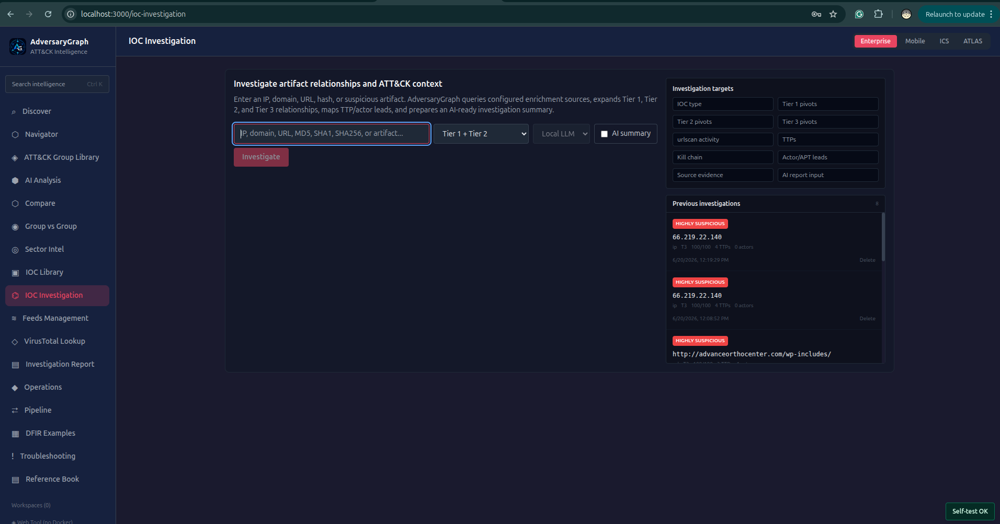
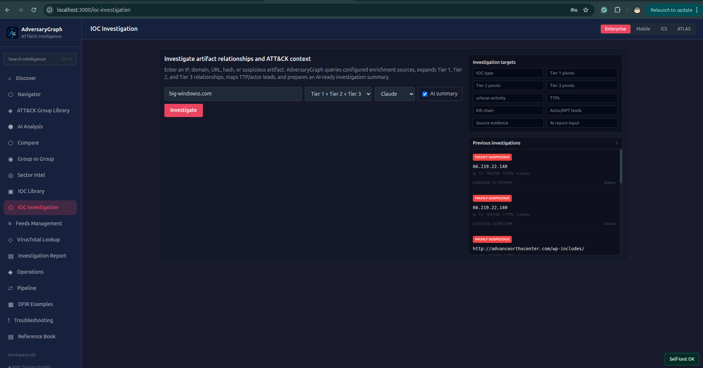
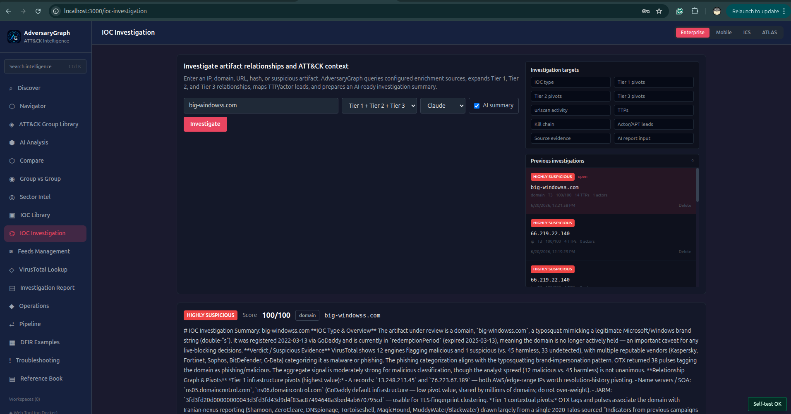
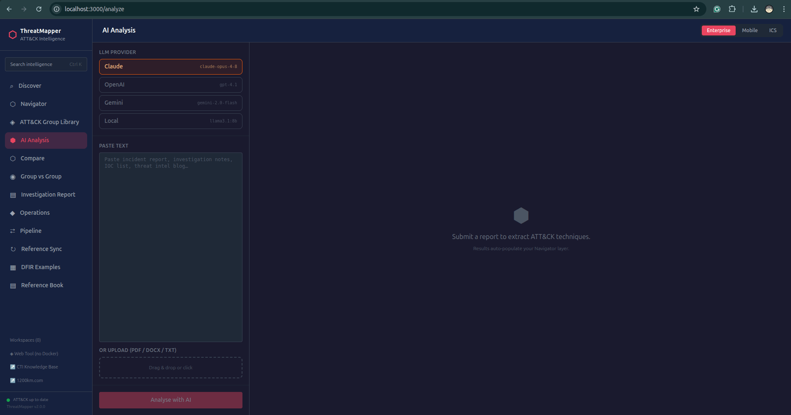
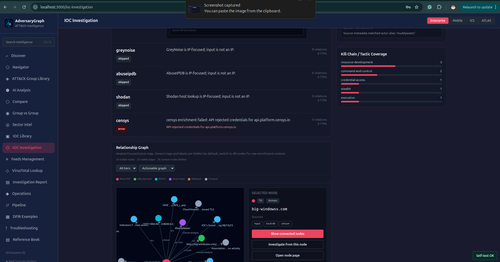
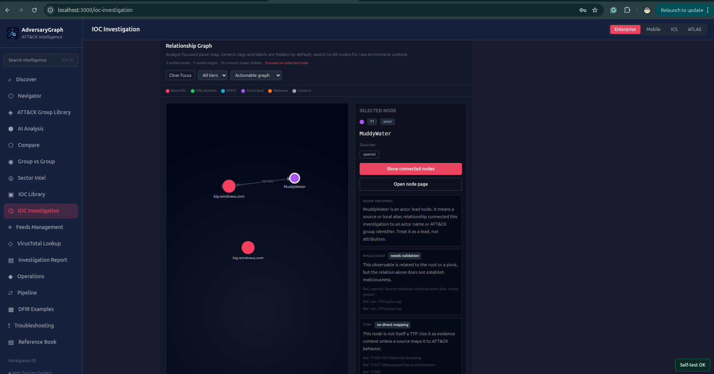
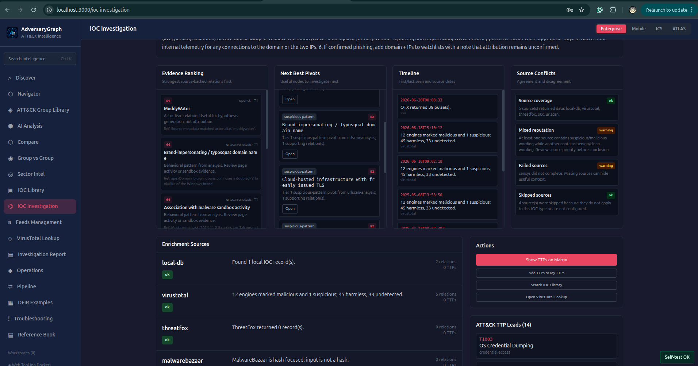
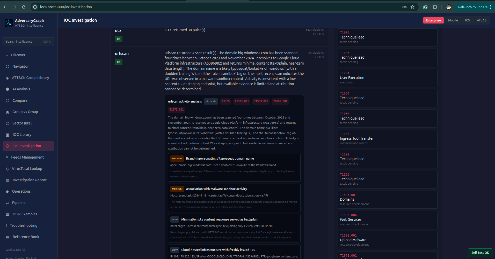

# AdversaryGraph v3.0: From IOC Lookup to Full Investigation Workbench

AdversaryGraph started as a self-hosted CTI-to-detection platform for mapping
threat reports to MITRE ATT&CK, comparing TTP overlap with known actors, and
turning intelligence into detection-engineering work.

Version 3.0 is a major step forward.

The platform is no longer only about reading a report and extracting ATT&CK
techniques. It can now support a complete analyst workflow that starts from a
single IOC, URL, hash, suspicious artifact, log excerpt, or PCAP-derived
telemetry export.

The goal is simple:

> Give an analyst enough source-backed context to answer: Is this suspicious?
> Why? Which TTPs are relevant? Is there an actor lead? What should I
> investigate next?

This article explains what changed in AdversaryGraph v3.0 and how the new IOC
Investigation, AI log/PCAP analysis, relationship graph, evidence ranking, and
saved investigation workflows fit together.

## Table Of Contents

- [What Changed In Version 3.0](#what-changed-in-version-30)
- [Why IOC Lookup Is Not Enough](#why-ioc-lookup-is-not-enough)
- [IOC Investigation Workflow](#ioc-investigation-workflow)
- [Relationship Graph And Clickable Nodes](#relationship-graph-and-clickable-nodes)
- [Evidence Ranking](#evidence-ranking)
- [Next Best Pivots](#next-best-pivots)
- [Timeline And Source Conflicts](#timeline-and-source-conflicts)
- [Saved Investigations](#saved-investigations)
- [AI Log Analysis](#ai-log-analysis)
- [AI PCAP Analysis](#ai-pcap-analysis)
- [ATT&CK And Actor Leads](#attck-and-actor-leads)
- [Detection And Reporting Handoff](#detection-and-reporting-handoff)
- [Installation](#installation)
- [Configuration](#configuration)
- [Example Investigation Flow](#example-investigation-flow)
- [Limitations](#limitations)
- [Links](#links)

## What Changed In Version 3.0

AdversaryGraph v3.0 adds a full investigation layer on top of the existing
ATT&CK mapping and CTI workflows.

The main additions are:

- IOC Investigation for IPs, domains, URLs, hashes, and suspicious artifacts
- Tier 1, Tier 2, and Tier 3 relationship expansion
- saved IOC investigations with reload and delete actions
- clickable relationship graph nodes
- node detail pages for every graph node
- connected-node graph focus mode
- observable reinvestigation from graph pivots
- evidence ranking
- next-best pivot ranking
- timeline extraction
- source-conflict summaries
- urlscan activity analysis
- AI log analysis
- AI PCAP-derived telemetry analysis
- cleaner report-ready AI output

This makes the platform more useful for real incident triage. Instead of only
asking "Which ATT&CK techniques are in this report?", the analyst can now ask:

- What is this IOC?
- What evidence supports the verdict?
- Which connected nodes should I inspect next?
- Which TTPs are suggested by the evidence?
- Is there an actor lead?
- Which sources agree or disagree?
- Can I generate a report from the investigation?

## Why IOC Lookup Is Not Enough

A single IOC lookup usually gives a flat answer:

- reputation score
- detections
- passive DNS
- tags
- related files
- maybe a malware family name

That is useful, but it is not an investigation.

An analyst still has to decide:

- which related observables matter
- whether tags are meaningful or just noisy labels
- whether a malware name has enough source support
- whether an actor name is a weak alias hit or a strong lead
- whether the activity maps to ATT&CK
- whether the finding is current or old
- what should be checked next

AdversaryGraph v3.0 tries to make those decisions visible and auditable.

It does not replace analyst judgment. It organizes the evidence so the analyst
can reason faster and write a more defensible conclusion.

## IOC Investigation Workflow

The IOC Investigation page accepts:

- IP addresses
- domains
- URLs
- MD5 hashes
- SHA1 hashes
- SHA256 hashes
- suspicious artifact names

The workflow queries configured local and external sources, including:

- local IOC database
- OpenCTI-imported indicators and reports
- MISP/STIX/TAXII/custom feed data
- VirusTotal
- ThreatFox
- MalwareBazaar
- AlienVault OTX
- urlscan.io
- GreyNoise
- AbuseIPDB
- Shodan
- Censys

Censys support uses Platform host lookup for IPs and web-property lookup for
domains/URLs. Broader Censys search is used only when the account has the
required organization/API role and search entitlement; otherwise the platform
keeps the Censys source as usable and explains the limitation in the result.

The result includes:

- IOC type
- verdict and suspicion score
- source status
- enrichment source evidence
- related observables
- relationship graph
- ATT&CK technique leads
- actor/APT leads
- kill-chain/tactic coverage
- AI-ready investigation input

The important point is that each source is shown separately. If one provider is
not configured or fails, the platform does not hide that fact. The analyst sees
what worked and what did not.



The investigation starts from a single artifact. The analyst chooses the pivot
depth, selects whether to include an AI summary, and can reopen previous
investigations from the history panel.



Saved investigations preserve the original score, artifact type, pivot depth,
TTP count, actor count, and timestamp. This makes it possible to return to a
prior result without rerunning external enrichment.



The summary view combines the verdict, score, artifact type, enrichment context,
TTP leads, actor leads, relationship pivots, and analyst-readable reasoning.



The animated workflow shows how the investigation page moves from artifact
entry to enrichment results, relationship graph review, and follow-up pivots.

## Relationship Graph And Clickable Nodes

The new graph is designed for investigation, not decoration.

The default view is an **Actionable graph**. It shows useful nodes first:

- root IOC
- related IPs
- domains
- URLs
- hashes
- malware leads
- actor leads
- reports
- vulnerabilities
- suspicious behavior patterns
- service exposure pivots

Noisy context such as generic OTX tags, labels, and keyword nodes is hidden by
default. If the analyst needs raw context, the graph can be switched to **All
nodes**.

Every graph node is clickable.

Clicking a node focuses the graph on that node's direct connections. This makes
dense investigations easier to read. Instead of looking at a large spiderweb,
the analyst can inspect one node neighborhood at a time.

Each node also has actions:

- open node page
- show connected nodes
- investigate from this node, when the node is an observable

This means an analyst can start with one URL, discover a related IP, click that
IP, inspect its local neighborhood, and then launch a fresh investigation from
that IP.



The graph side panel explains the selected node, shows which sources created
the relationship, and provides actions to show connected nodes, open the node
page, or start another investigation from that node when applicable.



Focus mode reduces the graph to the selected node neighborhood. Actor nodes are
treated as leads, not attribution, and the panel keeps that caveat visible.

## Evidence Ranking

The graph can still become noisy when multiple providers return many related
objects. Version 3.0 adds an evidence-ranking layer to help prioritize.

Evidence is ranked using practical factors:

- source reliability
- relation tier
- relation type
- suspicious wording
- corroborating relations
- directness to the root artifact

For example, a local report, OpenCTI record, MISP record, VirusTotal context, or
ThreatFox record usually carries more weight than a generic tag from a broad
OSINT pulse.

The ranking does not declare attribution or truth. It helps the analyst decide
which evidence should be reviewed first.



The evidence ranking, next-best pivots, timeline, and source-conflict panels
turn raw enrichment into a practical review order. They help the analyst decide
which lead to inspect first and where provider disagreement exists.

## Next Best Pivots

The **Next Best Pivots** panel answers a common investigation question:

> What should I click next?

The platform ranks related nodes based on evidence strength and usefulness.

Typical high-value pivots include:

- related URLs
- related domains
- resolved IPs
- file hashes
- malware-family leads
- suspicious behavior patterns
- actor leads with supporting evidence

Each pivot can be opened as a node page. Observable pivots can also start a new
IOC investigation.

## Timeline And Source Conflicts

The timeline extracts date-like values from enrichment source data. This helps
the analyst reason about recency:

- first seen
- last seen
- source timestamps
- scan timestamps
- report timestamps

The source-conflict view helps identify disagreement.

For example:

- one source may describe an IP as malicious
- another may classify it as a benign scanner
- another may have no current data
- a local report may link it to a malware family

The platform surfaces these conflicts so the analyst does not overstate the
finding.



urlscan activity analysis highlights suspicious URL/domain behavior such as
lookalike naming, sandbox activity, minimal content, recently issued TLS, and
cloud-hosted infrastructure. When the behavior suggests ATT&CK context, the
platform shows technique leads with source-backed caveats.

## Saved Investigations

IOC investigations are now saved automatically.

The analyst can:

- reopen previous investigations
- review old results without rerunning enrichment
- delete stale investigations
- preserve investigation context for later reporting

This matters because enrichment results change. A saved investigation becomes a
snapshot of what the platform saw at the time of analysis.

## AI Log Analysis

AdversaryGraph v3.0 also improves the AI Analysis workflow for logs and
telemetry.

An analyst can paste or upload:

- endpoint logs
- EDR notes
- firewall logs
- proxy logs
- authentication logs
- command-line traces
- PowerShell logs
- investigation notes
- IOC lists

The platform can extract:

- IPs
- domains
- URLs
- hashes
- suspicious commands
- suspicious PowerShell
- script/function names
- likely ATT&CK techniques
- actor-overlap hints
- report-ready summary text

The extracted TTPs can be injected into Navigator as a layer. From there the
analyst can compare the observed behavior against known actor profiles, campaign
profiles, or a defensive coverage layer.

## AI PCAP Analysis

AdversaryGraph does not need to parse raw packets directly to be useful in a
PCAP workflow.

A practical flow is:

1. Export PCAP-derived evidence from tools such as Zeek, Suricata, Wireshark,
   Arkime, tshark, or a sandbox.
2. Paste or upload the exported telemetry into AI Analysis.
3. Extract observables, protocol clues, suspicious domains, HTTP paths, DNS
   behavior, TLS/certificate values, JA3-like hints, and beaconing indicators.
4. Map the behavior to ATT&CK technique leads.
5. Send extracted IOCs into IOC Investigation.
6. Send extracted TTPs into Navigator for coverage and overlap review.

This gives the analyst a bridge from packet-derived evidence into CTI,
ATT&CK mapping, and detection engineering.

## ATT&CK And Actor Leads

AdversaryGraph intentionally uses careful language.

An ATT&CK technique lead is not automatically a confirmed technique. It is a
candidate that should be reviewed against the source evidence.

An actor lead is not attribution. It may come from:

- local actor IOC links
- source tags
- report names
- malware names
- alias matches
- enrichment text

The platform presents those leads as investigation hypotheses.

That matters for professional CTI work. Shared infrastructure, commodity
malware, copied tooling, and broad tags can all create weak actor hints.

## Detection And Reporting Handoff

After an investigation, the analyst can move into several handoff paths:

- add TTPs to My TTPs
- show TTPs on Navigator
- compare the layer with actor profiles
- review coverage gaps
- generate a local report
- use AI-assisted report drafting
- move into detection generation for Sigma, YARA, YARA-L, KQL, SPL, or EQL

The objective is to move from evidence to detection planning without losing the
source context that produced the finding.

## Installation

Clone the repository:

```bash
git clone https://github.com/anpa1200/adversarygraph.git
cd adversarygraph
cp .env.example .env
```

Start the platform:

```bash
docker compose up -d --build
```

Open:

```text
http://localhost:3000
```

Run a quick health check:

```bash
curl http://localhost:8000/api/health
```

## Configuration

At least one AI provider is recommended for AI Analysis and AI summaries:

```env
ANTHROPIC_API_KEY=
OPENAI_API_KEY=
GEMINI_API_KEY=
MINIMAX_API_KEY=
```

Optional IOC enrichment providers:

```env
VIRUSTOTAL_API_KEY=
THREATFOX_AUTH_KEY=
OTX_API_KEY=
URLSCAN_API_KEY=
GREYNOISE_API_KEY=
SHODAN_API_KEY=
ABUSEIPDB_API_KEY=
CENSYS_API_KEY=
CENSYS_ORG_ID=
```

OpenCTI sync:

```env
OPENCTI_URL=
OPENCTI_TOKEN=
OPENCTI_SYNC_LIMIT=500
```

Local-first usage is still possible. Missing optional keys are shown as source
statuses instead of breaking the whole investigation.

## Example Investigation Flow

One practical workflow:

1. Open IOC Investigation.
2. Paste a suspicious URL.
3. Run investigation with Tier 1, Tier 2, or Tier 3 depth.
4. Review the verdict and source status.
5. Open Evidence Ranking.
6. Pick the strongest relation.
7. Click a graph node to focus its connected neighborhood.
8. Open the node page.
9. If it is an observable, reinvestigate from that node.
10. Review TTP leads.
11. Add relevant TTPs to Navigator.
12. Compare against actor profiles or defensive coverage.
13. Save or export the report.

This is the workflow I wanted for daily CTI and incident-response triage:
source evidence first, graph pivots second, ATT&CK and actor hypotheses third,
and reporting after validation.

## Limitations

AdversaryGraph is an analyst-assistance platform, not an automated verdict
engine.

Important limitations:

- IOC reputation changes over time.
- Actor leads are not attribution.
- ATT&CK mappings require analyst review.
- Source tags can be noisy.
- Missing API keys reduce available evidence.
- AI output can be wrong or incomplete.
- PCAP analysis depends on the quality of exported telemetry.

Use the platform to organize evidence, generate hypotheses, and accelerate
analysis. Do not use it as a replacement for validation.

## Links

- GitHub: https://github.com/anpa1200/adversarygraph
- Documentation: https://1200km.com/adversarygraph-docs/
- Project hub: https://1200km.com/adversarygraph/
- Medium archive: https://medium.com/@1200km
- Portfolio / Knowledge Base: https://1200km.com/
